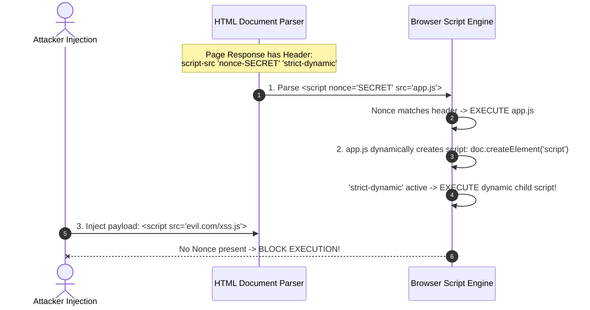
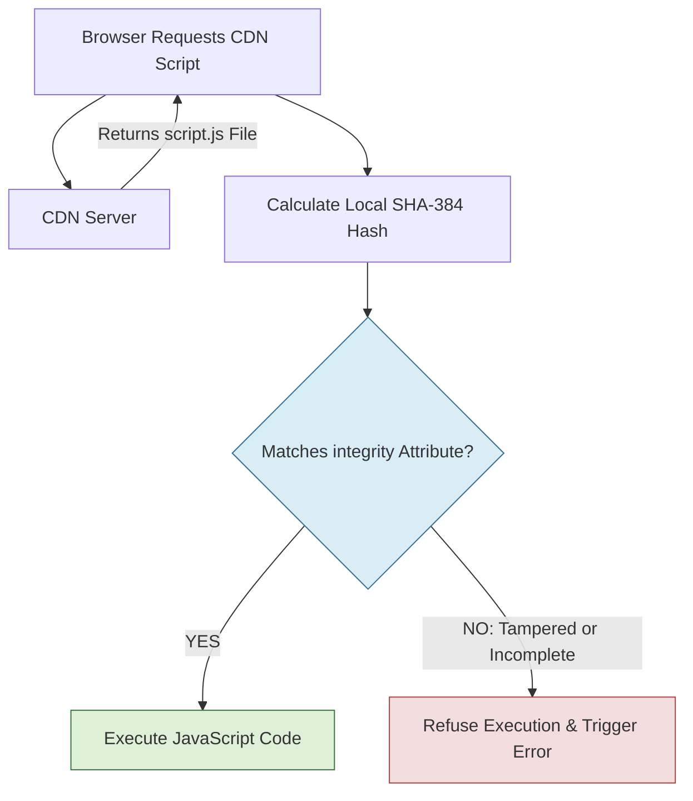

# 03. Content Security Policy (CSP v3) & Subresource Integrity (SRI)

A **Content Security Policy (CSP)** is an HTTP response header that provides a critical defense-in-depth layer against Cross-Site Scripting (XSS), clickjacking, dynamic data exfiltration, and supply chain attacks. When properly configured, CSP forces the browser to enforce strict boundaries on which scripts, stylesheets, images, and network requests can execute or load.

Complementing CSP, **Subresource Integrity (SRI)** ensures that third-party assets fetched from Content Delivery Networks (CDNs) have not been tampered with or compromised.

---

## 1. Why Domain Allowlist CSPs Fail

Historically, applications used domain allowlist policies (e.g., `script-src 'self' https://example.com https://cdnjs.cloudflare.com`). Modern application security research has proven that domain allowlists are inherently fragile and easily bypassed:

1. **JSONP Endpoints:** If any allowed domain hosts an open JSONP endpoint, an attacker can use it to wrap malicious payloads inside a valid callback function:
   ```html
   <!-- Attacker bypasses allowlist using cdnjs JSONP -->
   <script src="https://cdnjs.cloudflare.com/ajax/libs/angular.js/1.6.0/angular.min.js"></script>
   <script src="https://allowed-domain.com/api/jsonp?callback=alert(1)//"></script>
   ```
2. **Open Redirects:** An open redirect on an allowed domain enables script execution bypasses.
3. **User-Content Uploads:** Allowed domains hosting user uploads (e.g., S3 buckets) allow attackers to upload `.js` files and execute them in-origin.

---

## 2. Architecting a Strict Nonce-Based CSP v3

To eliminate domain allowlist bypasses, **CSP Level 3** introduces **Strict Nonce-Based Policy** combined with the `'strict-dynamic'` directive.

```http
Content-Security-Policy: 
  default-src 'none';
  script-src 'nonce-rAnd0m12345' 'strict-dynamic';
  style-src 'self' 'nonce-rAnd0m12345';
  img-src 'self' data: https:;
  font-src 'self';
  connect-src 'self' https://api.yourdomain.com;
  object-src 'none';
  base-uri 'none';
  form-action 'self';
  frame-ancestors 'none';
  require-trusted-types-for 'script';
  trusted-types default;
```

### A. How `'strict-dynamic'` Works
- When a browser encounters `'strict-dynamic'`, it **ignores** domain allowlists in `script-src`.
- Any script tag carrying a valid, matching `nonce="rAnd0m12345"` (or matching cryptographic hash) is executed.
- If an authorized script dynamically creates new `<script>` elements at runtime (e.g., loading Webpack chunks or analytics plugins), the browser **automatically trusts and executes** those descendant scripts without requiring additional nonces or domain rules.



---

## 3. Server-Side Nonce Generation (Multi-Language Examples)

A secure CSP nonce must be **cryptographically random**, **unique per HTTP request**, and **never reused**.

### Node.js (Express Framework)
```javascript
const express = require('express');
const crypto = require('crypto');
const app = express();

app.use((req, res, next) => {
  // Generate 16 bytes of cryptographically secure random data (Base64)
  const nonce = crypto.randomBytes(16).toString('base64');
  res.locals.nonce = nonce;

  res.setHeader(
    'Content-Security-Policy',
    `default-src 'none'; script-src 'nonce-${nonce}' 'strict-dynamic'; object-src 'none'; base-uri 'none';`
  );
  next();
});

app.get('/', (req, res) => {
  res.send(`
    <!DOCTYPE html>
    <html>
      <head>
        <script nonce="${res.locals.nonce}">
          console.log('Strict CSP Nonce verified!');
        </script>
      </head>
      <body><h1>Secure Node.js App</h1></body>
    </html>
  `);
});
```

### Python (Flask Framework)
```python
import os, base64
from flask import Flask, render_template_string, g

app = Flask(__name__)

@app.before_request
def generate_csp_nonce():
    # 16 random bytes encoded as base64
    g.nonce = base64.b64encode(os.urandom(16)).decode('utf-8')

@app.after_request
def apply_csp_header(response):
    csp = (
        f"default-src 'none'; "
        f"script-src 'nonce-{g.nonce}' 'strict-dynamic'; "
        f"object-src 'none'; base-uri 'none';"
    )
    response.headers['Content-Security-Policy'] = csp
    return response

@app.route('/')
def index():
    return render_template_string('''
        <!DOCTYPE html>
        <html>
          <head>
            <script nonce="{{ g.nonce }}">
              console.log("Flask CSP Nonce initialized");
            </script>
          </head>
          <body><h1>Flask Secure App</h1></body>
        </html>
    ''')
```

### Go (Standard `net/http`)
```go
package main

import (
	"crypto/rand"
	"encoding/base64"
	"fmt"
	"net/http"
)

func generateNonce() string {
	bytes := make([]byte, 16)
	rand.Read(bytes)
	return base64.StdEncoding.EncodeToString(bytes)
}

func secureHandler(w http.ResponseWriter, r *http.Request) {
	nonce := generateNonce()
	csp := fmt.Sprintf("default-src 'none'; script-src 'nonce-%s' 'strict-dynamic'; object-src 'none'; base-uri 'none';", nonce)
	w.Header().Set("Content-Security-Policy", csp)

	html := fmt.Sprintf(`<!DOCTYPE html>
<html>
  <head>
    <script nonce="%s">console.log("Go CSP Server Working");</script>
  </head>
  <body><h1>Go Application</h1></body>
</html>`, nonce)

	w.Write([]byte(html))
}

func main() {
	http.HandleFunc("/", secureHandler)
	http.ListenAndServe(":8080", nil)
}
```

### Java (Spring Boot Security Filter)
```java
package com.example.security;

import jakarta.servlet.*;
import jakarta.servlet.http.HttpServletResponse;
import java.io.IOException;
import java.security.SecureRandom;
import java.util.Base64;

public class CspNonceFilter implements Filter {

    private final SecureRandom secureRandom = new SecureRandom();

    @Override
    public void doFilter(ServletRequest request, ServletResponse response, FilterChain chain)
            throws IOException, ServletException {
        
        byte[] nonceBytes = new byte[16];
        secureRandom.nextBytes(nonceBytes);
        String nonce = Base64.getEncoder().encodeToString(nonceBytes);

        request.setAttribute("cspNonce", nonce);

        HttpServletResponse httpResponse = (HttpServletResponse) response;
        String csp = String.format("default-src 'none'; script-src 'nonce-%s' 'strict-dynamic'; object-src 'none'; base-uri 'none';", nonce);
        httpResponse.setHeader("Content-Security-Policy", csp);

        chain.doFilter(request, response);
    }
}
```

---

## 4. Web Server Production Configurations

### Nginx Configuration (`nginx.conf`)
```nginx
# Security Headers Configuration
server {
    listen 443 ssl http2;
    server_name example.com;

    # Note: For static Nginx hosting without dynamic nonces, use SHA-256 hashes or strict self headers.
    add_header Content-Security-Policy "default-src 'none'; script-src 'self'; style-src 'self' 'unsafe-inline'; img-src 'self' data:; font-src 'self'; connect-src 'self' https://api.example.com; object-src 'none'; base-uri 'none'; frame-ancestors 'none';" always;
    
    add_header X-Frame-Options "DENY" always;
    add_header X-Content-Type-Options "nosniff" always;
    add_header Referrer-Policy "strict-origin-when-cross-origin" always;
    add_header Permissions-Policy "geolocation=(), microphone=(), camera=()" always;
}
```

---

## 5. Subresource Integrity (SRI)

**Subresource Integrity (SRI)** allows web browsers to verify that assets fetched from external servers (such as CDNs) have not been modified by an attacker or hijacked CDN operator.

### A. How SRI Hash Verification Works
You attach an `integrity` attribute containing a cryptographic hash digest (SHA-256, SHA-384, or SHA-512) to `<script>` or `<link>` tags.

```html
<script 
  src="https://cdnjs.cloudflare.com/ajax/libs/react/18.2.0/umd/react.production.min.js"
  integrity="sha384-AhBkWwH...base64hash..."
  crossorigin="anonymous">
</script>
```

When fetching the file, the browser computes the cryptographic hash of the received bytes. If even a single byte differs from the `integrity` attribute, the browser discards the asset and logs a security error.



### B. Command-Line Generation of SRI Hashes
To generate an SRI SHA-384 hash digest for any asset file:

```bash
# Using OpenSSL
openssl dgst -sha384 -binary library.js | openssl base64 -A

# Output Example:
# sha384-q8i/X+965DzO0rT7abK41JStQIAqVgRVzpbzo5smXKp4YfRvH+8abtTE1Pi6jizo
```

---

## 6. CSP Telemetry & Violation Reporting

Deploying a strict CSP without monitoring can break application functionality. You can enforce policies gradually using **Report-Only Mode** and logging violation payloads.

### A. Report-Only Mode Header
```http
Content-Security-Policy-Report-Only: default-src 'none'; script-src 'nonce-XYZ' 'strict-dynamic'; report-to csp-endpoint;
```

### B. Configuring `Report-To` Endpoint Header
```http
Reporting-Endpoints: csp-endpoint="https://api.example.com/telemetry/csp-reports"
```

### C. Sample Violation Payload Received by Server
When a policy violation occurs, the browser posts a JSON report to your endpoint:

```json
{
  "csp-report": {
    "document-uri": "https://example.com/checkout",
    "referrer": "https://example.com/",
    "violated-directive": "script-src-elem",
    "effective-directive": "script-src",
    "original-policy": "default-src 'none'; script-src 'nonce-XYZ';",
    "disposition": "enforce",
    "blocked-uri": "https://attacker.com/malicious.js",
    "line-number": 42,
    "column-number": 12,
    "status-code": 200
  }
}
```

---
