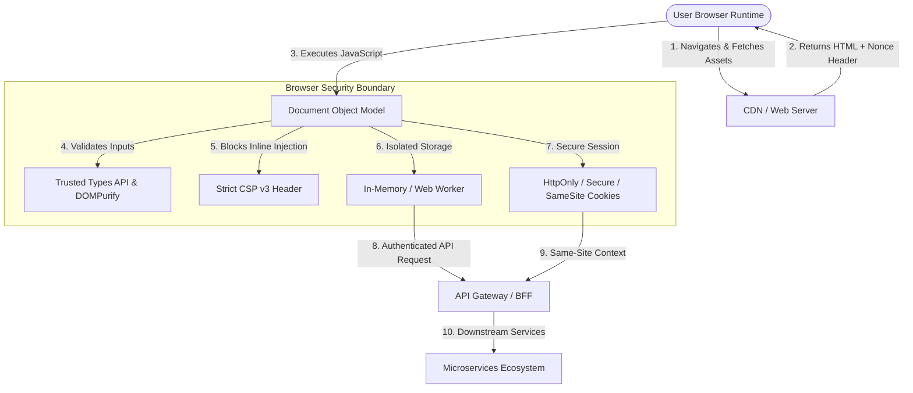

# Frontend Security Playbook

Welcome to the **Frontend Security Playbook**, part of the AppSec Atlas. Modern web engineering has shifted significant business logic, state management, and user interaction processing into the client runtime. While Single Page Applications (SPAs) and Server-Side Rendered (SSR) frameworks deliver high performance and rich user experiences, they also expand the client-side attack surface and convert the web browser into a high-stakes, hostile execution environment.

This playbook provides deep technical guidance, architecture patterns, attack mechanics, and production-grade defenses to build resilient modern web applications.

---

## 🌟 Overview & Core Architecture

Client-side security requires defense-in-depth across the entire frontend ecosystem: from browser memory storage and DOM execution sinks to third-party script integrations and header configurations.

---

## 🎯 Learning Objectives

By completing this guide, security engineers, application architects, and frontend developers will be able to:

1. **Model Browser Threat Surfaces:** Analyze Same-Origin Policy (SOP) boundaries, DOM source-to-sink data flows, and client-side supply chain threats.
2. **Harden Modern Frameworks:** Identify and eliminate security anti-patterns across **React**, **Vue.js**, **Angular**, and **Svelte** (e.g., `dangerouslySetInnerHTML`, `v-html`, `bypassSecurityTrustHtml`).
3. **Prevent Advanced DOM Attacks:** Implement the **Trusted Types API** and neutralize Client-Side Prototype Pollution vulnerabilities.
4. **Deploy Strict Content Security Policies:** Architect nonce-based and hash-based **CSP v3** with `'strict-dynamic'` and enforce **Subresource Integrity (SRI)**.
5. **Secure Authentication & Token Storage:** Eliminate `LocalStorage` token vulnerabilities using the **Backend-For-Frontend (BFF)** pattern, **Web Workers**, and cryptographic **OAuth 2.0 PKCE** flows.
6. **Automate Security Auditing:** Integrate SAST linters (`eslint-plugin-security`), dependency scanners (`retire.js`, `npm audit`), and DAST analyzers (`DOMInvader`) into CI/CD pipelines.
7. **Hands-On Exploitation & Remediation:** Execute a complete DOM XSS token theft lab attack and implement multi-layered defenses.

---

## 🛠️ Prerequisites

To get the most out of this playbook, you should be familiar with:

- **Core Web Technologies:** JavaScript (ES6+), TypeScript, HTML5, CSS3, HTTP/1.1 & HTTP/2 protocol fundamentals.
- **Modern Frameworks:** Conceptual understanding of SPAs (React, Vue, Angular) and SSR frameworks (Next.js, Nuxt).
- **Security Basics:** Familiarity with OWASP Web Top 10 vulnerabilities (specifically XSS, CSRF, and Supply Chain attacks).
- **Development Tools:** Node.js runtime, `npm`/`yarn`/`pnpm`, Git, and Chrome DevTools.

---

## 🧭 Playbook Navigation

The playbook is structured into 7 comprehensive technical chapters:

| Chapter | Title | Focus Area |
| :--- | :--- | :--- |
| **[01. Introduction](01-introduction.md)** | **Client-Side Threat Model & Foundations** | Browser execution model, SOP, DOM architecture, SPA vs SSR threat surfaces, and root causes. |
| **[02. Framework Protections](02-modern-framework-security.md)** | **Framework Security & DOM Vulnerabilities** | React, Vue, Angular, Svelte mechanics, DOM XSS, Prototype Pollution, and Trusted Types API. |
| **[03. Content Security Policy](03-content-security-policy-and-sri.md)** | **Strict CSP v3 & Subresource Integrity** | Nonce/hash policies, `'strict-dynamic'`, CSP reporting, SRI hash generation, and bypass prevention. |
| **[04. Auth & Storage](04-client-side-auth-and-storage.md)** | **Authentication, Token Storage & Storage Hazards** | LocalStorage risks, OAuth 2.0 PKCE, BFF Architecture, `HttpOnly` cookie prefixes, CSRF defenses. |
| **[05. Security Tooling](05-frontend-security-scanners.md)** | **Frontend Security Scanners & CI/CD** | SAST rules, Semgrep, dependency auditing (`retire.js`), DAST (DOMInvader), and CI/CD pipelines. |
| **[06. Hands-On Lab](06-hands-on-lab.md)** | **Exploiting & Securing a Modern React SPA** | Runnable vulnerability lab, DOM XSS exfiltration payload, DOMPurify fix, CSP, and verification scripts. |
| **[07. References](07-references.md)** | **Standards, CVEs & Technical References** | W3C specifications, OWASP cheat sheets, CVE case studies, and security tooling references. |

---

## 📊 Summary Vulnerability & Defense Matrix

| Vulnerability | Primary Root Cause | Impact | Gold Standard Mitigation | Verification Method |
| :--- | :--- | :--- | :--- | :--- |
| **DOM-based XSS** | Untrusted data flowing from source to unsafe DOM sink (`innerHTML`) | Full account compromise, session theft, keylogging | Context-aware escaping, DOMPurify, Trusted Types API, Strict CSP v3 | Static analysis (Semgrep), DAST (DOMInvader) |
| **Client-Side Token Theft** | Storing JWTs or sensitive credentials in `LocalStorage` / `SessionStorage` | Permanent account takeover via XSS exfiltration | **BFF Pattern** with `__Host-` `HttpOnly` `SameSite=Strict` cookies | Code review, Browser DevTools Storage audit |
| **Supply Chain Script Injection** | Compromised third-party scripts loaded without integrity verification | Data exfiltration (Magecart), credential harvesting | Subresource Integrity (SRI hashes), strict `script-src` CSP | `retire.js`, Lighthouse security audit |
| **Prototype Pollution** | Unsanitized recursive object merging (`lodash.merge`, custom clones) | Denial of Service, DOM XSS execution, RCE in Node SSR | `Object.freeze()`, `Object.create(null)`, JSON schema validation | SAST (`eslint-plugin-security`), automated fuzzing |
| **CSRF on State Mutations** | Cross-origin requests exploiting ambient browser credentials (cookies) | Unauthorized user actions (email/password change) | `SameSite=Strict/Lax` cookies, Custom request headers (`X-Requested-With`) | OWASP ZAP automated scanner, manual CSRF PoC |

---
