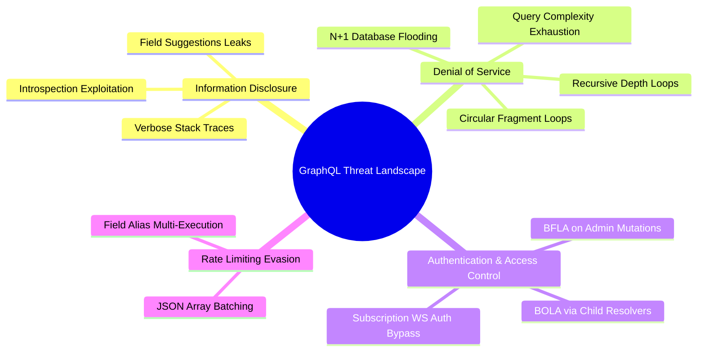

# 01. GraphQL Security Introduction & Threat Landscape

GraphQL is a query language for APIs and a runtime for fulfilling those queries with existing data. Developed internally by Facebook in 2012 and open-sourced in 2015, GraphQL provides a complete and understandable description of the data in your API, giving clients the power to ask for exactly what they need and nothing more.

However, the core capabilities that make GraphQL so attractive to frontend developers—flexible queries, single-endpoint aggregation, and client-driven data fetching—fundamentally challenge security assumptions built into traditional web application firewalls (WAFs) and REST security architectures.

---

## 1. GraphQL Architecture & Execution Engine

To understand GraphQL security, one must understand how a GraphQL server processes incoming requests. Unlike REST, where each endpoint maps directly to a predefined router controller, GraphQL parses queries into an **Abstract Syntax Tree (AST)** and evaluates that tree against a strongly typed schema.

```
+-----------------------------------------------------------------------------------+
|                              GraphQL Request Lifecycle                            |
+-----------------------------------------------------------------------------------+
|                                                                                   |
|  [ Client Query ]                                                                 |
|         |                                                                         |
|         v                                                                         |
|  +-----------------------+                                                        |
|  | 1. HTTP Transport     |  (POST /graphql with body JSON: {"query": "..."})      |
|  +-----------------------+                                                        |
|         |                                                                         |
|         v                                                                         |
|  +-----------------------+                                                        |
|  | 2. Lexical & AST      |  Converts string query into Abstract Syntax Tree       |
|  |    Parsing Phase      |  (Tokenizes keywords, selections, directives)          |
|  +-----------------------+                                                        |
|         |                                                                         |
|         v                                                                         |
|  +-----------------------+                                                        |
|  | 3. Validation Phase   |  Validates AST against Schema Definition Language (SDL) |
|  |                       |  (Checks types, field names, query depth & rules)      |
|  +-----------------------+                                                        |
|         |                                                                         |
|         v                                                                         |
|  +-----------------------+                                                        |
|  | 4. Execution Phase    |  Traverses AST nodes; invokes Field Resolvers           |
|  |                       |  (Context passed down: auth credentials, DB pools)     |
|  +-----------------------+                                                        |
|         |                                                                         |
|         v                                                                         |
|  +-----------------------+                                                        |
|  | 5. Response Building  |  Formats JSON result with 'data' and 'errors' keys     |
|  +-----------------------+                                                        |
|                                                                                   |
+-----------------------------------------------------------------------------------+
```

### The Schema Definition Language (SDL)
The GraphQL schema forms the contract between client and server. It defines:
- **Types & Fields**: Scalars (`String`, `Int`, `Float`, `Boolean`, `ID`) and Object types.
- **Operations**: `query` (read operations), `mutation` (write/delete operations), and `subscription` (real-time push over WebSockets).
- **Interfaces & Unions**: Polymorphic object definitions.
- **Directives**: Annotation syntax (e.g., `@deprecated`, `@auth`) used to modify query execution or schema capabilities.

---

## 2. REST vs. GraphQL: Security Paradigm Shift

Traditional security tooling (such as WAFs, API Gateways, and HTTP Rate Limiters) was built around RESTful principles. Transitioning to GraphQL invalidates several security defaults.

| Security Dimension | REST Architecture | GraphQL Architecture | Security Impact / Risk |
| :--- | :--- | :--- | :--- |
| **Endpoint Footprint** | Multi-endpoint (`/api/v1/users`, `/api/v1/orders`) | Single endpoint (`/graphql` or `/v1/graphql`) | WAFs cannot enforce URL path-based access rules; all operations share one route. |
| **HTTP Verbs & Status** | Meaningful verbs (`GET`, `POST`, `PUT`, `DELETE`), HTTP 401/403/404 | Usually `POST` only; returns `200 OK` even when containing application errors | Automated monitoring tools fail to detect spikes in 4xx/5xx security events. |
| **Request Control** | Server defines response structure | Client defines request structure and response shape | Attackers can construct deeply nested or recursive queries causing DoS. |
| **Authorization Layer** | Route/Middleware level (`router.use('/admin', checkAdmin)`) | Field/Resolver level (`User.email`, `Order.total`) | Developers often forget authorization checks on nested child resolvers. |
| **Rate Limiting** | Count requests per IP / Endpoint (`100 req/min`) | One HTTP request can contain 1,000 batched queries or field aliases | Traditional request-counter rate limiters are completely bypassed. |
| **Schema Discovery** | OpenAPI / Swagger (often manual or opt-in) | Introspection System (`__schema`, `__type`) enabled by default in many frameworks | Attackers automatically extract complete database structures and hidden APIs. |

> [!NOTE]
> **The 200 OK Paradox:** A GraphQL server will almost always return HTTP Status `200 OK`, even when authorization fails or a database query crashes. Errors are returned inside an `errors` array in the JSON response payload. WAFs expecting `403 Forbidden` or `500 Internal Server Error` will miss malicious traffic unless specifically configured to inspect JSON response bodies.

---

## 3. Root Causes of GraphQL Vulnerabilities

Why do GraphQL APIs frequently suffer from severe security flaws? Grounding our analysis in application engineering reveals five primary root causes:

1. **Client-Controlled Graph Traversal**: GraphQL allows clients to specify recursive object traversals (e.g., `user -> posts -> author -> posts -> author`). Without explicit execution boundaries, a 50-line query can trigger millions of backend database reads.
2. **Granular Resolver Decoupling**: In GraphQL frameworks, each field in a query can have its own independent execution resolver. Developers frequently place authentication checks on top-level Query fields (e.g., `me`), but forget checks on child resolvers (e.g., `User.organizations`), allowing unauthorized data access (BOLA/BFLA).
3. **Implicit Introspection & Field Suggestions**: Default configurations in popular libraries (Apollo Server, Graphene, Spring GraphQL) enable full schema introspection. Even when introspection is toggled off, fuzzy matching algorithms ("Did you mean `privatePasswordHash`?") leak valid schema elements upon error.
4. **N+1 Query Amplification**: If a client queries a list of 100 `Users` and requests their `Friends`, naive resolver implementations execute 1 initial query for users, plus 100 individual queries for friends. Attackers exploit this to execute massive server-side resource exhaustion.
5. **Batching Execution Semantics**: GraphQL specifications allow multiple operations within a single HTTP payload (either via JSON arrays or query field aliasing). Security controls at the HTTP layer cannot see or limit the number of operations packed inside the payload.

---

## 4. GraphQL Threat Landscape & OWASP Mapping

GraphQL APIs are vulnerable to classic web flaws (SQL Injection, XSS) as well as GraphQL-specific structural attack vectors. The table below maps GraphQL threats to the **OWASP API Security Top 10 (2023)**:



### OWASP API Security Top 10 Mapping

| OWASP API Top 10 Category | GraphQL Specific Manifestation | Severity |
| :--- | :--- | :--- |
| **API1:2023 - Broken Object Level Authorization (BOLA)** | Accessing another user's resource by manipulating `id` arguments in nested resolvers or queries (`user(id: "1337") { ssn }`). | **CRITICAL** |
| **API2:2023 - Broken Authentication** | Failing to authenticate persistent WebSocket connections for GraphQL Subscriptions or missing token checks in mutation resolvers. | **HIGH** |
| **API3:2023 - Broken Object Property Level Authorization** | Exposing sensitive internal fields (e.g., `is_admin`, `password_hash`, `stripe_customer_id`) because field-level selection masks were missing. | **HIGH** |
| **API4:2023 - Unrestricted Resource Consumption** | Submitting unconstrained deep recursive queries, complex directive aliases, or massive array batching requests causing CPU/Memory crashes. | **HIGH** |
| **API5:2023 - Broken Function Level Authorization (BFLA)** | Executing administrative mutations (e.g., `deleteUser`, `exportDatabase`) that lack role verification checks inside the resolver context. | **CRITICAL** |
| **API8:2023 - Security Misconfiguration** | Leaving Introspection enabled in production, returning debug stack traces in response `extensions`, or permitting raw GET mutations. | **MEDIUM** |

> [!WARNING]
> **GraphQL is NOT a Database Engine:** A common misconception is that GraphQL handles database security automatically. GraphQL is merely an execution layer. If your backend resolvers pass untrusted field arguments directly into SQL, NoSQL, or ORM calls, your API remains vulnerable to full database takeover via Injection attacks.

---

*Next Chapter: [02. Core Concepts & Attack Vectors →](02-core-concepts.md)*
