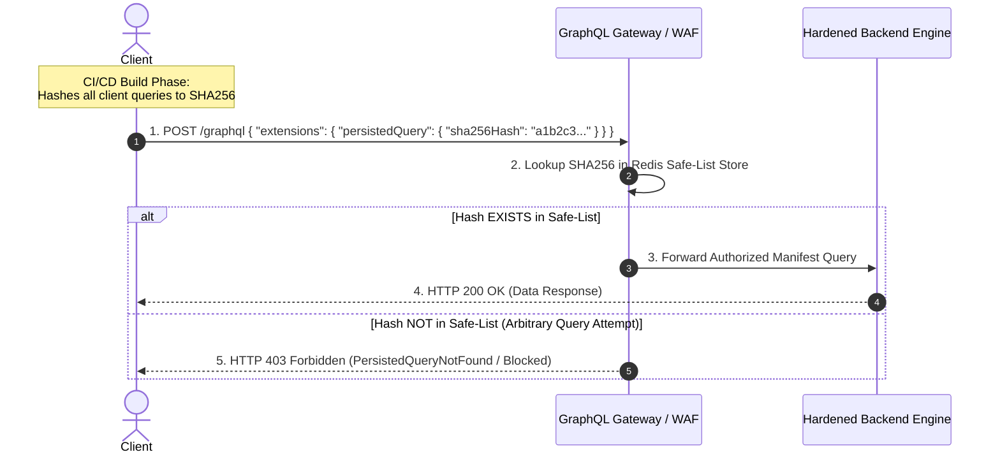

# 04. Production-Grade Defenses & Architecture Patterns

Defending GraphQL APIs requires a multi-layered security model spanning API gateways, AST validation rules, schema directives, dynamic execution cost limits, and centralized authorization policies.

---

## 1. Dynamic Query Complexity & Cost Calculation Algorithms

To block structural DoS attacks without breaking valid client queries, production GraphQL gateways implement **Static Query Analysis** before execution starts.

### The Query Cost Algorithm
Each field in the schema is assigned a base complexity score (default = 1 point). List fields multiply the cost of their child selections based on pagination parameters (`first`, `limit`, `last`).

$$\text{Cost}(\text{Node}) = \text{BaseWeight} + \left( \text{PaginationLimit} \times \sum \text{Cost}(\text{ChildNodes}) \right)$$

```
                                [ Query Root ]
                                      |
                           users(first: 50) [Cost: 10 + 50 * Children]
                                      |
                      +---------------+---------------+
                      |                               |
                 name [Cost: 1]                orders(limit: 10) [Cost: 5 + 10 * Children]
                                                      |
                                                 total [Cost: 1]

   Total Calculation:
   orders cost  = 5 + (10 * 1) = 15
   users cost   = 10 + (50 * (1 + 15)) = 10 + (50 * 16) = 810 points
```

### Enforcing Complexity Scoring in Production
If a incoming query's calculated total score exceeds the maximum threshold (e.g., `1,000 points`), the gateway rejects the query immediately at the AST validation phase, returning HTTP 400 without touching backend database infrastructure.

---

## 2. Automatic Persisted Queries (APQ) & Operation Allowlisting

The ultimate defense against arbitrary GraphQL query abuse (DoS, introspection, unintended field combinations) is **Query Allowlisting (Safe-listing)** or **Strict Automatic Persisted Queries (APQ)**.

### APQ Architecture Workflow



### Production Hardening Guidelines for APQ:
1. **Disable Dynamic Registration in Production**: By default, APQ allows clients to register new query hashes at runtime if missing (`PersistedQueryNotFound`). In high-security environments, **disable runtime registration**!
2. **Build-Time Query Manifest Generation**: Use build plugins (`relay-compiler`, `graphql-codegen`) to output a JSON manifest of all approved query hashes during CI/CD. Upload this manifest to the API Gateway or Redis cache during deployment.
3. **Reject Unapproved Hash Executions**: Any incoming request that does not supply a valid pre-approved SHA256 query hash is instantly dropped.

---

## 3. Declarative Schema Directives & Policy-as-Code (OPA)

Instead of scattering authorization checks inside individual resolver functions, use **Declarative Schema Directives** or delegate authorization decisions to a Policy-as-Code engine like **Open Policy Agent (OPA)**.

### A. Declarative Schema Directives Definition (SDL)
```graphql
# Schema Definition with Custom Security Directives
directive @auth(requires: Role = USER) on FIELD_DEFINITION | OBJECT
directive @ownerOnly(idArg: String = "id") on FIELD_DEFINITION

enum Role {
  PUBLIC
  USER
  ADMIN
  SYSTEM
}

type User {
  id: ID!
  username: String!
  email: String! @auth(requires: ADMIN) # Only admins can query user email
  ssn: String! @ownerOnly(idArg: "id")   # Only account owner can query SSN
}
```

### B. OPA Policy Decision Point (PDP) Resolver Integration
Connect your GraphQL middleware to Open Policy Agent to evaluate fine-grained ABAC policies:

```rego
# Rego Policy (policy.rego)
package graphql.authz

default allow = false

# Allow user to read their own record
allow {
    input.action == "READ"
    input.target_type == "User"
    input.target_id == input.user_id
}

# Allow ADMIN users to execute any mutation
allow {
    input.user_role == "ADMIN"
}
```

```javascript
// Node.js Resolver Middleware with OPA Integration
import { verifyOpaPolicy } from './opaClient';

const authzMiddleware = async (resolve, parent, args, context, info) => {
  const input = {
    user_id: context.currentUser.id,
    user_role: context.currentUser.role,
    target_type: info.parentType.name,
    field_name: info.fieldName,
    target_id: parent?.id || args?.id,
  };

  const isAllowed = await verifyOpaPolicy(input);
  if (!isAllowed) {
    throw new Error(`Access Denied: Unauthorized field access to '${info.fieldName}'`);
  }

  return resolve(parent, args, context, info);
};
```

---

## 4. Complexity-Based Token Bucket Rate Limiting

Traditional rate limiters increment request counts per IP. A hardened GraphQL gateway deducts **query complexity points** from a Redis token bucket:

```javascript
// Redis Complexity Token Bucket Implementation (Gateway Middleware)
import Redis from 'ioredis';
import { calculateQueryCost } from './complexityCalculator';

const redis = new Redis(process.env.REDIS_URL);
const BUCKET_CAPACITY = 5000; // Max points per IP
const REFILL_RATE_PER_SEC = 100; // Points restored per second

export async function rateLimitGraphQLMiddleware(req, res, next) {
  const clientIp = req.ip;
  const key = `ratelimit:graphql:${clientIp}`;

  // 1. Parse AST and calculate query cost
  const queryCost = calculateQueryCost(req.body.query);

  // 2. Fetch current token bucket state from Redis
  const now = Date.now();
  const [tokens, lastRefill] = await redis.hmget(key, 'tokens', 'lastRefill');

  let currentTokens = tokens ? parseFloat(tokens) : BUCKET_CAPACITY;
  let lastRefillTime = lastRefill ? parseInt(lastRefill, 10) : now;

  // 3. Calculate refilled tokens based on elapsed time
  const elapsedTime = (now - lastRefillTime) / 1000;
  currentTokens = Math.min(BUCKET_CAPACITY, currentTokens + elapsedTime * REFILL_RATE_PER_SEC);

  // 4. Check if client has sufficient points
  if (currentTokens < queryCost) {
    return res.status(429).json({
      errors: [{
        message: `Rate limit exceeded. Query cost (${queryCost} pts) exceeds available tokens (${Math.floor(currentTokens)} pts).`,
        extensions: { code: 'RATE_LIMITED', retryAfterSeconds: Math.ceil((queryCost - currentTokens) / REFILL_RATE_PER_SEC) }
      }]
    });
  }

  // 5. Deduct cost and update Redis
  await redis.hmset(key, 'tokens', currentTokens - queryCost, 'lastRefill', now);
  next();
}
```

---

## 5. Gateway & Network Layer Hardening

### Nginx Hardening Configuration for GraphQL Endpoint

```nginx
# Nginx Hardening Rules for /graphql
http {
    # Limit max payload size to prevent huge payload DoS (100KB max)
    client_max_body_size 100k;

    # Rate limiting zone for IP requests
    limit_req_zone $binary_remote_addr zone=graphql_limit:10m rate=10r/s;

    server {
        listen 443 ssl http2;
        server_name api.example.com;

        location /graphql {
            # ✅ Block HTTP GET operations to prevent CSRF mutation execution
            limit_except POST {
                deny all;
            }

            # Enforce request rate limit zone
            limit_req zone=graphql_limit burst=5 nodelay;

            # Forward to backend GraphQL gateway
            proxy_pass http://graphql_backend;
            proxy_set_header Host $host;
            proxy_set_header X-Real-IP $remote_addr;
        }
    }
}
```

> [!TIP]
> **Disable HTTP GET Mutations:** The GraphQL specification allows queries via HTTP `GET` requests (e.g., `/graphql?query=mutation{...}`). Allowing mutations via GET exposes your API to **Cross-Site Request Forgery (CSRF)** via image tags or hyperlinked clicks. Strictly restrict mutation operations to HTTP `POST` requests with anti-CSRF tokens or custom headers (`X-Requested-With: GraphQL`).

---

*Next Chapter: [05. Security Tools & Automation →](05-tools.md)*
