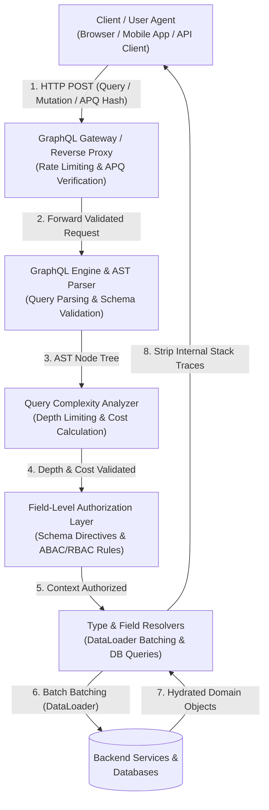

# GraphQL Security Masterclass

Welcome to the **GraphQL Security Masterclass**, an authoritative, production-grade guide designed to equip Application Security Engineers, Software Architects, and Security Researchers with deep technical expertise in securing GraphQL execution engines and API infrastructure.

> [!IMPORTANT]
> **Shift in API Paradigm & Attack Surface:** GraphQL fundamental shifts control of the request shape from the server to the client. While REST endpoints expose predefined data schemas over explicit routes, a single GraphQL endpoint (typically `/graphql`) accepts arbitrary client queries, nested object graphs, and custom execution directives. This flexibility introduces structural Denial of Service (DoS) vectors, field-level authorization gaps, N+1 query amplification, and query batching rate-limit bypasses.

---

## Core Architecture Overview

The following lifecycle diagram illustrates how a client GraphQL operation traverses HTTP transport, Abstract Syntax Tree (AST) parsing, static query analysis, field authorization, data fetching, and error formatting:

---

## Module Roadmap & Navigation

| Chapter | Focus Area | Core Topics Covered | Key Artifacts |
| :--- | :--- | :--- | :--- |
| **[01 - Introduction](01-introduction.md)** | Foundations & Threat Landscape | GraphQL Execution Model, AST Parsing, REST vs GraphQL Security Paradigm, Root Causes of Flaws | Architectural Flowcharts, Comparative Tradeoff Matrix |
| **[02 - Core Concepts](02-core-concepts.md)** | Attack Vectors & Mechanics | Introspection Abuse, Recursive Depth DoS, Array & Alias Batching Attacks, BOLA/BFLA Field Flaws, Subscriptions | Deep Technical Payloads, Attack Sequence Diagrams |
| **[03 - Code Examples](03-code-examples.md)** | Vulnerable vs Secure Patterns | Production Code in **Python**, **Node.js**, **Go**, and **Java** covering Introspection, Depth/Cost rules, Auth directives, DataLoaders | Multi-Language Side-by-Side Code Snippets |
| **[04 - Defenses](04-defenses.md)** | Hardening & Architecture Patterns | Query Cost Analysis Algorithms, Automatic Persisted Queries (APQ), Safe-Listing, Redis Rate Limiting, WAF Rules | Algorithmic Formulas, Config Files, Architecture Blueprints |
| **[05 - Security Tools](05-tools.md)** | Tooling & CI/CD Security | Graphw0of, Clairvoyance, InQL, GraphQL-Cop, GraphQL Map, Custom Semgrep SAST Rules, DAST Workflows | SAST Rule Definitions, CI/CD Pipeline Automation |
| **[06 - Hands-on Lab](06-labs.md)** | Offensive & Defensive Lab | Complete runnable Express/Apollo GraphQL Lab app, vulnerabilities (Depth, Batching, BOLA, Info Disclosure), Python exploit script | `server.js`, `exploit.py`, Step-by-Step Remediation |
| **[07 - References](07-references.md)** | CVEs & Standards | Notable GraphQL CVEs, OWASP API Top 10 Mapping, GraphQL Specification, Hardening Libraries | Reference Index & Research Reading |

---

## Prerequisites

To maximize the benefit of this masterclass, you should possess:
- **API & Protocol Foundations:** Solid understanding of HTTP/1.1 and HTTP/2 semantics, JSON structure, REST API conventions, and JWT bearer authentication.
- **GraphQL Fundamentals:** Familiarity with Schema Definition Language (SDL), Types, Queries, Mutations, Resolvers, and Abstract Syntax Trees (AST).
- **Programming Proficiency:** Ability to read and construct code in Python, Node.js (JavaScript/TypeScript), Go, or Java.

---

## Learning Objectives

Upon completion of this module, you will be capable of:
1. **Auditing GraphQL Schemas & Engine Execution:** Identify architectural misconfigurations such as unhardened Introspection, exposed field suggestions, and unmasked error extensions.
2. **Preventing Structural Denial of Service:** Implement static query analysis including maximum depth limiting and dynamic query complexity scoring to block circular payload execution.
3. **Enforcing Fine-Grained Authorization:** Architect bulletproof field-level access control using schema directives, resolver execution contexts, and centralized Policy Decision Points (OPA).
4. **Mitigating Batching & Rate Limit Bypasses:** Configure Automatic Persisted Queries (APQ), query allowlisting, and token bucket complexity rate limiting at the API gateway layer.
5. **Automating GraphQL Security Scanning:** Deploy open-source DAST scanners (GraphQL-Cop, InQL) and custom Semgrep SAST rules into production CI/CD pipelines.
