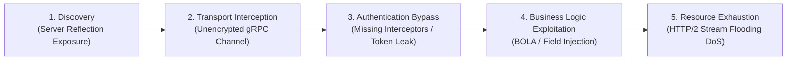

# 01. Introduction to gRPC & HTTP/2 Security

Modern high-performance cloud architectures, microservice meshes, and mobile backends rely heavily on **gRPC** (gRPC Remote Procedure Calls)—an open-source high-performance RPC framework originally developed by Google. 

While gRPC provides massive throughput improvements, lower latency, and strict interface contracts compared to traditional REST APIs, its reliance on **HTTP/2 multiplexed transport** and **binary Protocol Buffer serialization** shifts the security architecture dramatically.

---

## 1. gRPC Protocol Stack & Architecture

To audit or secure gRPC applications, security engineers must understand how gRPC layers over HTTP/2 and Protocol Buffers.

```
┌─────────────────────────────────────────────────────────────┐
│                    gRPC Service Logic                       │
├─────────────────────────────────────────────────────────────┤
│      Protocol Buffers (Binary Serialization & RPC Stubs)    │
├─────────────────────────────────────────────────────────────┤
│   HTTP/2 Protocol (Multiplexed Streams, HPACK, Framing)     │
├─────────────────────────────────────────────────────────────┤
│         TLS 1.3 / mTLS (Transport Layer Security)           │
├─────────────────────────────────────────────────────────────┤
│                     TCP / IP Network                        │
└─────────────────────────────────────────────────────────────┘
```

### A. HTTP/2 Framing & Stream Multiplexing

Unlike HTTP/1.1, which processes requests serially over individual TCP connections, HTTP/2 multiplexes multiple bidirectional request/response **streams** over a single long-lived TCP connection.

gRPC operations map directly to HTTP/2 frames:
* **HEADERS Frame**: Initiates an RPC call. Carries HTTP/2 headers and gRPC metadata (e.g., `:path: /package.ServiceName/MethodName`, `content-type: application/grpc`, `authorization: Bearer <token>`).
* **DATA Frame**: Contains the binary Protocol Buffer payload prefixed by a 5-byte gRPC frame header (1-byte compression flag + 4-byte big-endian message length).
* **RST_STREAM Frame**: Abruptly terminates a stream (used by gRPC to cancel RPCs or communicate transport errors).
* **SETTINGS Frame**: Configures stream flow control, max concurrent streams, and window sizes.

> [!WARNING]
> **HTTP/2 Complexity Multiplies Attack Vectors:** HTTP/2 state management is far more complex than HTTP/1.1. Vulnerabilities in HTTP/2 frame parsers—such as stream state desynchronization, stream ID exhaustion, or SETTINGS frame flooding—can cause complete server denial-of-service before gRPC application interceptors are even executed.

### B. Protocol Buffers (Protobuf) Wire Format

gRPC defaults to Protocol Buffers for structured data serialization. Protobuf encodes messages into compact binary streams using **Key-Value pairs (Tags)** rather than field names.

A Protobuf field tag on the wire is encoded as a variable-length integer (varint) combining the **Field Number** and the **Wire Type**:

```text
Header Byte = (Field Number << 3) | Wire Type
```

| Wire Type | Type Name | Meaning / Examples |
| :--- | :--- | :--- |
| **0** | `Varint` | `int32`, `int64`, `uint32`, `bool`, `enum` |
| **1** | `64-bit` | `fixed64`, `sfixed64`, `double` |
| **2** | `Length-delimited` | `string`, `bytes`, embedded messages, packed repeated fields |
| **5** | `32-bit` | `fixed32`, `sfixed32`, `float` |

Because field names (`username`, `account_balance`) do **not** exist in the serialized binary data, a client or WAF **cannot inspect or parse a gRPC payload without access to the compiled `.proto` schema definition**.

---

## 2. Technical Comparison Matrix: REST vs GraphQL vs gRPC

Understanding the architectural differences between API paradigms is critical when designing security controls:

| Feature / Dimension | REST APIs | GraphQL | gRPC |
| :--- | :--- | :--- | :--- |
| **Transport Layer** | HTTP/1.1 or HTTP/2 | HTTP/1.1 or HTTP/2 | HTTP/2 exclusively |
| **Data Payload Format** | JSON, XML, Form-data | JSON | Protocol Buffers (Binary) |
| **Payload Readability** | Human-readable (Plaintext) | Human-readable (Plaintext) | Binary (Requires `.proto` schema) |
| **Standard WAF Inspection** | Native support (Regex / Rules) | Native support (Query depth analysis) | Blind without gRPC-aware decoding |
| **Contract Enforcement** | Optional (OpenAPI/Swagger) | Strict (GraphQL Schema) | Strict (Protobuf `.proto` contract) |
| **Streaming Capabilities** | SSE, WebSockets (Separate) | Subscriptions (WebSockets) | Native Bidirectional HTTP/2 Streams |
| **Client Authentication** | Authorization Headers, Cookies | Authorization Headers, Cookies | gRPC Metadata (`authorization`), mTLS |
| **Server Reflection** | OpenAPI `/docs` endpoint | Introspection (`__schema`) | gRPC Reflection Service (`ServerReflection`) |

---

## 3. Root Causes of gRPC Security Vulnerabilities

gRPC security incidents generally stem from five core architectural root causes:

### 1. WAF & Security Monitoring Blind Spots
Standard edge Web Application Firewalls (WAFs) inspect incoming HTTP POST bodies for SQL injection, Command Injection, or XSS signatures using string matching and JSON parsers. When presented with `content-type: application/grpc`, standard WAFs see opaque binary streams and pass them uninspected, leaving application servers vulnerable if internal validation is missing.

### 2. The "Internal Network Trust" Fallacy
Organizations migrating from monoliths to gRPC microservices often assume that internal RPC traffic inside Kubernetes clusters or VPCs is inherently safe. Microservices are frequently deployed with plain unencrypted TCP (`InsecureChannel`) without mutual authentication (mTLS) or per-RPC identity tokens.

```
[Attacker inside VPC] ──(Plaintext gRPC)──► [Internal Payment Microservice] (Zero Auth Check!)
```

### 3. Production Reflection Exposure
The gRPC Server Reflection Protocol enables client CLI tools (`grpcurl`, `grpcui`) to discover available RPC services and method signatures at runtime. Leaving reflection enabled in production environment provides attackers with an exact blueprint of your internal data models, method parameters, and hidden administrative calls.

### 4. Absence of Native Input Sanitization
While Protocol Buffers enforce data types (e.g., ensuring a field is an integer or string), protobuf serializers **do not validate business constraints** (e.g., verifying that a string is a valid email, an integer is positive, or a string does not exceed 100 characters). Developers mistakenly treat type safety as input validation.

### 5. HTTP/2 Framing & Resource Exhaustion Vulnerabilities
Because gRPC maintains long-lived TCP connections with concurrent streams, malicious actors can exploit low-level HTTP/2 framing mechanics to exhaust CPU and memory allocations with minimal network bandwidth (e.g., HTTP/2 Rapid Reset attacks).

---

## 4. gRPC Threat Landscape & Microservice Attack Surfaces

Attackers targeting gRPC microservice environments typically follow a structured attack chain:



### Threat Breakdown:

1. **Reconnaissance & Schema Mining**:
   - Querying exposed `grpc.reflection.v1alpha.ServerReflection` to extract `.proto` definition schemas.
   - Brute-forcing package and service paths (e.g., `/admin.AdminService/DeleteUser`).

2. **MitM & Identity Spoofing**:
   - Eavesdropping on unencrypted internal gRPC network hops (`grpc.WithInsecure()`).
   - Forging identity headers when microservices fail to validate mTLS SPIFFE identities or JWT metadata context.

3. **Broken Object Level Authorization (BOLA / IDOR)**:
   - Calling gRPC methods directly with modified target IDs (e.g., changing `user_id: 1001` to `1002` in a `GetUserProfileRequest` message).

4. **Resource Exhaustion & Denial of Service**:
   - Opening thousands of unclosed HTTP/2 client-streaming calls.
   - Triggering heavy server-side processing via nested Protobuf messages.
   - Sending high-frequency HTTP/2 `RST_STREAM` frames.

---

*Next Chapter: [02. Core Security Concepts & Attack Vectors →](02-core-concepts.md)*
