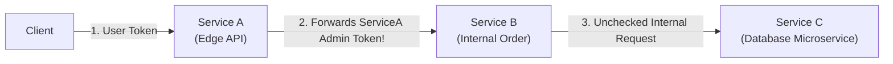
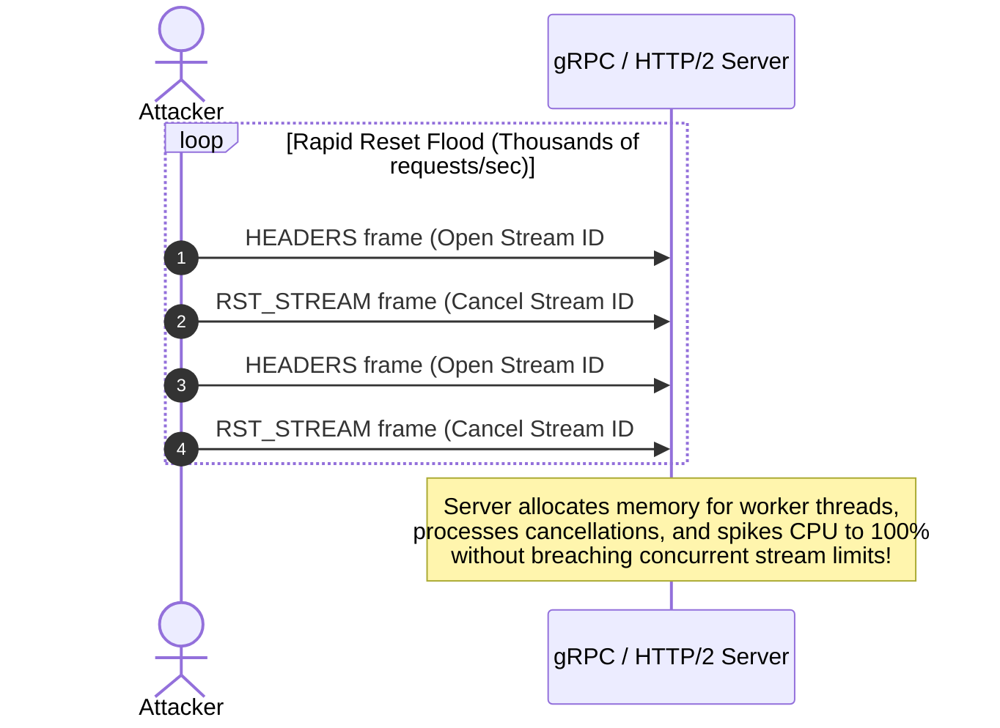

# 02. Core Security Concepts & Attack Vectors

This chapter explores the primary technical attack vectors targetting gRPC services and HTTP/2 transport infrastructure. Understanding these mechanisms allows security teams to identify vulnerabilities during code reviews and penetration testing.

---

## 1. gRPC Transport Security & mTLS Mechanics

gRPC supports two transport modes: **Insecure Channels** (plaintext over HTTP/2) and **TLS/mTLS-Secured Channels**.

```
❌ Insecure Setup:
Client ──[ Plaintext HTTP/2 over TCP (Port 50051) ]──► gRPC Server (Sniffable / Tamperable)

✅ Secure mTLS Setup:
Client ──[ TLS 1.3 Mutual Authentication (x509 Certs) ]──► gRPC Server (Encrypted + Authenticated)
```

### Attack Vector A: Insecure Channel Usage in Microservice Mesh
Developers frequently disable TLS for "internal service-to-service communication" to avoid managing certificates, relying instead on network perimeter controls:

```go
// VULNERABLE: Insecure transport connection in Go
conn, err := grpc.Dial("payment-service.internal:50051", grpc.WithInsecure())
```

**Security Impact:**
* **Eavesdropping:** Attackers positioned inside the network (e.g., via a compromised pod in a Kubernetes cluster) can sniff sensitive gRPC traffic, extracting credentials and API keys.
* **Man-in-the-Middle (MitM) Spoofing:** Attackers can ARP-spoof or poison DNS to redirect RPC calls to a rogue server.

### Attack Vector B: Disabled Certificate Verification & SAN Misconfigurations
When TLS is enabled, developers sometimes disable hostname verification or trust all root CAs to bypass self-signed certificate errors during development:

```python
# VULNERABLE: Python gRPC client trusting all certificates without hostname validation
credentials = grpc.ssl_channel_credentials(root_certificates=open("server.crt", "rb").read())
# If host verification is bypassed or wildcard CAs are trusted blindly, MitM is possible!
```

> [!CAUTION]
> **SPIFFE ID SAN Verification:** In microservice environments, standard Domain Name (DNS) verification is insufficient. Microservices must validate the **Subject Alternative Name (SAN)** URI format following the SPIFFE standard (e.g., `spiffe://cluster.local/ns/production/sa/payment-service`). Failing to validate the specific URI allows any valid certificate issued by the internal CA to impersonate any service!

---

## 2. Metadata & Context Propagation Vulnerabilities

In gRPC, call credentials, authentication tokens, and request context are transmitted via **Metadata**—a map of key-value pairs backed by HTTP/2 headers.

### Metadata Conventions:
* **ASCII Metadata:** Plain text key-value pairs (e.g., `authorization: Bearer <JWT>`).
* **Binary Metadata:** Keys ending with the `-bin` suffix (e.g., `user-context-bin`). gRPC automatically base64 encodes/decodes binary metadata values.

```
HEADERS Frame (HTTP/2):
:method: POST
:path: /orders.OrderService/CreateOrder
:scheme: https
content-type: application/grpc
authorization: Bearer eyJhbGciOi...
custom-trace-bin: A1B2C3D4E5==
```

### Attack Vector A: Downstream Context Leakage & Privileged Identity Forgery
In microservice chains (Service A `$\rightarrow$` Service B `$\rightarrow$` Service C), context propagation mistakes are common:



1. **Over-Forwarding Identity (Credential Leakage):** Service A receives a user request, validates it, and then calls Service B using Service A's own high-privilege system token instead of scoping down the context. If Service B is compromised, Service A's master token is leaked.
2. **Context Stripping (Implicit Trust):** Service A validates the client's JWT, strips the header, and calls Service B over plaintext. Service B assumes all incoming requests are pre-authorized, introducing a **Broken Function Level Authorization (BFLA)** flaw.

---

## 3. Server Reflection Abuse & Information Disclosure

gRPC supports the **Server Reflection Protocol** (`grpc.reflection.v1alpha.ServerReflection`). When registered on a server, clients can query the reflection service to dynamically discover exposed services, methods, and Protobuf message structures.

### Exploitation Mechanics:

An attacker uses tools like `grpcurl` or `grpcui` against a production endpoint:

```bash
# Query exposed services via reflection
grpcurl -insecure target-grpc-server.com:50051 list

# Output:
# admin.AdminService
# grpc.reflection.v1alpha.ServerReflection
# user.UserService

# Describe internal AdminService methods
grpcurl -insecure target-grpc-server.com:50051 describe admin.AdminService

# Output:
# service AdminService {
#   rpc DeleteUser ( admin.DeleteUserRequest ) returns ( admin.DeleteUserResponse );
#   rpc DumpDatabase ( admin.DumpRequest ) returns ( stream admin.DataChunk );
# }
```

> [!WARNING]
> **Schema Leaks Expose Hidden Attack Surfaces:** Server reflection reveals unlinked administrative endpoints, internal debug RPCs, and full message schema field names. An attacker can craft arbitrary binary RPC calls against discovered endpoints without needing access to `.proto` source files.

---

## 4. Protocol Buffer Parsing & Insecure Deserialization

Although Protocol Buffers are strongly typed, parsing binary Protobuf payloads introduces unique security vulnerabilities:

### A. Protobuf Field Smuggling (Unknown Field Retention)
In Proto3, when a receiving service parses a Protobuf binary payload containing field tags that are not present in its compiled `.proto` definition, the parser **retains these unknown fields in memory** and re-serializes them when forwarding the message downstream.

```
Attacker Payload ──► Intermediate Proxy (Proto Schema v1) ──► Internal Service (Proto Schema v2)
(Contains Tag 99)    (Ignores Tag 99, but keeps bytes)        (Parses Tag 99 as "is_admin=true"!)
```

**Attack Scenario:**
1. An attacker sends a gRPC payload containing an extra binary field tag (Tag 99: `is_admin = true`).
2. An intermediate API Gateway compiled with an older `.proto` schema (Schema v1) parses the request. It does not recognize Tag 99, but retains the raw bytes.
3. The Gateway forwards the message to a downstream backend service compiled with a newer schema (Schema v2).
4. The backend service parses Tag 99, triggering privilege escalation.

### B. Nested Message Stack Overflow (Recursion DoS)
Protobuf messages can contain nested sub-messages. If an attacker submits a maliciously crafted binary payload containing hundreds of deeply nested sub-message tags, the Protobuf deserializer will recursively allocate stack memory, resulting in a **Stack Overflow / Process Crash DoS**:

```protobuf
message Node {
  string name = 1;
  Node child = 2; // Recursive nested field
}
```

```
Binary Payload: Tag 2 -> Tag 2 -> Tag 2 -> Tag 2 ... (Depth 10,000) -> Stack Overflow!
```

---

## 5. HTTP/2 Transport & Stream Abuse (DoS Vectors)

Because gRPC relies on HTTP/2 stream state machines, attackers can target transport layer vulnerabilities to exhaust server resources.

### A. HTTP/2 Rapid Reset Attack (CVE-2023-44487)

In October 2023, a critical zero-day vulnerability in HTTP/2 implementations was disclosed. The attack exploits stream multiplexing and cancellation mechanics:



**Mechanics:**
1. The attacker opens a new HTTP/2 stream by sending a `HEADERS` frame.
2. The attacker **immediately** sends a `RST_STREAM` frame to cancel the request before the server can process it.
3. The server immediately cancels processing, but has already spent CPU and memory instantiating the stream context.
4. Because the stream was canceled, it does not count against the server's `SETTINGS_MAX_CONCURRENT_STREAMS` limit, allowing the attacker to repeat this loop millions of times per second from a single connection.

### B. Unbounded Streaming RPC Memory Exhaustion
gRPC supports four invocation paradigms:

1. **Unary RPC:** Single Request `$\rightarrow$` Single Response.
2. **Server Streaming RPC:** Single Request `$\rightarrow$` Stream of Responses.
3. **Client Streaming RPC:** Stream of Requests `$\rightarrow$` Single Response.
4. **Bidirectional Streaming RPC:** Stream of Requests `$\leftrightarrow$` Stream of Responses.

```
Client Streaming Attack:
Attacker ──[ Send 1,000,000 DATA frames without closing stream ]──► gRPC Server (Out-Of-Memory Crash)
```

If a client-streaming RPC accumulates incoming messages in memory without enforcing strict size or count limits, an attacker can open a stream and transmit gigabytes of binary data, causing an Out-of-Memory (OOM) killer event on the backend host.

---

*Next Chapter: [03. gRPC Attack Scenarios & Multi-Language Code Examples →](03-code-examples.md)*
