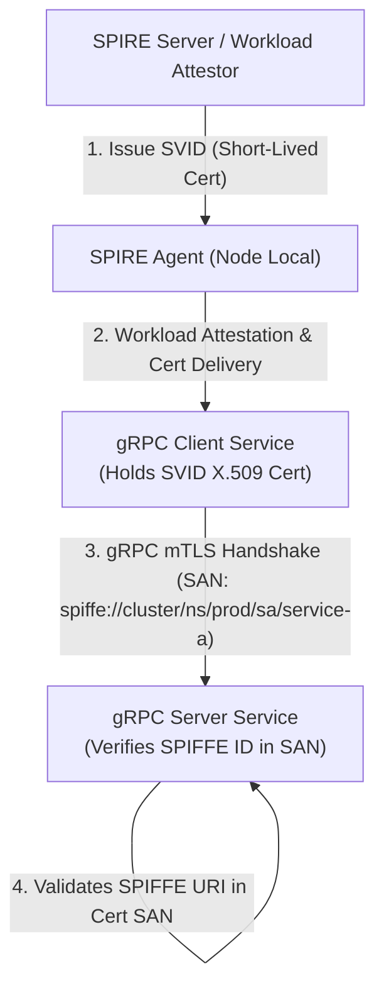

# 04. Production Defenses & gRPC Hardening

Deploying gRPC microservices securely requires defense-in-depth: combining transport identity, interceptor policy enforcement, automated schema validation, and gateway-level rate limiting.

---

## 1. Identity & Zero-Trust Access Control (mTLS & SPIFFE/SPIRE)

Traditional IP-based firewall rules fail in dynamic container environments (Kubernetes, ECS). Microservices require **cryptographic workload identity** verified on every connection.



### SPIFFE ID Validation Rules:
1. **Never match raw Subject Common Names (CN).** CNs are deprecated and do not support dynamic workload URI SANs.
2. **Validate the complete URI SAN string**:
   ```
   spiffe://<trust-domain>/ns/<namespace>/sa/<service-account-name>
   ```
3. **Automate Certificate Rotation:** SPIFFE Verifiable Identity Documents (SVIDs) should have short lifetimes (e.g., 1 hour to 12 hours) to render stolen certificates useless.

---

## 2. Hardened Interceptor Architecture (Interceptor Chains)

In production gRPC servers, request processing must pass through a strict ordered sequence of unary and streaming interceptors before reaching business handlers:

```
Incoming Request ──► [1. Rate Limiting] ──► [2. mTLS Identity Check] ──► [3. JWT AuthN] ──► [4. OPA AuthZ Policy] ──► [5. Protobuf Field Validator] ──► Business Handler
```

### Fine-Grained Authorization using Open Policy Agent (OPA)

Instead of hardcoding authorization checks inside service methods, delegate policy decisions to OPA:

#### Example Rego Policy (`grpc_authz.rego`):
```rego
package grpc.authz

default allow = false

# Allow users to call GetUserProfile ONLY for their own user ID
allow {
    input.grpc_method == "/user.UserService/GetUserProfile"
    input.claims.role == "user"
    input.request.user_id == input.claims.sub
}

# Allow Admins to call any endpoint
allow {
    input.claims.role == "admin"
}
```

---

## 3. Automated Protobuf Validation (`buf validate` / `protoc-gen-validate`)

To prevent malformed data, injection payloads, and business logic violations, enforce schema constraints directly in `.proto` files using **`buf validate`** rules.

### Hardened `.proto` Definition (`order_service.proto`):

```protobuf
syntax = "proto3";

package order.v1;

import "buf/validate/validate.proto";

service OrderService {
  rpc CreateOrder (CreateOrderRequest) returns (CreateOrderResponse);
}

message CreateOrderRequest {
  // SECURE: Enforce UUID v4 string format
  string order_id = 1 [(buf.validate.field).string.uuid = true];

  // SECURE: Enforce email pattern validation
  string customer_email = 2 [(buf.validate.field).string.email = true];

  // SECURE: Strict integer boundary validation (Must be between 1 and 100 items)
  int32 quantity = 3 [(buf.validate.field).int32 = {gte: 1, lte: 100}];

  // SECURE: Precision bounds on transaction amount (Strictly positive)
  double amount_usd = 4 [(buf.validate.field).double.gt = 0.0];

  // SECURE: String length bounds to prevent memory consumption attacks
  string shipping_address = 5 [(buf.validate.field).string = {min_len: 10, max_len: 250}];
}

message CreateOrderResponse {
  bool success = 1;
  string status_message = 2;
}
```

> [!TIP]
> **Automated Code Generation:** Compile `.proto` files with `protoc-gen-buf-validate` to automatically generate validation code in Go, C++, Python, and Java. Interceptors can then invoke `.Validate()` automatically on every incoming message without manual `if` checks!

---

## 4. Network & Proxy-Level Hardening (Envoy Proxy Config)

Deploying **Envoy Proxy** in front of gRPC services provides edge security, gRPC-Web translation, rate limiting, and reflection blocking.

### Hardened Envoy Configuration Snippet (`envoy.yaml`):

```yaml
static_resources:
  listeners:
  - name: grpc_edge_listener
    address:
      socket_address: { address: 0.0.0.0, port_value: 10000 }
    filter_chains:
    - filters:
      - name: envoy.filters.network.http_connection_manager
        typed_config:
          "@type": type.googleapis.com/envoy.extensions.filters.network.http_connection_manager.v3.HttpConnectionManager
          stat_prefix: grpc_hcm
          codec_type: HTTP2 # Enforce HTTP/2 transport
          
          # SECURE: Harden HTTP/2 protocol settings against DoS
          http2_protocol_options:
            max_concurrent_streams: 100
            initial_stream_window_size: 65536
            initial_connection_window_size: 1048576

          route_config:
            name: local_route
            virtual_hosts:
            - name: backend
              domains: ["*"]
              routes:
              
              # SECURE: Block Server Reflection Protocol externally!
              - match: { prefix: "/grpc.reflection.v1alpha.ServerReflection" }
                direct_response: { status: 403, body: "Server Reflection Access Denied" }

              # Allow standard gRPC service routes
              - match: { prefix: "/order.v1.OrderService/" }
                route: { cluster: grpc_order_service }

          http_filters:
          # SECURE: Enable Envoy gRPC Web Filter for browser compatibility
          - name: envoy.filters.http.grpc_web
            typed_config:
              "@type": type.googleapis.com/envoy.extensions.filters.http.grpc_web.v3.GrpcWeb
          # SECURE: Enable Envoy gRPC JSON Transcoder / Rate Limiting
          - name: envoy.filters.http.router
            typed_config:
              "@type": type.googleapis.com/envoy.extensions.filters.http.router.v3.Router
```

---

## 5. HTTP/2 Transport & Stream Protections

To protect gRPC services from transport-layer resource exhaustion (such as CVE-2023-44487), configure low-level HTTP/2 runtime flags across your infrastructure:

| Configuration Parameter | Recommended Value | Security Purpose |
| :--- | :--- | :--- |
| **`MAX_CONCURRENT_STREAMS`** | `100` – `250` | Prevents connection-level stream flooding DoS. |
| **`MAX_HEADER_LIST_SIZE`** | `8192` (8 KB) | Mitigates HPACK header compression memory attacks. |
| **`MAX_RECEIVE_MESSAGE_SIZE`** | `4194304` (4 MB) | Blocks huge Protobuf payload memory allocation. |
| **`HTTP2_PING_TIMEOUT`** | `10s` – `20s` | Terminates half-open / dead connections. |
| **`MIN_RECVMSS` / Keepalive** | `Enforce client PING interval > 5s` | Blocks KeepAlive PING flood DoS. |

---

*Next Chapter: [05. gRPC Security Tools & Auditing Frameworks →](05-tools.md)*
