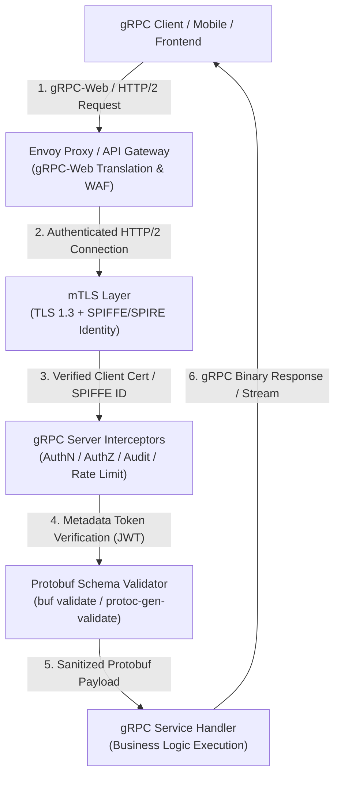

# gRPC Security Masterclass

Welcome to the **gRPC Security Masterclass**, an authoritative, production-grade guide designed for Application Security Engineers, Security Architects, and Cloud-Native Backend Developers.

> [!IMPORTANT]
> **The Paradigm Shift of RPC Security:** Unlike traditional REST APIs that send human-readable JSON over standard HTTP/1.1 endpoints, gRPC leverages binary Protocol Buffers (protobuf) multiplexed over HTTP/2 streams. Standard Web Application Firewalls (WAFs) and traditional HTTP proxies are often completely blind to gRPC payloads unless specifically configured with Protobuf schema awareness and HTTP/2 stream inspection engines.

---

## Core Architecture & Security Lifecycle

The security of a modern gRPC microservices architecture relies on transport encryption, identity attestation, context metadata verification, and field validation across the entire request lifecycle:

---

## Module Roadmap & Navigation

| Chapter | Focus Area | Core Topics Covered | Practical Artifacts |
| :--- | :--- | :--- | :--- |
| **[01 - Introduction](01-introduction.md)** | Architecture & Threat Landscape | gRPC & HTTP/2 framing, Protobuf serialization wire format, Root causes of gRPC flaws, Threat landscape | Microservice Threat Map, REST vs gRPC Security Matrix |
| **[02 - Core Concepts](02-core-concepts.md)** | Attack Vectors & Vulnerabilities | mTLS bypasses, Metadata token leakage, Protobuf field injection, Server reflection disclosure, HTTP/2 DoS | Exploit Mechanics & Binary Payload Dissection |
| **[03 - Code Examples](03-code-examples.md)** | Multi-Language Implementation | Vulnerable vs Secure code side-by-side in Go, Python, Node.js, and Java | Runnable Code Snippets & Hardened Interceptors |
| **[04 - Production Defenses](04-defenses.md)** | Architecture & Mitigations | mTLS with SPIFFE/SPIRE, Interceptor auth chains, Protobuf validation rules, Envoy proxy policy | Envoy Hardening Configs & `buf validate` Schemas |
| **[05 - Security Tools](05-tools.md)** | Testing & Auditing Frameworks | `grpcurl`, `grpcui`, `ghz` DoS testing, Protobuf linters (`buf`), Semgrep SAST rules | CLI Commands, Audit Scripts & Custom SAST Rules |
| **[06 - Hands-on Lab](06-labs.md)** | Offensive & Defensive Lab | Exploiting unauthenticated gRPC endpoints, Reflection exposure, BOLA, and negative transfer bugs | Self-Contained Python Lab & Exploit Script |
| **[07 - References](07-references.md)** | Standards, Specs & CVEs | CVE-2023-44487 (HTTP/2 Rapid Reset), CVE-2021-3616, OWASP API Top 10 mapping, RFC 7540/9113 | Security Standards Matrix & Case Studies |

---

## Prerequisites

To get the most out of this masterclass, you should have:
- **Networking & HTTP/2 Fundamentals:** Familiarity with TLS certificates, HTTP headers, stream multiplexing, and binary protocols.
- **Protocol Buffers Basics:** Understanding of `.proto` definition files, messages, services, and code generation.
- **Programming Knowledge:** Capability to inspect and write backend code in Go, Python, Node.js, or Java.

---

## Learning Objectives

Upon completing this guide, you will be able to:
1. **Analyze gRPC & HTTP/2 Attack Surfaces:** Identify security risks introduced by HTTP/2 framing, multiplexing, binary protobuf serialization, and gRPC reflection services.
2. **Execute & Defend Against gRPC Exploits:** Audit microservices for mTLS bypasses, unauthorized RPC calls, BOLA flaws, and stream exhaustion attacks (e.g., HTTP/2 Rapid Reset).
3. **Build Hardened Multi-Language Interceptors:** Implement enterprise-ready gRPC interceptors for authentication, authorization, rate limiting, and structured logging in Go, Python, Node.js, and Java.
4. **Implement Automated Protobuf Validation:** Enforce strict field-level constraints using `buf validate` and `protoc-gen-validate` to eliminate injection and malformed message vulnerabilities.
5. **Audit Infrastructure with Security Tooling:** Utilize `grpcurl`, `grpcui`, `ghz`, `buf`, and Semgrep to scan, test, and harden gRPC services in continuous integration pipelines.
