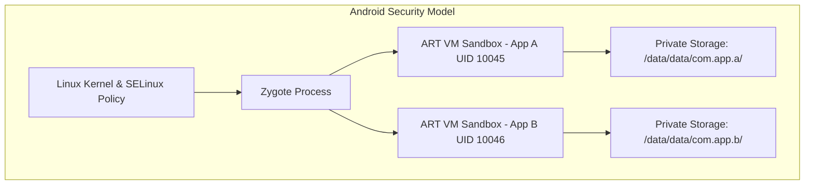
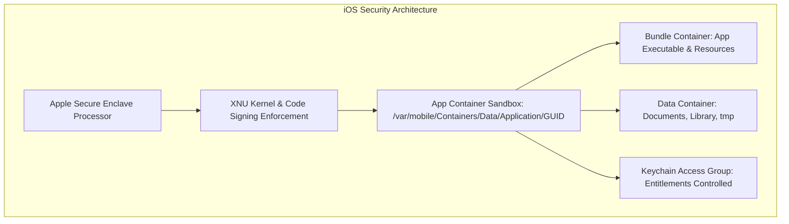

# 01 - Introduction to Mobile Security

> [!TIP]
> **Production Rule:** Mobile application binaries must be treated as untrusted zero-trust endpoints. Any business logic, secret key, or authentication check that resides exclusively on the client device can and will be bypassed by a skilled adversary.

---

## The Hostile Mobile Environment

Web applications execute client code inside standardized web browser sandboxes while keeping primary application logic, secrets, and data persistence behind secure enterprise firewalls. Mobile applications reverse this paradigm: compiled application binaries (`.apk`/`.aab` for Android, `.ipa` for iOS) are deployed directly onto hardware fully owned and controlled by the end user.

When a device is in the physical or administrative control of an attacker (or when an attacker compromises the device via malware or root/jailbreak exploits), the client environment becomes hostile. 

```mermaid
graph TD
    subgraph Hostile Mobile Device Environment
        A[Attacker / Device Owner] --> B[Root / Jailbreak Access]
        B --> C[Frida / Dynamic Hooking]
        B --> D[Decompilation & Disassembly]
        B --> E[Network Proxying / MitM]
        
        subgraph Mobile App Binary
            F[Local Encrypted Storage]
            G[API Credentials & Secrets]
            H[Authentication Logic]
        </div>
    </div>
    
    C -->|Override Return Values| H
    D -->|Extract Hardcoded Keys| G
    E -->|Intercept API Tokens| F
```

### Threat Capabilities on Compromised Mobile Devices
*   **Static Binary Analysis:** Attackers decompile Dalvik Executable (`.dex`) files back into readable Java/Kotlin source code using tools like JADX, or disassemble Mach-O binaries using Ghidra and Hopper to inspect logic, internal routes, and embedded credentials.
*   **Dynamic Runtime Instrumentation:** Using frameworks such as Frida and Objection, attackers inject custom JavaScript into running app processes to hook native libraries (e.g., C/C++ `.so` files) or managed functions, alter variable values in real time, and bypass authentication checks.
*   **Storage Access:** Root/jailbreak privileges allow attackers to bypass OS permission checks, reading raw `SharedPreferences`, `NSUserDefaults`, internal SQLite databases, and unencrypted file caches.
*   **Network Interception:** Attackers install custom root certificates into the OS trust store and use proxy tools (Burp Suite, OWASP ZAP, Proxyman) to capture, inspect, and replay encrypted HTTPS/TLS traffic.

---

## OWASP Mobile Top 10 (2024)

The OWASP Mobile Top 10 categorizes the most critical security risks facing mobile applications:

| Risk Category | Vulnerability Name | Technical Impact & Attack Surface |
| :--- | :--- | :--- |
| **M1** | **Improper Credential Usage** | Hardcoding API keys, AWS credentials, or OAuth client secrets inside binary source code or config files. |
| **M2** | **Inadequate Supply Chain Security** | Incorporating vulnerable third-party SDKs, malicious dependencies, or compromised build pipelines. |
| **M3** | **Insecure Authentication/Authorization** | Relying solely on local biometrics without server validation; fail-open local auth checks. |
| **M4** | **Insufficient Input/Output Validation** | SQL injection in local SQLite databases, XSS in WebViews, and Path Traversal in File Providers. |
| **M5** | **Insecure Communication** | Transmitting data over cleartext HTTP, trusting user-installed CAs, or failing to validate TLS certificates. |
| **M6** | **Inadequate Privacy Controls** | Logging personally identifiable information (PII), excessive permissions, leaking tokens to third-party analytics SDKs. |
| **M7** | **Insufficient Binary Protection** | Omitting code obfuscation (R8/ProGuard), leaving debug symbols intact, allowing easy decompilation. |
| **M8** | **Security Misconfiguration** | Enabling debug flags (`android:debuggable="true"`), weak Network Security Config, exposed exported components. |
| **M9** | **Insecure Data Storage** | Storing session tokens, PII, or credentials in plaintext files, unencrypted SQLite, or system backups. |
| **M10** | **Insufficient Cryptography** | Utilizing weak algorithms (DES, MD5, RC4), ECB cipher mode, or static, non-rotated encryption keys. |

---

## Mobile Architecture & Sandboxing Basics

### Android Architecture & Security Model

Android is built on top of a modified Linux kernel. Security relies heavily on Linux User IDs (UIDs) and Mandatory Access Control (MAC) via SELinux.



#### 1. UID Separation & Sandboxing
During installation, the Android package manager assigns each application a unique Linux User ID (e.g., `app_a` gets UID `10045`, `app_b` gets UID `10046`). Files created by App A reside under `/data/data/com.app.a/` with file permissions set to `0600` or `0700` owned by `10045`. Linux file permission checks enforce that App B cannot read App A's directory.

#### 2. Android Runtime (ART) & Zygote
Applications execute inside the ART virtual machine. During OS boot, the `Zygote` process starts, loads system framework classes, and warms up the runtime. When an app launches, `Zygote` forks a new process for the application, dropping privileges to the assigned app UID.

#### 3. IPC & Component Model Attack Surface
Android applications consist of four core component types defined in `AndroidManifest.xml`:
*   **Activities:** Screen UI views. Exposing an activity via `android:exported="true"` without permission checks allows malicious third-party apps on the same device to launch it.
*   **Services:** Background processing components. Unprotected services can be bound to or invoked by unauthorized apps.
*   **Broadcast Receivers:** Event listeners. Unprotected receivers can receive spoofed system or custom intent broadcasts.
*   **Content Providers:** Database abstraction layer. Insecurely exported content providers are frequent targets for SQL injection and file path traversal vulnerabilities.

---

### iOS Architecture & Security Model

iOS is built on the XNU kernel (Mach + BSD). Security is enforced at hardware, kernel, and system levels.



#### 1. Mandatory Code Signing
Every executable line of code running on non-jailbroken iOS devices must be cryptographically signed by an Apple-issued certificate. The kernel validates signature hashes page-by-page at runtime. Dynamically loading executable code or executing unverified memory pages is blocked.

#### 2. App Container Sandboxing
Each iOS app runs inside a sandbox managed by the `sandbox_init` kernel extension. The application is assigned a unique GUID directory structure:
*   **Bundle Container:** Read-only directory containing the application Mach-O binary and assets.
*   **Data Container:** Application sandbox containing `Documents/`, `Library/` (including `Preferences/`), and `tmp/`.
*   **Keychain Access Group:** Encrypted shared storage protected by Apple's `Security.framework` and hardware Secure Enclave.

#### 3. iOS IPC Attack Surfaces
*   **Custom URL Schemes (`myapp://`):** If an app registers a custom scheme, any app on the device can invoke it. Input received in `openURL` must be strictly validated.
*   **Universal Links:** Domain-verified HTTPS links that open the app directly. More secure than custom URL schemes because ownership is verified via `apple-app-site-association` files on the domain.
*   **App Extensions:** Share extensions or Widget extensions that communicate with the host app via Shared App Groups.

---

## Primary Root Causes of Mobile Vulnerabilities

1.  **Implicit Client-Side Trust:** Engineering teams often assume client code compiled into native bytecode cannot be analyzed or modified. This leads to placing sensitive authorization checks, payment validation logic, or key generation code entirely on the device.
2.  **Insecure Inter-Process Communication (IPC):** Exporting Android components or accepting unvalidated iOS URL scheme parameters allows local malicious apps installed on the same device to initiate privileged actions.
3.  **Failure to Utilize Hardware Security Modules:** Relying on software encryption routines or plaintext storage instead of hardware-backed enclaves (Android KeyStore TEE/StrongBox, iOS Secure Enclave).
4.  **Absence of Server-Side Attestation:** Depending on local checks for root/jailbreak or tampering instead of cryptographically validating device and app integrity using backend attestation endpoints.
