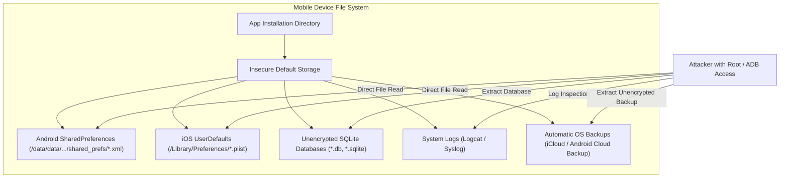
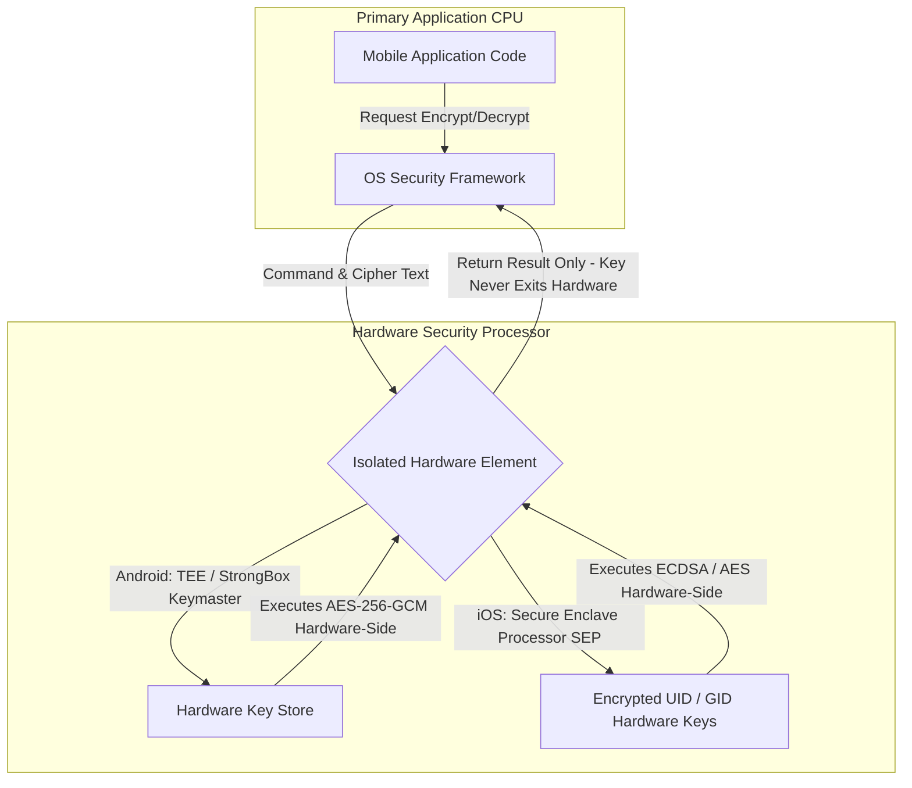

# 02 - Mobile Data Storage and Cryptography

> [!IMPORTANT]
> **Core Security Requirement (OWASP MASVS-STORAGE & MASVS-CRYPTO):** Sensitive data (authentication tokens, PII, cryptographic keys) must never be written to local storage in plaintext. All encryption keys must be generated inside and managed by hardware security modules (TEE, StrongBox, or Secure Enclave).

---

## Data Storage Vulnerabilities & Attack Vectors

Mobile operating systems provide convenient client-side storage mechanisms. However, default storage implementations write data in unencrypted format to disk files. If an attacker extracts a device backup, gains root/jailbreak access, or exploits a local path traversal vulnerability, these storage locations are immediately exposed.



### Common Attack Vectors
1.  **Plaintext Preferences:** `SharedPreferences` (Android) and `UserDefaults` (iOS) store key-value pairs as unencrypted XML or XML property list (`.plist`) files on disk.
2.  **Unencrypted Local Databases:** SQLite databases created with standard Android/iOS database helpers write data pages in raw format.
3.  **System Log Leaks:** Debug statements (`Log.d()`, `NSLog()`, `print()`) output messages to system ring buffers. Any app with `READ_LOGS` permission on older Android versions, or an attacker connected via USB/ADB, can capture sensitive tokens and PII.
4.  **Side-Channel Data Exposure:**
    *   **OS Auto-Backups:** Android Auto-Backup and iOS iCloud backups include app sandbox directories by default unless explicitly configured otherwise.
    *   **App Switcher Snapshots:** When an app moves to the background, the OS captures a high-resolution screenshot of the UI and saves it to the file system.
    *   **Custom Keyboard Caches:** Auto-correct engines cache user text input unless text fields are flagged as sensitive passwords.

---

## Hardware-Backed Key Storage Architecture

To prevent key extraction even on compromised devices, modern mobile platforms use specialized, isolated hardware microprocessors.



### Android KeyStore System (TEE & StrongBox)
*   **Trusted Execution Environment (TEE):** An isolated core within the main SoC running a secure OS (e.g., Trusty OS). Cryptographic keys generated in TEE never enter main CPU memory.
*   **StrongBox Keymaster:** A dedicated hardware Security Module (HSM) with physically separate CPU, RAM, and tamper-resistant storage (available on modern devices).
*   **Cryptographic Primitives:** Supports AES-GCM, AES-CBC, HMAC, RSA, and EC keys with hardware-enforced access policies (e.g., requiring user biometric authentication before key usage).

### iOS Secure Enclave Processor (SEP)
*   **Architecture:** A coprocessor fabricated into Apple SoCs equipped with hardware-encrypted RAM and a dedicated Secure Boot ROM.
*   **Hardware Unique ID (UID):** An AES-256 key fused into the SEP silicon during manufacturing. It cannot be read by software or Apple. All Keychain items configured with Secure Enclave protection are tied to this UID and the user's passcode.
*   **Keychain Services API:** Interface for storing small sensitive payloads (passwords, tokens, keys) with fine-grained access control flags (`kSecAttrAccessibleWhenUnlockedThisDeviceOnly`).

---

## Code Implementation Patterns

### Android Data Storage: Vulnerable vs. Secure

#### Vulnerable Pattern (Plaintext SharedPreferences)
```kotlin
// INSECURE: Data saved in plaintext XML file under /data/data/<package>/shared_prefs/
val sharedPref = context.getSharedPreferences("UserSession", Context.MODE_PRIVATE)
val editor = sharedPref.edit()
editor.putString("auth_token", "eyJhbGciOiJIUzI1NiIsInR5cCI6IkpXVCJ9...")
editor.putString("user_pin", "4921")
editor.apply()
```

#### Secure Pattern (EncryptedSharedPreferences with Android KeyStore)
```kotlin
import androidx.security.crypto.EncryptedSharedPreferences
import androidx.security.crypto.MasterKey

// SECURE: Uses Android KeyStore backed by TEE/StrongBox to encrypt keys and values
fun getSecurePreferences(context: Context): SharedPreferences {
    // Step 1: Generate or retrieve a hardware-backed Master Key using AES-256-GCM
    val masterKey = MasterKey.Builder(context)
        .setKeyScheme(MasterKey.KeyScheme.AES256_GCM)
        .setRequestAuthorizeByBiometrics(false)
        .build()

    // Step 2: Initialize EncryptedSharedPreferences
    // Keys are encrypted with AES-256 SIV, values with AES-256 GCM
    return EncryptedSharedPreferences.create(
        context,
        "secure_user_session",
        masterKey,
        EncryptedSharedPreferences.PrefKeyEncryptionScheme.AES256_SIV,
        EncryptedSharedPreferences.PrefValueEncryptionScheme.AES256_GCM
    )
}

fun saveSessionToken(context: Context, token: String) {
    val securePrefs = getSecurePreferences(context)
    securePrefs.edit().putString("auth_token", token).apply()
}
```

#### Secure Pattern: Hardware KeyStore Key Generation with Biometric Requirement
```kotlin
import android.security.keystore.KeyGenParameterSpec
import android.security.keystore.KeyProperties
import java.security.KeyStore
import javax.crypto.KeyGenerator
import javax.crypto.SecretKey

fun generateBiometricProtectedKey(keyAlias: String) {
    val keyGenerator = KeyGenerator.getInstance(
        KeyProperties.KEY_ALGORITHM_AES, 
        "AndroidKeyStore"
    )
    
    val keyGenSpec = KeyGenParameterSpec.Builder(
        keyAlias,
        KeyProperties.PURPOSE_ENCRYPT or KeyProperties.PURPOSE_DECRYPT
    )
    .setBlockModes(KeyProperties.BLOCK_MODE_GCM)
    .setEncryptionPaddings(KeyProperties.ENCRYPTION_PADDING_NONE)
    .setKeySize(256)
    // Require biometric authentication within 30 seconds of key use
    .setUserAuthenticationRequired(true)
    .setUserAuthenticationParameters(
        30, 
        KeyProperties.AUTH_BIOMETRIC_STRONG
    )
    .setInvalidatedByBiometricEnrollment(true)
    .build()

    keyGenerator.init(keyGenSpec)
    keyGenerator.generateKey()
}
```

---

### iOS Data Storage: Vulnerable vs. Secure

#### Vulnerable Pattern (Plaintext UserDefaults)
```swift
// INSECURE: Data saved in plaintext property list under /Library/Preferences/com.app.plist
UserDefaults.standard.set("eyJhbGciOiJIUzI1NiIsInR5cCI6IkpXVCJ9...", forKey: "auth_token")
UserDefaults.standard.synchronize()
```

#### Secure Pattern (iOS Keychain Services API)
```swift
import Foundation
import Security

struct SecureKeychainManager {
    
    static func saveToken(account: String, token: String) -> Bool {
        guard let data = token.data(using: .utf8) else { return false }
        
        // Define strict access query using kSecAttrAccessibleWhenUnlockedThisDeviceOnly
        let query: [String: Any] = [
            kSecClass as String: kSecClassGenericPassword,
            kSecAttrAccount as String: account,
            kSecValueData as String: data,
            // Strict Protection: Accessible only when unlocked, excluded from iTunes/iCloud backups
            kSecAttrAccessible as String: kSecAttrAccessibleWhenUnlockedThisDeviceOnly
        ]
        
        // Delete existing item if present
        SecItemDelete(query as CFDictionary)
        
        // Add new item to Secure Keychain
        let status = SecItemAdd(query as CFDictionary, nil)
        return status == errSecSuccess
    }
    
    static func getToken(account: String) -> String? {
        let query: [String: Any] = [
            kSecClass as String: kSecClassGenericPassword,
            kSecAttrAccount as String: account,
            kSecReturnData as String: kCFBooleanTrue!,
            kSecMatchLimit as String: kSecMatchLimitOne
        ]
        
        var dataTypeRef: AnyObject?
        let status = SecItemCopyMatching(query as CFDictionary, &dataTypeRef)
        
        if status == errSecSuccess, let data = dataTypeRef as? Data {
            return String(data: data, encoding: .utf8)
        }
        return nil
    }
}
```

---

### Multi-Language Backend Verification (Python / Node.js)

When receiving encrypted payloads or attestation tokens from mobile clients, backend APIs must validate hardware signatures or decrypt AES-256-GCM tokens cleanly.

#### Python (AES-256-GCM Payload Decryption)
```python
import base64
from cryptography.hazmat.primitives.ciphers.aead import AESGCM

def decrypt_mobile_payload(key_b64: str, nonce_b64: str, ciphertext_b64: str, tag_b64: str) -> str:
    """
    Decrypts AES-256-GCM payload generated by mobile Secure Enclave / KeyStore.
    """
    key = base64.b64decode(key_b64)
    nonce = base64.b64decode(nonce_b64)
    ciphertext = base64.b64decode(ciphertext_b64)
    tag = base64.b64decode(tag_b64)
    
    # Cryptography package expects ciphertext + tag combined
    aesgcm = AESGCM(key)
    decrypted_bytes = aesgcm.decrypt(nonce, ciphertext + tag, associated_data=None)
    return decrypted_bytes.decode('utf-8')
```

#### Node.js (AES-256-GCM Payload Decryption)
```javascript
const crypto = require('crypto');

function decryptMobilePayload(keyBase64, nonceBase64, ciphertextBase64, tagBase64) {
    const key = Buffer.from(keyBase64, 'base64');
    const nonce = Buffer.from(nonceBase64, 'base64');
    const ciphertext = Buffer.from(ciphertextBase64, 'base64');
    const tag = Buffer.from(tagBase64, 'base64');

    const decipher = crypto.createDecipheriv('aes-256-gcm', key, nonce);
    decipher.setAuthTag(tag);

    let decrypted = decipher.update(ciphertext, null, 'utf8');
    decrypted += decipher.final('utf8');
    return decrypted;
}
```

---

## Mitigating Side-Channel Leaks

### 1. Stripping System Logs in Release Builds

#### Android (ProGuard / R8 Rules)
Add the following directives to `proguard-rules.pro` to remove `android.util.Log` calls during compilation:

```proguard
-assumenosideeffects class android.util.Log {
    public static boolean isLoggable(java.lang.String, int);
    public static int v(...);
    public static int d(...);
    public static int i(...);
    public static int w(...);
    public static int e(...);
}
```

#### iOS (Swift Logging Hygiene)
Use `#if DEBUG` macro wrappers or custom wrapper frameworks to enforce zero release logging:

```swift
func secureLog(_ message: String) {
    #if DEBUG
    print("[DEBUG]: \(message)")
    #endif
}
```

---

### 2. Disabling Automatic OS Cloud Backups

#### Android: Disabling Auto Backup (`AndroidManifest.xml`)
```xml
<application
    android:allowBackup="false"
    android:fullBackupContent="false">
    <!-- Application components -->
</application>
```

#### iOS: Excluding Specific Files from iCloud Backup
```swift
func excludeFileFromBackup(fileURL: URL) {
    var resourceURL = fileURL
    var values = URLResourceValues()
    values.isExcludedFromBackup = true
    try? resourceURL.setResourceValues(values)
}
```

---

### 3. Preventing UI Exposure in App Switcher & Screenshots

#### Android (`FLAG_SECURE`)
Add `FLAG_SECURE` to window attributes in `onCreate()` to prevent screenshots and obscure app preview in recent tasks list:

```kotlin
override fun onCreate(savedInstanceState: Bundle?) {
    super.onCreate(savedInstanceState)
    window.setFlags(
        WindowManager.LayoutParams.FLAG_SECURE,
        WindowManager.LayoutParams.FLAG_SECURE
    )
    setContentView(R.layout.activity_main)
}
```

#### iOS (Blur Screen on Backgrounding)
In `AppDelegate.swift` or `SceneDelegate.swift`, overlay a blurred view when entering the background:

```swift
func sceneWillResignActive(_ scene: UIScene) {
    let blurEffect = UIBlurEffect(style: .dark)
    let blurView = UIVisualEffectView(effect: blurEffect)
    blurView.frame = window?.bounds ?? CGRect.zero
    blurView.tag = 999
    window?.addSubview(blurView)
}

func sceneDidBecomeActive(_ scene: UIScene) {
    window?.viewWithTag(999)?.removeFromSuperview()
}
```
