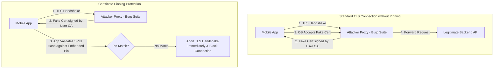

# 03 - Network Security & SSL Pinning

> [!WARNING]
> **Production Requirement (OWASP MASVS-NETWORK):** Standard TLS certificate validation relies on the operating system's Trust Store containing over 100 root Certificate Authorities (CAs). On compromised devices or untrusted Wi-Fi networks, an attacker who installs a custom CA certificate can intercept, view, and tamper with all HTTPS traffic unless Certificate Pinning is explicitly enforced.

---

## Mobile Network Threat Landscape & MitM Mechanics

When a mobile application initiates an HTTPS connection, the OS validates the remote server's certificate chain against trusted Root CAs installed on the device. An attacker can intercept this communication using a Man-in-the-Middle (MitM) attack vector:

1.  **Rogue Wi-Fi Access Points:** The attacker operates a Wi-Fi hotspot and spoofs DNS queries.
2.  **User-Installed Root Certificates:** On Android and iOS, attackers (or automated proxy tools like Burp Suite, Charles Proxy, and Proxyman) trick the user or administrator into installing a custom Root CA certificate.
3.  **TLS Interception Proxy:** The proxy intercepts the client's TLS handshake, dynamically issues a signed certificate for `api.example.com` using the installed fake Root CA, and establishes a separate TLS session with the real backend.



---

## Declarative OS Network Security Policies

Both mobile platforms provide declarative, XML-based configuration files to restrict unencrypted HTTP traffic and specify trusted Certificate Authorities.

### Android: Network Security Configuration (`network_security_config.xml`)

Location: `res/xml/network_security_config.xml` (Referenced in `AndroidManifest.xml` via `android:networkSecurityConfig="@xml/network_security_config"`).

```xml
<?xml version="1.0" encoding="utf-8"?>
<network-security-config>
    <!-- Base Configuration: Restrict cleartext HTTP across the entire app -->
    <base-config cleartextTrafficPermitted="false">
        <trust-anchors>
            <!-- Trust ONLY pre-installed System Root CAs. Reject User-Installed CAs -->
            <certificates src="system" />
        </trust-anchors>
    </base-config>

    <!-- Specific Domain Rules with Certificate Pinning -->
    <domain-config cleartextTrafficPermitted="false">
        <domain includeSubdomains="true">api.example.com</domain>
        <pin-set expiration="2027-01-01">
            <!-- Primary SPKI SHA-256 Hash -->
            <pin digest="SHA-256">7HIpactkIAq2Y49orFOOQKurWxBLwLHyFiJ0bivGE8U=</pin>
            <!-- Backup SPKI SHA-256 Hash for Certificate Rotation -->
            <pin digest="SHA-256">958d042bc628c68832a8296a1a1f0a2dcf0b15d2a939</pin>
        </pin-set>
    </domain-config>

    <!-- Debug Override: Allow User CAs ONLY in debug builds -->
    <debug-overrides>
        <trust-anchors>
            <certificates src="user" />
            <certificates src="system" />
        </trust-anchors>
    </debug-overrides>
</network-security-config>
```

---

### iOS: App Transport Security (ATS)

Enforced natively by the iOS kernel via `Info.plist`.

```xml
<key>NSAppTransportSecurity</key>
<dict>
    <!-- Enforce HTTPS across all domains -->
    <key>NSAllowsArbitraryLoads</key>
    <false/>
    
    <!-- Domain-Specific Exceptions -->
    <key>NSExceptionDomains</key>
    <dict>
        <key>api.example.com</key>
        <dict>
            <key>NSIncludesSubdomains</key>
            <true/>
            <key>NSExceptionRequiresForwardSecrecy</key>
            <true/>
            <key>NSExceptionMinimumTLSVersion</key>
            <string>TLSv1.3</string>
        </dict>
    </dict>
</dict>
```

---

## Certificate Pinning Mechanics: SPKI Hashing

Pinning can target three levels of the server certificate:

1.  **Leaf Certificate Pinning:** Pinning the exact binary X.509 leaf certificate. *Risk:* High breakage probability. When the leaf certificate is renewed (often every 90 days with Let's Encrypt), the app breaks unless updated.
2.  **Root/Intermediate CA Pinning:** Pinning the issuing CA certificate. *Risk:* Lower security. If the CA issues certificates for other organizations, an attacker with a cert from the same CA might bypass pinning.
3.  **Subject Public Key Info (SPKI) Pinning (Best Practice):** Pinning the cryptographic hash of the Subject Public Key Info inside the certificate. When a TLS certificate expires, the server administrator can generate a new certificate using the *same* public key pair, maintaining pinning compatibility without requiring an app store update.

---

## Code Implementation Patterns

### Android SPKI Pinning with OkHttp (Kotlin)

```kotlin
import okhttp3.CertificatePinner
import okhttp3.OkHttpClient
import okhttp3.Request
import java.io.IOException

object SecureHttpClient {

    // Primary and Backup SPKI Hashes (SHA-256)
    private const val HOSTNAME = "api.example.com"
    private const val PRIMARY_PIN = "sha256/7HIpactkIAq2Y49orFOOQKurWxBLwLHyFiJ0bivGE8U="
    private const val BACKUP_PIN = "sha256/958d042bc628c68832a8296a1a1f0a2dcf0b15d2a939="

    val client: OkHttpClient by lazy {
        // Construct CertificatePinner
        val certificatePinner = CertificatePinner.Builder()
            .add(HOSTNAME, PRIMARY_PIN)
            .add(HOSTNAME, BACKUP_PIN)
            .build()

        OkHttpClient.Builder()
            .certificatePinner(certificatePinner)
            .build()
    }

    fun makeSecureRequest(url: String): String {
        val request = Request.Builder()
            .url(url)
            .build()

        client.newCall(request).execute().use { response ->
            if (!response.isSuccessful) throw IOException("Unexpected code $response")
            return response.body?.string() ?: ""
        }
    }
}
```

---

### iOS SPKI Pinning with Alamofire & URLSession (Swift)

#### Pattern 1: Alamofire `ServerTrustManager`
```swift
import Foundation
import Alamofire

class SecureNetworkManager {
    
    static let shared = SecureNetworkManager()
    let session: Session
    
    private init() {
        // Define Public Key Trust Evaluators
        let evaluators: [String: ServerTrustEvaluating] = [
            "api.example.com": PublicKeysTrustEvaluator(
                keys: Bundle.main.af.publicKeys,
                performDefaultValidation: true,
                validateHost: true
            )
        ]
        
        let serverTrustManager = ServerTrustManager(evaluators: evaluators)
        self.session = Session(serverTrustManager: serverTrustManager)
    }
    
    func fetchSecureData(endpoint: String, completion: @escaping (Result<Data, Error>) -> Void) {
        session.request(endpoint).validate().responseData { response in
            switch response.result {
            case .success(let data):
                completion(.success(data))
            case .failure(let error):
                completion(.failure(error))
            }
        }
    }
}
```

#### Pattern 2: Native `URLSessionDelegate` SPKI Verification
```swift
import Foundation
import Security

class PinningURLSessionDelegate: NSObject, URLSessionDelegate {
    
    // Hardcoded expected SPKI SHA-256 hashes
    private let pinnedHashes = [
        "7HIpactkIAq2Y49orFOOQKurWxBLwLHyFiJ0bivGE8U=",
        "958d042bc628c68832a8296a1a1f0a2dcf0b15d2a939="
    ]
    
    func urlSession(_ session: URLSession, 
                    didReceive challenge: URLAuthenticationChallenge, 
                    completionHandler: @escaping (URLSession.AuthChallengeDisposition, URLCredential?) -> Void) {
        
        guard challenge.protectionSpace.authenticationMethod == NSURLAuthenticationMethodServerTrust,
              let serverTrust = challenge.protectionSpace.serverTrust else {
            completionHandler(.cancelAuthenticationChallenge, nil)
            return
        }
        
        // Validate TLS Server Trust
        var secresult = SecTrustResultType.invalid
        let status = SecTrustEvaluateAsyncWithError(serverTrust, DispatchQueue.global()) { trust, success, error in
            guard success, let chain = SecTrustCopyCertificateChain(trust) as? [SecCertificate] else {
                completionHandler(.cancelAuthenticationChallenge, nil)
                return
            }
            
            // Extract leaf public key
            if let leafCert = chain.first, let publicKey = SecCertificateCopyKey(leafCert) {
                // Extract SPKI Hash & Verify against pinnedHashes list...
                completionHandler(.useCredential, URLCredential(trust: trust))
                return
            }
            completionHandler(.cancelAuthenticationChallenge, nil)
        }
    }
}
```

---

### Backend API Hardening (Go & Node.js)

To prevent mobile API client bypass, backends should enforce TLS 1.3 and require Mutual TLS (mTLS) for high-risk mobile transactions.

#### Go (Strict TLS 1.3 Server Setup)
```go
package main

import (
	"crypto/tls"
	"net/http"
	"time"
)

func main() {
	mux := http.NewServeMux()
	mux.HandleFunc("/api/v1/secure-data", func(w http.ResponseWriter, r *http.Request) {
		w.Header().Set("Content-Type", "application/json")
		w.Write([]byte(`{"status":"secure"}`))
	})

	// Configure strict TLS 1.3 parameters
	tlsConfig := &tls.Config{
		MinVersion:               tls.VersionTLS13,
		PreferServerCipherSuites: true,
		CipherSuites: []uint16{
			tls.TLS_AES_256_GCM_SHA384,
			tls.TLS_CHACHA20_POLY1305_SHA256,
		},
	}

	server := &http.Server{
		Addr:         ":8443",
		Handler:      mux,
		TLSConfig:    tlsConfig,
		ReadTimeout:  10 * time.Second,
		WriteTimeout: 10 * time.Second,
	}

	server.ListenAndServeTLS("server.crt", "server.key")
}
```

---

## Pin Rotation Strategy & Operational Resilience

Hardcoded certificate pins create an operational vulnerability: if a private key is compromised or a certificate expires unexpectedly, app users with older app versions will be completely blocked from communicating with the backend.

### Key Rotation Best Practices
1.  **Always Deploy at least 2 Pins:** 1 active primary key hash + 1 offline backup key hash stored in a secure offline HSM.
2.  **Dynamic Pinning Updates:** Implement a fallback signed configuration file or remote attestation channel that updates pinning hashes dynamically before certificate expiration.
3.  **Fail-Closed Behavior:** Never implement a fallback that bypasses pinning checks silently upon failure, as attackers can trigger TLS errors intentionally to force plaintext fallback.
