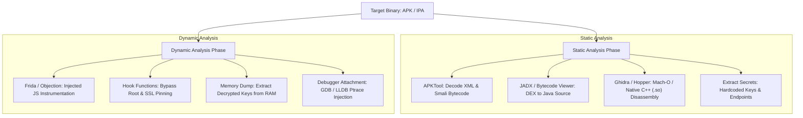
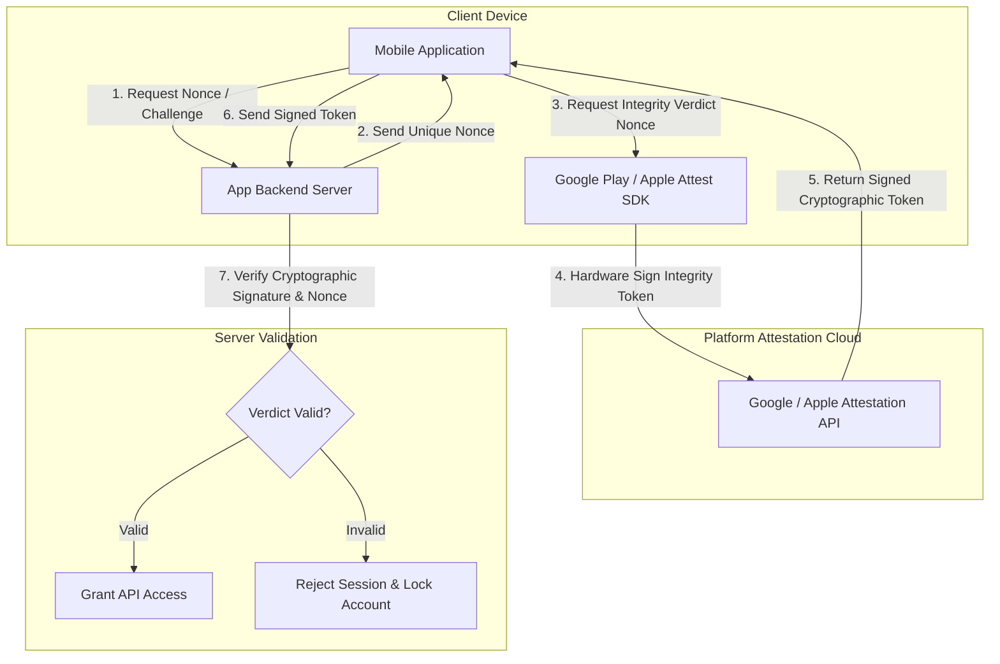

# 04 - Reverse Engineering and Tampering

> [!IMPORTANT]
> **Security Baseline (OWASP MASVS-RESILIENCE):** Local client-side anti-tampering heuristics (such as root checks or debugger detectors) can always be hooked and bypassed by an attacker using Frida. Production mobile applications must combine binary obfuscation with hardware-backed server-side remote attestation (Google Play Integrity API and Apple App Attest).

---

## The Reverse Engineering Lifecycle

Reverse engineering is the process of decompiling, disassembling, and analyzing compiled mobile binaries to discover vulnerabilities, bypass security controls, or extract proprietary business logic.



### 1. Static Analysis Techniques
*   **Android DEX Decompilation:** APK archives contain `.dex` (Dalvik Executable) files. Tools like **JADX** decompile `.dex` files into near-original Kotlin/Java source code.
*   **Android Smali Analysis:** **APKTool** disassembles `.dex` into Smali (an assembly-like representation of Dalvik bytecode), allowing attackers to edit instructions and rebuild signed APKs.
*   **iOS Binary Decryption & Disassembly:** Apps downloaded from the App Store are encrypted using Apple FairPlay DRM. Attackers execute the app on a jailbroken device, dump decrypted memory using tools like `frida-ios-dump`, and disassemble the resulting Mach-O binary in Ghidra or Hopper.

### 2. Dynamic Analysis & Instrumentation
*   **Function Hooking (Frida):** Injecting JavaScript runtime hooks into memory addresses or class methods to intercept input parameters, modify return values, or bypass control flow statements.
*   **Debugger Attachment:** Attaching `lldb` or `gdb` using OS debugging interfaces (`ptrace` on Linux/Android, `sysctl` on iOS) to step through memory execution instructions.

---

## Defensive Countermeasures

### 1. Code Obfuscation & Shrinking

Code obfuscation transforms human-readable class names, methods, and variables into non-descriptive identifiers, flattens control flow, and encrypts hardcoded strings.

#### Android ProGuard / R8 Configuration
R8 is Android's default compiler for code shrinking and obfuscation. Add strict rules to `proguard-rules.pro`:

```proguard
# Enable aggressive optimizations and obfuscation
-repackageclasses 'a'
-allowaccessmodification
-flattenpackagehierarchy 'a'

# Strip debug attributes and source file attributes
-renamesourcefileattribute SourceFile
-keepattributes SourceFile,LineNumberTable

# Obfuscate all custom application packages
-keep class com.example.app.security.** { *; }

# Encrypt strings (Requires commercial DexGuard / GuardSquare extension)
```

---

### 2. Root & Jailbreak Detection Heuristics

While client-side heuristics can be bypassed by Frida, implementing multi-layered checks raises the bar for automated attack scripts.

#### Common Android Root Indicators
*   Presence of `su` binaries under `/system/bin/`, `/system/xbin/`, `/sbin/`, or `/vendor/bin/`.
*   Presence of root management packages (e.g., `com.topjohnwu.magisk`, `eu.chainfire.supersu`).
*   Test-keys build tags (`android.os.Build.TAGS.contains("test-keys")`).
*   Ability to write files to system directories outside the app sandbox.

#### Common iOS Jailbreak Indicators
*   Presence of Cydia, Sileo, Zebra, or Installer package paths (`/Applications/Cydia.app`, `/var/binpack`).
*   Presence of dynamic hooking frameworks (`/Library/MobileSubstrate/MobileSubstrate.dylib`, `ElleKit`).
*   Ability to open restricted URL schemes (`cydia://`, `sileo://`).
*   Ability to write files outside the sandbox (`/private/jailbreak_test.txt`).

---

## Hardware-Backed Remote Attestation

To achieve true resilience against root/jailbreak and dynamic tampering, mobile applications must defer integrity verdicts to hardware attestation services provided by Google and Apple.



---

### Android Play Integrity API Implementation

The Google Play Integrity API generates a cryptographically signed token containing evaluation verdicts for app licensing, device integrity, and application identity.

#### Client-Side Request (Kotlin)
```kotlin
import android.content.Context
import com.google.android.gms.tasks.Task
import com.google.android.play.core.integrity.IntegrityManagerFactory
import com.google.android.play.core.integrity.IntegrityTokenRequest
import com.google.android.play.core.integrity.IntegrityTokenResponse

fun requestPlayIntegrityToken(
    context: Context, 
    serverNonce: String, 
    onSuccess: (String) -> Unit, 
    onError: (Exception) -> Unit
) {
    // Step 1: Initialize Integrity Manager
    val integrityManager = IntegrityManagerFactory.create(context)

    // Step 2: Build Token Request using server-provided Nonce
    val request = IntegrityTokenRequest.builder()
        .setNonce(serverNonce) // Must be a cryptographically random, fresh nonce from backend
        .build()

    // Step 3: Request Integrity Token
    val task: Task<IntegrityTokenResponse> = integrityManager.requestIntegrityToken(request)
    task.addOnSuccessListener { response ->
        val token = response.token()
        onSuccess(token)
    }.addOnFailureListener { exception ->
        onError(exception)
    }
}
```

#### Backend Token Verification (Python)
```python
from google.oauth2 import service_account
from googleapiclient.discovery import build
import json

def verify_play_integrity_token(integrity_token: str, expected_package: str, expected_nonce: str) -> bool:
    """
    Verifies Play Integrity Token via Google Play Developer API.
    """
    SCOPES = ['https://www.googleapis.com/auth/playintegrity']
    SERVICE_ACCOUNT_FILE = 'service_account_credentials.json'

    # Authenticate with Google Play API
    creds = service_account.Credentials.from_service_account_file(SERVICE_ACCOUNT_FILE, scopes=SCOPES)
    service = build('playintegrity', 'v1', credentials=creds)

    # Call decodeIntegrityToken
    body = {'integrityToken': integrity_token}
    request = service.v1().decodeIntegrityToken(packageName=expected_package, body=body)
    response = request.execute()

    token_payload = response.get('tokenPayloadExternal', {})
    request_details = token_payload.get('requestDetails', {})
    app_integrity = token_payload.get('appIntegrity', {})
    device_integrity = token_payload.get('deviceIntegrity', {})

    # 1. Validate Nonce freshness
    if request_details.get('nonce') != expected_nonce:
        print("[!] Nonce mismatch!")
        return False

    # 2. Validate App Package Name and Licensing
    if app_integrity.get('appRecognitionVerdict') != 'PLAY_RECOGNIZED':
        print("[!] Unrecognized app binary!")
        return False

    # 3. Validate Device Integrity Verdict
    device_verdicts = device_integrity.get('deviceRecognitionVerdict', [])
    if 'MEETS_DEVICE_INTEGRITY' not in device_verdicts:
        print("[!] Device failed integrity check (Rooted/Emulated/Compromised)")
        return False

    return True
```

---

### iOS DeviceCheck & App Attest API Implementation

Apple's App Attest API creates an asymmetric keypair inside the Secure Enclave and registers the public key with Apple servers to attest to app authenticity.

#### Client-Side App Attest Key Generation (Swift)
```swift
import DeviceCheck
import Foundation

class AppAttestManager {
    
    let service = DCAppAttestService.shared
    
    func attestDevice(serverChallenge: Data, completion: @escaping (Result<(String, Data), Error>) -> Void) {
        guard service.isSupported else {
            completion(.failure(NSError(domain: "AppAttest", code: -1, userInfo: [NSLocalizedDescriptionKey: "AppAttest not supported"])))
            return
        }
        
        // Step 1: Generate Keypair in Secure Enclave
        service.generateKey { keyId, error in
            if let error = error {
                completion(.failure(error))
                return
            }
            
            guard let keyId = keyId else { return }
            
            // Step 2: Attest Key against Server Challenge
            let challengeHash = Data(SHA256.hash(data: serverChallenge))
            self.service.attestKey(keyId, clientDataHash: challengeHash) { attestationObject, error in
                if let error = error {
                    completion(.failure(error))
                    return
                }
                
                if let attestationObject = attestationObject {
                    completion(.success((keyId, attestationObject)))
                }
            }
        }
    }
}
```

---

## Runtime Application Self-Protection (RASP)

RASP represents native defense-in-depth security embedded directly into the application binary. RASP solutions continuously audit runtime behavior:

1.  **Memory Integrity Checks:** Periodically validating memory checksums of native code segments to detect runtime bytecode patches.
2.  **Ptrace Attachment Block:** Issuing `ptrace(PTRACE_TRACEME, 0, 1, 0)` on startup. Since only one debugger can attach to a process at a time, this prevents attackers from attaching `gdb` or `lldb`.
3.  **Frida Named Pipe Detection:** Scanning active file descriptors and TCP sockets for standard Frida instrumentation ports (`27042`) and named pipes (`/data/local/tmp/frida-*`).
4.  **Active Termination:** If a runtime compromise is detected, the RASP engine immediately clears cryptographic key material from memory and cleanly terminates the process.
