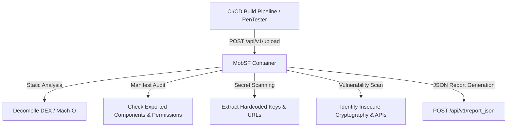

# 05 - Mobile Security Tools

> [!NOTE]
> **Audit Standard:** A rigorous mobile security audit requires combining automated static analysis (SAST) with dynamic runtime instrumentation (DAST/IAST). Automated scanners detect baseline misconfigurations, while dynamic tools (Frida/Objection) verify runtime resilience against active manipulation.

---

## 1. Mobile Security Framework (MobSF)

MobSF is an automated, open-source security framework capable of performing static and dynamic security assessments on Android (APK/AAB), iOS (IPA), and Windows app packages.



### Docker Deployment & CLI Workflow

```bash
# Pull and start MobSF container on port 8000
docker pull opensecurity/mobile-security-framework-mobsf:latest
docker run -it --rm -p 8000:8000 opensecurity/mobile-security-framework-mobsf:latest
```

### Automating MobSF Scans in CI/CD (Bash / Curl)

You can integrate MobSF directly into GitHub Actions or GitLab CI pipelines using MobSF's REST API:

```bash
#!/bin/bash
MOBSF_URL="http://localhost:8000"
API_KEY="YOUR_MOBSF_API_KEY"
FILE_PATH="build/outputs/apk/release/app-release.apk"

# Step 1: Upload binary to MobSF
echo "[*] Uploading $FILE_PATH to MobSF..."
UPLOAD_RESPONSE=$(curl -s -F "file=@$FILE_PATH" -H "Authorization: $API_KEY" "$MOBSF_URL/api/v1/upload")
HASH=$(echo $UPLOAD_RESPONSE | jq -r '.hash')

echo "[+] Binary uploaded successfully. Hash: $HASH"

# Step 2: Trigger Static Scan
echo "[*] Initiating static analysis..."
SCAN_RESPONSE=$(curl -s -X POST -d "hash=$HASH" -H "Authorization: $API_KEY" "$MOBSF_URL/api/v1/scan")

# Step 3: Fetch JSON Vulnerability Report
echo "[*] Fetching JSON scan report..."
curl -s -X POST -d "hash=$HASH" -H "Authorization: $API_KEY" "$MOBSF_URL/api/v1/report_json" -o mobsf_report.json

# Step 4: Parse high-severity security findings
HIGH_COUNT=$(jq '.high | length' mobsf_report.json)
echo "[+] Scan completed. Total High Severity Issues: $HIGH_COUNT"

if [ "$HIGH_COUNT" -gt 0 ]; then
    echo "[!] Security Gate Failed: High severity vulnerabilities detected!"
    exit 1
fi
```

---

## 2. Frida Dynamic Instrumentation Toolkit

Frida injects Google V8 JavaScript engine instances into native processes, enabling security engineers to inspect memory, overwrite function behavior, and trace APIs at runtime.

### Setup Architecture
*   **Host System:** Install Python tools (`pip install frida-tools`).
*   **Target Device (Android/iOS):** Upload and run `frida-server` matching device CPU architecture (e.g., `arm64`).

```bash
# Verify host-device connection over USB
frida-ps -U
```

### Essential Frida Commands

```bash
# List running processes on connected USB device
frida-ps -U -a

# Launch an application and immediately attach Frida engine
frida -U -f com.example.targetapp -l bypass_script.js --no-pause

# Trace native Java or C library function calls
frida-trace -U -f com.example.targetapp -i "Java_com_example_*"

# Trace cryptographic cipher operations
frida-trace -U -f com.example.targetapp -i "javax.crypto.Cipher.init"
```

### Production Frida Hook Template (Android / Java)

```javascript
// frida_hook_template.js
Java.perform(function () {
    console.log("[*] Frida script loaded. Intercepting target application...");

    // Example 1: Intercept and modify boolean return value
    try {
        var TargetClass = Java.use("com.example.targetapp.SecurityManager");
        TargetClass.isDeviceCompromised.implementation = function () {
            console.log("[+] Intercepted isDeviceCompromised(). Forcing return value -> false");
            return false;
        };
    } catch (err) {
        console.log("[!] Error hooking SecurityManager: " + err.message);
    }

    // Example 2: Intercept String argument parameters
    try {
        var AuthClass = Java.use("com.example.targetapp.AuthenticationService");
        AuthClass.login.overload('java.lang.String', 'java.lang.String').implementation = function (user, pass) {
            console.log("[+] Intercepted Auth Credentials: User=" + user + " | Pass=" + pass);
            // Call original implementation
            return this.login(user, pass);
        };
    } catch (err) {
        console.log("[!] Error hooking AuthenticationService: " + err.message);
    }
});
```

---

## 3. Objection Runtime Exploration Toolkit

Objection is a mobile exploration toolkit powered by Frida that provides a REPL interface for executing runtime security testing without writing raw JavaScript hooks.

```bash
# Install Objection
pip install objection
```

### Objection REPL Workflow

```bash
# Launch target app and attach Objection REPL
objection -g com.example.targetapp explore
```

### Essential Objection REPL Commands

```text
# --- SSL Pinning & Root Bypass ---
android sslpinning disable
android root disable

# --- Keystore & Keychain Audit ---
android keystore watch
ios keychain dump

# --- SQLite Database Inspection ---
sqlite connect app_database.db
sqlite execute schema

# --- Memory & Storage Dumping ---
memory dump all dump.bin
env
ls
```

---

## 4. Decompilation & Static Analysis Tools

| Tool | Platform | Primary Capability | CLI Example |
| :--- | :--- | :--- | :--- |
| **JADX** | Android | Decompiles `.dex` bytecode directly into readable Java source code. | `jadx-gui app.apk` |
| **APKTool** | Android | Decodes resource files (`AndroidManifest.xml`, layouts) and disassembles `.dex` to Smali. | `apktool d app.apk -o output_folder` |
| **Ghidra** | Cross-Platform | Reverse engineers compiled native shared libraries (`.so`, Mach-O binaries). | `ghidraRun` |
| **Frida-DEXDump** | Android | Extracts in-memory `.dex` files from protected or packed applications. | `frida-dexdump -U -f com.example.app` |

---

## 5. Intercepting Proxy Configuration (Burp Suite / Proxyman)

To capture HTTPS traffic on Android 7.0+ (API 24+) and modern iOS devices:

### Android 7+ System Trust Setup
On Android 7+, apps ignore user-installed CA certificates by default. To bypass this restriction during penetration testing:

1.  **Option A (App Source Edit):** Configure `network_security_config.xml` to allow user certificates in debug builds.
2.  **Option B (Root / Magisk Module):** Use the `AlwaysTrust` or `MagiskTrustUserCerts` module to automatically move the Proxy CA certificate from the User Trust Store (`/data/misc/user/0/cacerts-added/`) to the System Trust Store (`/system/etc/security/cacerts/`).

### iOS Custom Certificate Trust Setup
1.  Download Proxy CA profile (`http://burp` or `http://proxyman.debug`) via Safari on iOS.
2.  Navigate to **Settings -> Profile Downloaded** and install the Certificate Profile.
3.  Navigate to **Settings -> General -> About -> Certificate Trust Settings**.
4.  Enable **Full Trust for Root Certificates** for the installed Proxy CA.
