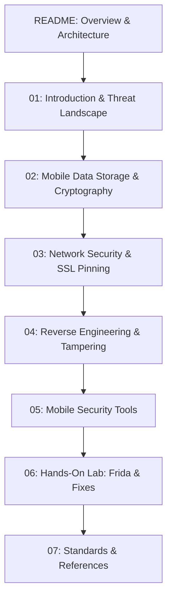

# Mobile Application Security Guide

## Overview

Welcome to the AppSec Atlas guide on **Mobile Application Security**. Mobile applications operate in an environment fundamentally different from web applications. In traditional web models, application logic and sensitive data processing reside on servers within secure corporate perimeters. In contrast, mobile binaries (Android APK/AAB and iOS IPA) are distributed directly to untrusted, user-controlled endpoints. 

Attacking a mobile application requires no server-side exploitation; an adversary can decompile the binary, dynamically inspect memory, hook native and managed function calls, intercept network traffic using custom Certificate Authorities (CAs), and operate within rooted or jailbroken OS environments.

This guide provides security engineers, mobile developers, and penetration testers with production-ready patterns, threat models, multi-language code snippets, dynamic instrumentation scripts, and hardware-backed defensive architectures for securing modern Android and iOS applications.

---

## Key Industry Standards & Frameworks

Security controls in this guide are mapped directly to global standards:

*   **OWASP MASVS 2.0 (Mobile Application Security Verification Standard):** The primary benchmark defining mobile security requirements across six domains: Storage, Crypto, Auth, Network, Resilience, and Code.
    *   **MASVS-L1 (Standard Security):** Essential security controls required for all mobile applications.
    *   **MASVS-L2 (Defense-in-Depth):** Advanced controls for applications handling highly sensitive data (e.g., banking, healthcare, authentication apps).
    *   **MASVS-R (Resilience Against Reverse Engineering):** Anti-tampering, obfuscation, anti-debugging, and hardware attestation controls.
*   **OWASP MASTG (Mobile Application Security Testing Guide):** The technical manual detailing test cases, Frida scripts, and analysis procedures for auditing MASVS requirements.
*   **NIST SP 800-163 Rev. 1:** Technical guidelines for assessing mobile application security.

---

## Architectural Comparison: Android vs. iOS

Understanding platform security models is prerequisite to designing effective defenses. The table below details the architectural security boundaries of Android and iOS:

| Feature | Android Architecture | iOS Architecture |
| :--- | :--- | :--- |
| **Kernel & OS Base** | Modified Linux Kernel + SELinux | XNU Kernel (Mach + BSD) |
| **Execution Sandbox** | Application-specific Linux UID/GID + ART (Android Runtime) VM sandbox | Mandatory Access Control (MAC) sandbox (App Container) |
| **App Package Format** | `.apk` / `.aab` (ZIP archive containing `.dex`, resources, Native Libraries) | `.ipa` (ZIP archive containing Mach-O binary, frameworks, bundle resources) |
| **Hardware Key Storage** | Android KeyStore (TEE / StrongBox Keymaster/Keymint) | Secure Enclave Processor (SEP) |
| **Code Signing** | APK Signature Scheme (v1 to v4); enforced at install | Mandatory Code Signing with Apple Certificate Authority; enforced continuously at kernel level |
| **Declarative Network Security** | Network Security Configuration (`network_security_config.xml`) | App Transport Security (ATS) in `Info.plist` |
| **Inter-Process Communication** | Intents, Broadcast Receivers, Content Providers, Binder RPC | Custom URL Schemes, Universal Links, App Extensions, Mach IPC |
| **System Attestation** | Play Integrity API (Hardware & OS verdict) | App Attest / DeviceCheck API (Hardware-backed key assertion) |

---

## Learning Objectives

By working through this guide, you will master:

1.  **Threat Modeling Mobile Assets:** Analyzing client-side attack surfaces, decompilation risks, and untrusted execution environments.
2.  **Hardware-Backed Data Security:** Implementing AES-256-GCM encryption with Android KeyStore (TEE/StrongBox) and iOS Secure Enclave Keychain.
3.  **Network Resilience & SSL Pinning:** Enforcing declarative network policies and implementing Subject Public Key Info (SPKI) certificate pinning in OkHttp and Alamofire.
4.  **Reverse Engineering & Anti-Tampering:** Defeating decompilation with R8/ProGuard, implementing root/jailbreak heuristics, and validating integrity using Play Integrity API and App Attest.
5.  **Dynamic Instrumentation & Security Tooling:** Auditing apps using MobSF, Frida, Objection, JADX, and intercepting proxies (Burp Suite/Proxyman).
6.  **Hands-On Vulnerability Remediation:** Exploiting a vulnerable mobile application using Frida scripts and engineering a production-grade secure replacement.

---

## Navigation & Chapter Outline

1.  [01 - Introduction to Mobile Security](01-introduction.md)
    *   Mobile threat landscape, untrusted device execution, OWASP Mobile Top 10 (2024), Android vs iOS low-level security models, IPC attack surfaces.
2.  [02 - Mobile Data Storage & Cryptography](02-mobile-data-storage-and-crypto.md)
    *   Insecure storage vectors, Android KeyStore, iOS Secure Enclave, EncryptedSharedPreferences, Keychain Services, log stripping, side-channel leak mitigations.
3.  [03 - Network Security & SSL Pinning](03-network-security-and-ssl-pinning.md)
    *   MitM interception, Android Network Security Config, iOS App Transport Security, SPKI certificate pinning in Kotlin and Swift, pin rotation strategies.
4.  [04 - Reverse Engineering & Anti-Tampering](04-reverse-engineering-and-tampering.md)
    *   Static analysis (DEX/Mach-O), dynamic instrumentation (Frida), code obfuscation (R8/DexGuard), root/jailbreak detection, Google Play Integrity API & Apple App Attest integration.
5.  [05 - Mobile Security Tools](05-mobile-security-tools.md)
    *   MobSF static/dynamic scanner, Frida CLI & JS scripting, Objection REPL workflows, JADX/Apktool/Ghidra decompilation, proxy setup for Android 7+ and iOS.
6.  [06 - Hands-On Lab](06-hands-on-lab.md)
    *   End-to-end lab: Auditing a vulnerable Android application, writing a Frida script to bypass client controls, and writing secure Kotlin & Python attestation code.
7.  [07 - References & Resources](07-references.md)
    *   OWASP MASVS 2.0 mapping, MASTG test cases, official platform documentation, historical vulnerability case studies (Stagefright, Pegasus, XcodeGhost).
