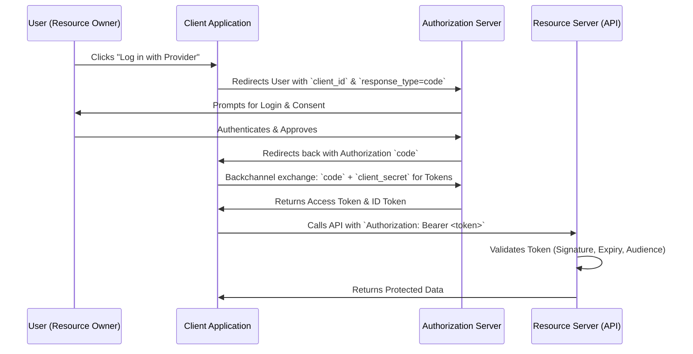

# 01 - OAuth2 and OIDC Fundamentals

## 1. The Concept (ELI5)
Imagine you're visiting a fancy hotel (the Resource Server) and you want to use the pool. Instead of giving the pool guard your passport and credit card (your password), you go to the front desk (the Authorization Server). The front desk checks your ID once, then gives you a plastic keycard (the Access Token) that only works for the pool room, and only for the next 24 hours. 

In the digital world, **OAuth2** is the framework for giving out these keycards (Access Tokens) to allow third-party apps to access APIs on your behalf. **OpenID Connect (OIDC)** is an extension on top of OAuth2 that also gives you an "ID Badge" (the ID Token), which tells the hotel *who* you are, not just what you can access. 

## 2. The Visual



## 3. The Code

**The Flaw**: Hardcoding credentials or using the implicit grant (which leaks tokens in the URL).

### ❌ Vulnerable Code (Node.js - Implicit Grant)
```typescript
// DANGEROUS: Returning tokens directly in the URL hash (Implicit Flow)
app.get('/authorize', (req, res) => {
    const token = generateToken(req.user);
    res.redirect(`https://client.app/callback#access_token=${token}`);
});
```

### ✅ Production-Ready Secure Code (TypeScript/Node.js)
```typescript
import { Issuer, Strategy } from 'openid-client';
import passport from 'passport';

// SECURE: Authorization Code Flow with PKCE
const issuer = await Issuer.discover('https://auth.example.com');
const client = new issuer.Client({
  client_id: process.env.OIDC_CLIENT_ID,
  client_secret: process.env.OIDC_CLIENT_SECRET,
  redirect_uris: ['https://app.example.com/callback'],
  response_types: ['code'], // Enforce Auth Code Flow
});

passport.use('oidc', new Strategy({ client, passReqToCallback: true }, 
  (req, tokenSet, userinfo, done) => {
    // Tokens are safely exchanged back-channel
    return done(null, userinfo);
}));
```

### ✅ Production-Ready Secure Code (Go)
```go
import (
    "golang.org/x/oauth2"
)

// SECURE: Using proper OAuth2 configuration and PKCE
conf := &oauth2.Config{
    ClientID:     os.Getenv("CLIENT_ID"),
    ClientSecret: os.Getenv("CLIENT_SECRET"),
    Scopes:       []string{"openid", "profile", "email"},
    Endpoint:     provider.Endpoint(),
    RedirectURL:  "https://app.example.com/callback",
}

// Generate PKCE verifier and challenge
verifier := oauth2.GenerateVerifier()
url := conf.AuthCodeURL("state", oauth2.AccessTypeOffline, oauth2.S256ChallengeOption(verifier))
// Exchange code using verifier...
```

### ✅ Production-Ready Secure Code (Python)
```python
from authlib.integrations.flask_client import OAuth

# SECURE: Flask with Authlib utilizing PKCE
oauth = OAuth(app)
oauth.register(
    name='my_provider',
    client_id=os.environ['CLIENT_ID'],
    client_secret=os.environ['CLIENT_SECRET'],
    server_metadata_url='https://auth.example.com/.well-known/openid-configuration',
    client_kwargs={'scope': 'openid profile email'}
)
```

## 4. The Guardrail

**Semgrep Rule**: Forbid the use of the Implicit Grant (`response_type=token`).

```yaml
rules:
  - id: forbid-implicit-grant
    message: "OAuth2 Implicit Grant is deprecated and insecure. Use Authorization Code flow with PKCE."
    severity: ERROR
    languages:
      - typescript
      - javascript
    patterns:
      - pattern: |
          response_type: 'token'
```
