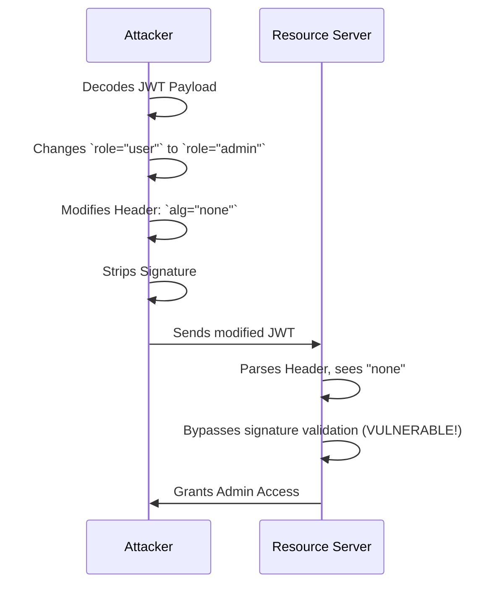

# 02 - JWT Security Masterclass

## 1. The Concept (ELI5)
A JSON Web Token (JWT) is like a digitally signed hall pass. If the principal signs a pass that says "Let Timmy go to the bathroom," the teacher trusts it because of the signature. However, if Timmy realizes he can just erase the principal's signature, write "none" for the signature type, and change the pass to "Let Timmy play video games," he exploits a vulnerability. 

In APIs, developers often forget to verify the signature properly, or they blindly trust the algorithm specified in the token header (like `alg: none`). Attackers can manipulate the JWT to forge identities.

## 2. The Visual



## 3. The Code

### ❌ Vulnerable Code (Python - PyJWT)
```python
import jwt

def verify_token(token):
    # DANGEROUS: Not validating the algorithm, accepts 'none' or symmetric key confusion
    decoded = jwt.decode(token, options={"verify_signature": False}) 
    return decoded
```

### ✅ Production-Ready Secure Code (Python)
```python
import jwt
from jwt import PyJWKClient

url = "https://auth.example.com/.well-known/jwks.json"
jwks_client = PyJWKClient(url)

def verify_token(token):
    # SECURE: Fetch JWK, enforce RS256, validate audience and issuer
    signing_key = jwks_client.get_signing_key_from_jwt(token)
    decoded = jwt.decode(
        token,
        signing_key.key,
        algorithms=["RS256"], # Enforce specific asymmetric algorithm
        audience="my_api_client",
        issuer="https://auth.example.com/"
    )
    return decoded
```

### ✅ Production-Ready Secure Code (TypeScript)
```typescript
import jwt from 'jsonwebtoken';
import jwksClient from 'jwks-rsa';

const client = jwksClient({ jwksUri: 'https://auth.example.com/.well-known/jwks.json' });

function getKey(header: any, callback: any) {
  client.getSigningKey(header.kid, (err, key) => {
    const signingKey = key?.getPublicKey();
    callback(null, signingKey);
  });
}

// SECURE: Enforce RS256 algorithm and validate claims
jwt.verify(token, getKey, {
  algorithms: ['RS256'],
  audience: 'my_api_client',
  issuer: 'https://auth.example.com/'
}, (err, decoded) => {
  // handle result
});
```

### ✅ Production-Ready Secure Code (Go)
```go
import "github.com/golang-jwt/jwt/v5"

// SECURE: Strongly type the expected signing method
token, err := jwt.Parse(tokenString, func(token *jwt.Token) (interface{}, error) {
    // Validate the alg is what you expect
    if _, ok := token.Method.(*jwt.SigningMethodRSA); !ok {
        return nil, fmt.Errorf("Unexpected signing method: %v", token.Header["alg"])
    }
    return rsaPublicKey, nil
})
```

## 4. The Guardrail

**Semgrep Rule**: Prevent skipping JWT signature verification.

```yaml
rules:
  - id: jwt-decode-without-verify
    message: "Decoding a JWT without verifying its signature leads to authentication bypass."
    severity: ERROR
    languages:
      - python
    patterns:
      - pattern: |
          jwt.decode($TOKEN, verify=False, ...)
      - pattern: |
          jwt.decode($TOKEN, options={"verify_signature": False}, ...)
```
