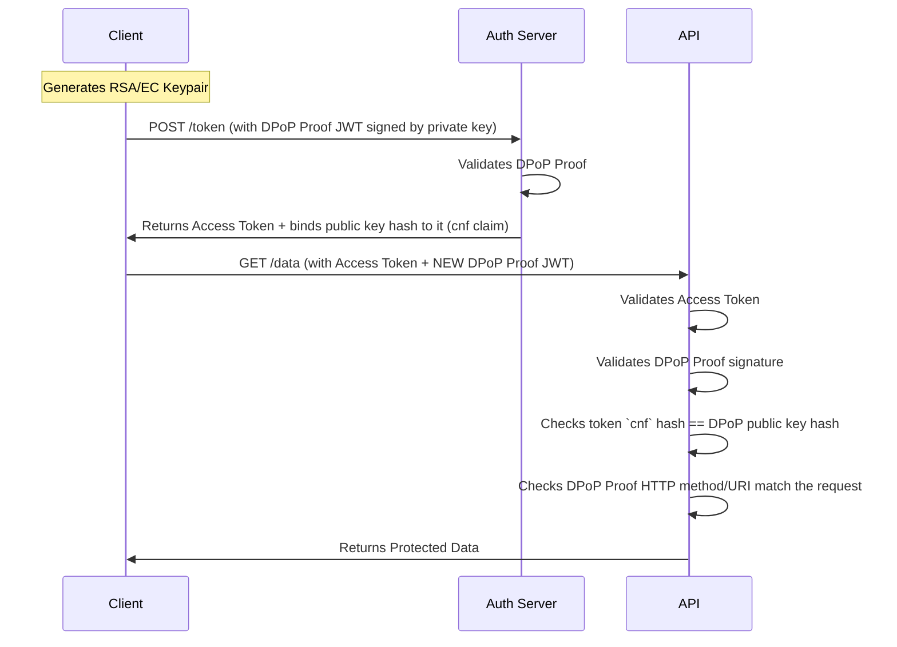

# 03 - DPoP (Demonstrating Proof-of-Possession)

## 1. The Concept (ELI5)
Standard API access tokens are "Bearer" tokens. If you hold (bear) the token, you can use it. It's like finding a VIP ticket on the floor; whoever picks it up gets in.

**DPoP (Demonstrating Proof-of-Possession)** binds the token to the specific person who originally requested it. It's like a VIP ticket that has your fingerprint embedded in it. To use the ticket, you must also provide your fingerprint at the door. If a hacker steals your DPoP token, they can't use it because they don't possess your private key (fingerprint).

## 2. The Visual



## 3. The Code

### ❌ Vulnerable Code (Standard Bearer Token)
Standard tokens are vulnerable to exfiltration (e.g., XSS stealing local storage).

```typescript
// VULNERABLE: Just sending the bearer token. If stolen, it's game over.
const response = await fetch('https://api.example.com/data', {
  headers: {
    'Authorization': `Bearer ${token}`
  }
});
```

### ✅ Production-Ready Secure Code (TypeScript Client - DPoP)
```typescript
import { generateKeyPair, SignJWT, exportJWK } from 'jose';
import crypto from 'crypto';

// 1. Generate client-side keypair (store securely)
const { publicKey, privateKey } = await generateKeyPair('ES256');
const jwk = await exportJWK(publicKey);

// 2. Generate DPoP Proof for the specific API request
const dpopProof = await new SignJWT({
    htm: 'GET',
    htu: 'https://api.example.com/data',
    jti: crypto.randomUUID(),
    iat: Math.floor(Date.now() / 1000)
  })
  .setProtectedHeader({ alg: 'ES256', typ: 'dpop+jwt', jwk })
  .sign(privateKey);

// 3. Send request with DPoP headers
const response = await fetch('https://api.example.com/data', {
  headers: {
    'Authorization': `DPoP ${accessToken}`,
    'DPoP': dpopProof
  }
});
```

### ✅ Production-Ready Secure Code (Go API Server - DPoP Validation)
```go
// SECURE: Validating DPoP in Go
func ValidateDPoP(r *http.Request, accessToken string, dpopHeader string) error {
    // 1. Parse Access Token and extract 'cnf' (Confirmation) claim
    // 2. Parse DPoP Header JWT
    // 3. Verify DPoP JWT signature using the JWK embedded in its header
    // 4. Hash the JWK and compare it to the 'cnf' claim in the Access Token
    // 5. Verify DPoP 'htm' == r.Method and 'htu' == r.URL.String()
    
    // (Omitted low-level JWT parsing for brevity)
    if hash(dpopJWK) != accessTokenCnf {
        return errors.New("DPoP key binding failed")
    }
    if dpop.Htm != r.Method {
        return errors.New("DPoP method mismatch")
    }
    return nil
}
```

## 4. The Guardrail

**API Gateway Config (Kong)**: Ensure API Gateway enforces DPoP plugin for highly sensitive endpoints.

```yaml
plugins:
  - name: oauth2-introspection
    config:
      introspection_endpoint: https://auth.example.com/introspect
      authorization_value: DPoP # Enforce DPoP scheme instead of Bearer
```
