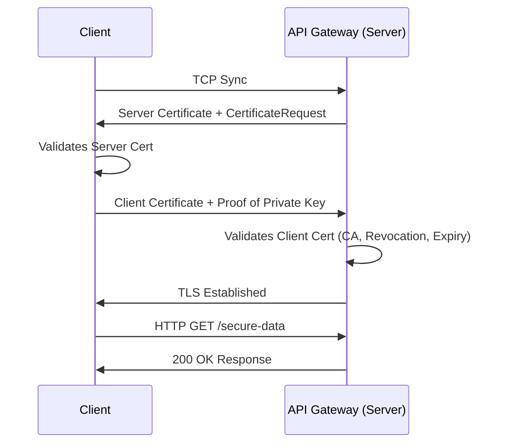

# 04 - Mutual TLS (mTLS)

## 1. The Concept (ELI5)
Normal web browsing uses one-way TLS: your browser checks the server's certificate to ensure it is actually google.com, but google.com doesn't check *your* certificate. 

**Mutual TLS (mTLS)** is a two-way street. Not only does the client verify the server, but the server demands a cryptographic ID card (Client Certificate) from the client before the connection is even established. It’s like a secret club where the bouncer shows you his badge, and you have to show him your badge before you can even talk.

## 2. The Visual



## 3. The Code

### ❌ Vulnerable Code (Ignoring Client Cert Validation)
```go
// VULNERABLE: Server does not require client certificates
tlsConfig := &tls.Config{
    ClientAuth: tls.NoClientCert,
}
```

### ✅ Production-Ready Secure Code (Go - mTLS Server)
```go
import (
    "crypto/tls"
    "crypto/x509"
    "os"
    "net/http"
)

// SECURE: Server requires and validates client certificates against a trusted Root CA
caCert, err := os.ReadFile("rootCA.crt")
caCertPool := x509.NewCertPool()
caCertPool.AppendCertsFromPEM(caCert)

tlsConfig := &tls.Config{
    ClientCAs:  caCertPool,
    ClientAuth: tls.RequireAndVerifyClientCert, // Mandatory mTLS
    MinVersion: tls.VersionTLS13,
}

server := &http.Server{
    Addr:      ":8443",
    TLSConfig: tlsConfig,
}
server.ListenAndServeTLS("server.crt", "server.key")
```

### ✅ Production-Ready Secure Code (Python/Requests - mTLS Client)
```python
import requests

# SECURE: Presenting client certificate and key
response = requests.get(
    'https://api.example.com/secure-data',
    cert=('/path/to/client.crt', '/path/to/client.key'),
    verify='/path/to/server_rootCA.crt'
)
```

### ✅ Production-Ready Secure Code (Node.js - mTLS Client)
```typescript
import https from 'https';
import fs from 'fs';

const agent = new https.Agent({
  cert: fs.readFileSync('client.crt'),
  key: fs.readFileSync('client.key'),
  ca: fs.readFileSync('rootCA.crt'),
});

// Pass the agent to fetch/axios
```

## 4. The Guardrail

**Terraform (AWS API Gateway / ALB)**: Enforce mTLS via Infrastructure as Code.

```hcl
resource "aws_apigatewayv2_domain_name" "mtls_api" {
  domain_name = "api.example.com"
  
  domain_name_configuration {
    certificate_arn = aws_acm_certificate.example.arn
    endpoint_type   = "REGIONAL"
    security_policy = "TLS_1_2"
  }

  mutual_tls_authentication {
    truststore_uri     = "s3://my-bucket/truststore.pem"
    truststore_version = "1"
  }
}
```
