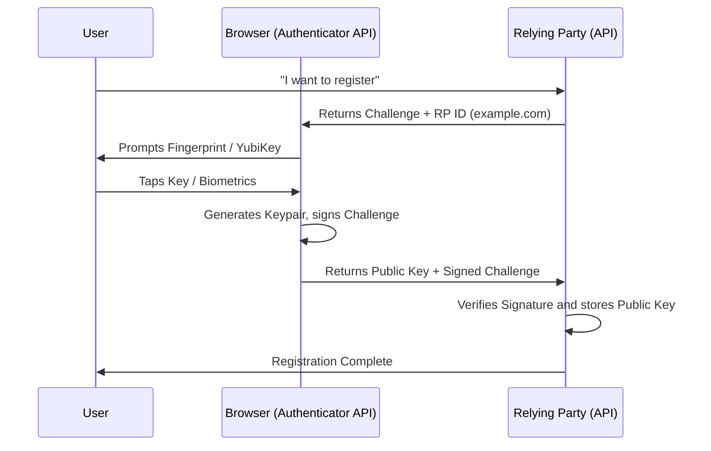

# 05 - WebAuthn and FIDO2

## 1. The Concept (ELI5)
Passwords can be guessed, phished, or leaked. **FIDO2 / WebAuthn** eliminates passwords by using hardware. 
Imagine instead of a password, you have a magical physical key (like a YubiKey or your laptop's fingerprint reader). When a website asks you to log in, it sends a random math problem (a challenge). Only your magical key can solve the problem using a secret formula (private key) burned inside it. You tap the key, it solves the problem, and gives the answer back. Hackers cannot steal this because the secret formula *never* leaves the physical key. Furthermore, the key checks what website you are on, so if a hacker tricks you into visiting `faceb00k.com`, the key refuses to solve the problem for that fake site (unphishable).

## 2. The Visual



## 3. The Code

### ❌ Vulnerable Code (Phishable Passwords)
```typescript
// VULNERABLE: Standard password check. Susceptible to credential stuffing and phishing.
if (await bcrypt.compare(req.body.password, user.passwordHash)) {
   login(user);
}
```

### ✅ Production-Ready Secure Code (TypeScript / SimpleWebAuthn)
```typescript
import { generateRegistrationOptions, verifyRegistrationResponse } from '@simplewebauthn/server';

// 1. Generate options to send to the browser
const options = await generateRegistrationOptions({
  rpName: 'My Secure App',
  rpID: 'app.example.com',
  userID: user.id,
  userName: user.email,
  attestationType: 'none',
  authenticatorSelection: {
    residentKey: 'required',
    userVerification: 'preferred',
  },
});
// Save options.challenge to session/db

// 2. Verify the response sent back by the browser
const verification = await verifyRegistrationResponse({
  response: req.body, // The output from navigator.credentials.create()
  expectedChallenge: expectedChallengeFromSession,
  expectedOrigin: 'https://app.example.com',
  expectedRPID: 'app.example.com',
});

if (verification.verified) {
  // SECURE: Save verification.registrationInfo.credentialPublicKey to DB
}
```

### ✅ Production-Ready Secure Code (Go / go-webauthn)
```go
import "github.com/go-webauthn/webauthn/webauthn"

// SECURE: WebAuthn Initialization
w, err := webauthn.New(&webauthn.Config{
    RPDisplayName: "My Secure App",
    RPID:          "app.example.com",
    RPOrigins:     []string{"https://app.example.com"},
})

// Generate Registration Options
options, sessionData, err := w.BeginRegistration(user)

// Verify Registration Response
credential, err := w.FinishRegistration(user, sessionData, request)
```

## 4. The Guardrail

**Policy Constraint (Rego/OPA)**: Ensure RPID perfectly matches the deployment domain to prevent Cross-Origin Authentication.

```rego
package webauthn

default valid_rp_id = false

valid_rp_id {
    input.expected_origin == "https://app.example.com"
    input.rp_id == "app.example.com"
}
```
