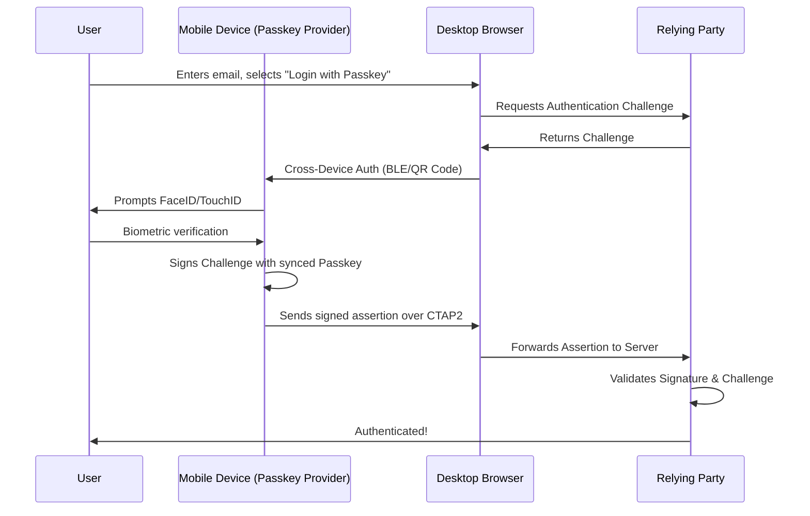

# 06 - Passkeys Implementation

## 1. The Concept (ELI5)
**Passkeys** are the consumer-friendly evolution of FIDO2/WebAuthn. Remember the magical physical key from the previous chapter? The problem was if you lost the key, you were locked out. 
Passkeys take that magical secret formula (private key) and securely sync it across all your devices using your Apple iCloud, Google Password Manager, or 1Password. If you create a Passkey on your iPhone, you can seamlessly use it on your Mac, or even scan a QR code to log in on a Windows PC. It provides the unphishable security of FIDO2 with the convenience of a synced password manager.

## 2. The Visual



## 3. The Code

### ✅ Production-Ready Secure Code (Frontend - JavaScript)
```javascript
// SECURE: Requesting Passkey Authentication via WebAuthn API
async function authenticateWithPasskey(challengeOptions) {
    // challengeOptions provided by the backend (includes random challenge, rpId)
    // Map backend data to Uint8Array required by WebAuthn
    challengeOptions.challenge = Uint8Array.from(atob(challengeOptions.challenge), c => c.charCodeAt(0));
    
    try {
        const credential = await navigator.credentials.get({
            publicKey: challengeOptions
        });
        
        // Send 'credential' back to server for verification
        return credential;
    } catch (err) {
        console.error("Passkey auth failed", err);
    }
}
```

### ✅ Production-Ready Secure Code (Backend - Python/PyWebAuthn)
```python
from webauthn import verify_authentication_response
from webauthn.helpers.structs import AuthenticationCredential

# SECURE: Validating a synced Passkey authentication
def verify_passkey_login(request_body, saved_challenge, stored_public_key, stored_sign_count):
    credential = AuthenticationCredential.parse_raw(request_body)

    verification = verify_authentication_response(
        credential=credential,
        expected_challenge=saved_challenge,
        expected_origin="https://app.example.com",
        expected_rp_id="app.example.com",
        credential_public_key=stored_public_key,
        credential_current_sign_count=stored_sign_count,
    )
    
    # Update sign count in DB to prevent replay attacks
    update_sign_count(credential.id, verification.new_sign_count)
    return True
```

## 4. The Guardrail

**Security Requirements**: 
When implementing Passkeys, the server *must* track the `signCount` to detect cloned authenticators (though synced passkeys often keep this at 0). 

**Semgrep Rule**: Enforce `expected_origin` and `expected_rp_id` validation.
```yaml
rules:
  - id: webauthn-missing-origin-validation
    message: "WebAuthn verification must rigidly check expected_origin and expected_rp_id to prevent phishing."
    severity: ERROR
    languages:
      - python
    patterns:
      - pattern: |
          verify_authentication_response(..., expected_origin=$ORIGIN, expected_rp_id=$RP, ...)
```
