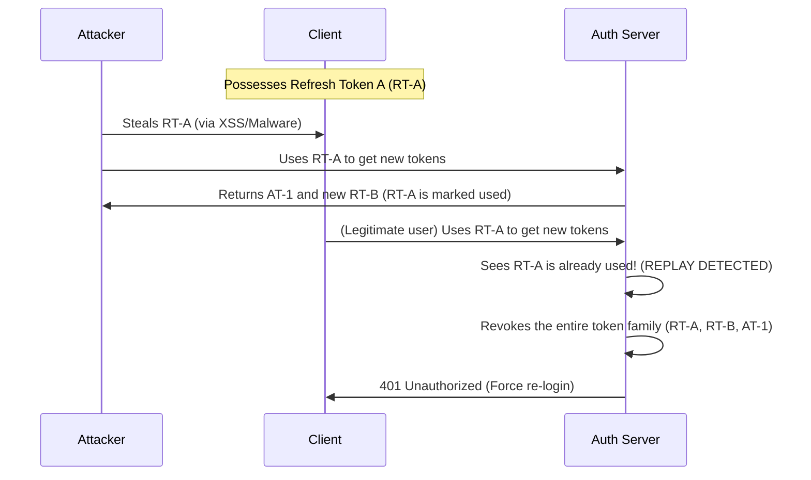

# 07 - Token Binding and Rotation

## 1. The Concept (ELI5)
Imagine you get a VIP wristband (Access Token) that lasts for 15 minutes, and a hidden golden ticket (Refresh Token) that lasts for days. 
If someone steals your VIP wristband, they only get 15 minutes of access. But if they steal the golden ticket, they could keep printing new VIP wristbands forever! 
**Refresh Token Rotation** solves this: every time you use a golden ticket to get a new wristband, you must turn in the old golden ticket and receive a brand new one. If an attacker uses a stolen golden ticket, the system notices two people trying to use the same ticket, immediately invalidates *everything*, and kicks everyone out.

## 2. The Visual



## 3. The Code

### ❌ Vulnerable Code (Static Refresh Tokens)
```typescript
// VULNERABLE: Refresh tokens live forever and are never rotated
app.post('/refresh', async (req, res) => {
    const user = await verifyRefreshToken(req.body.token);
    const newAccessToken = generateAccessToken(user);
    // Returns same refresh token, if stolen, attacker has persistent access
    res.json({ accessToken: newAccessToken, refreshToken: req.body.token }); 
});
```

### ✅ Production-Ready Secure Code (TypeScript - Token Rotation)
```typescript
// SECURE: Refresh Token Rotation with Replay Detection
app.post('/refresh', async (req, res) => {
    const { refreshToken } = req.body;
    const tokenRecord = await db.tokens.find({ token: refreshToken });

    if (!tokenRecord) {
        // Token doesn't exist. Invalid.
        return res.status(401).send();
    }

    if (tokenRecord.isUsed) {
        // REPLAY ATTACK DETECTED!
        // A used token was submitted. Invalidate entire token family!
        await db.tokens.updateMany(
            { familyId: tokenRecord.familyId }, 
            { $set: { isRevoked: true } }
        );
        return res.status(401).json({ error: 'Token theft detected. Re-authenticate.' });
    }

    // Mark current token as used
    await db.tokens.updateOne({ _id: tokenRecord._id }, { $set: { isUsed: true } });

    // Generate NEW Access and Refresh Tokens linked to same family
    const newAccessToken = generateAccessToken(tokenRecord.userId);
    const newRefreshToken = crypto.randomBytes(40).toString('hex');
    
    await db.tokens.create({
        token: newRefreshToken,
        familyId: tokenRecord.familyId,
        userId: tokenRecord.userId,
        isUsed: false,
        isRevoked: false
    });

    res.json({ accessToken: newAccessToken, refreshToken: newRefreshToken });
});
```

### ✅ Production-Ready Secure Code (Go - Redis Token Store)
```go
// SECURE: Storing tokens in Redis for quick revocation
func Refresh(ctx context.Context, oldToken string) error {
    status, _ := redisClient.Get(ctx, "RT:"+oldToken).Result()
    if status == "USED" {
        // Replay detected. Revoke family
        familyID, _ := redisClient.Get(ctx, "RT_FAMILY:"+oldToken).Result()
        redisClient.Del(ctx, "FAMILY:"+familyID)
        return errors.New("token reuse detected")
    }
    // Mark as used, issue new...
}
```

## 4. The Guardrail

**Database Constraint**: Ensure tokens have short lifespans and tracking fields.

```sql
-- DDL for Secure Refresh Token Storage
CREATE TABLE refresh_tokens (
    id UUID PRIMARY KEY DEFAULT gen_random_uuid(),
    user_id UUID REFERENCES users(id),
    family_id UUID NOT NULL,
    token_hash VARCHAR(255) UNIQUE NOT NULL,
    is_used BOOLEAN DEFAULT FALSE,
    is_revoked BOOLEAN DEFAULT FALSE,
    expires_at TIMESTAMP WITH TIME ZONE NOT NULL
);

-- Guardrail: Auto-delete expired tokens to save space
CREATE INDEX idx_refresh_tokens_expiry ON refresh_tokens(expires_at);
```
