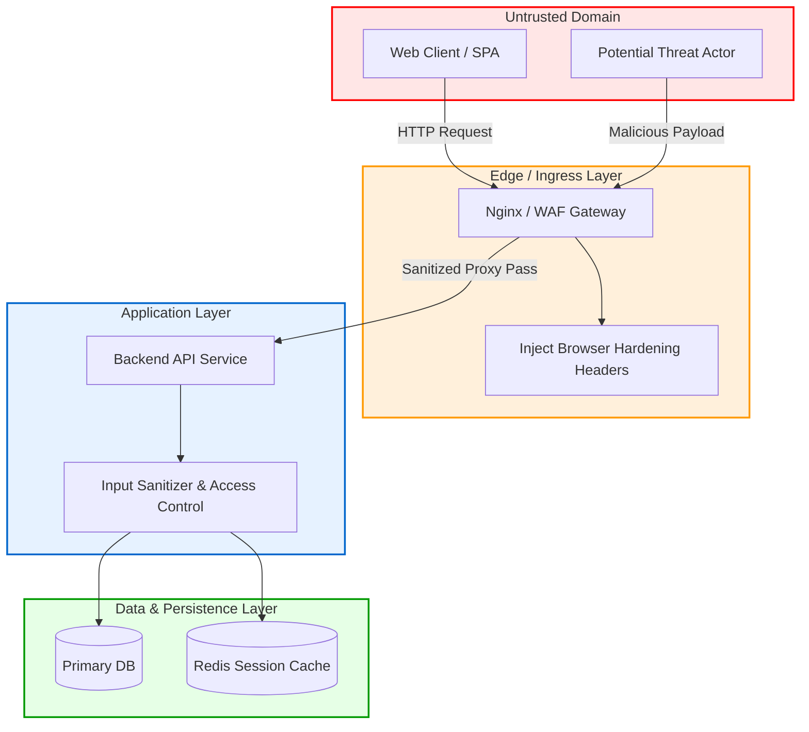

# 01 - Introduction to Web Application Security & Architecture

## Modern Web Application Architecture & Trust Boundaries

Modern web applications are complex multi-tiered systems spanning client-side Single-Page Applications (SPAs), edge reverse proxies, web application firewalls (WAFs), backend API services, asynchronous background workers, and distributed datastores. 

Security engineering requires modeling data flows across distinct **trust boundaries**. A trust boundary represents any transition where data crosses from an untrusted environment (such as a client browser or third-party API) into a trusted control zone (such as an application server or internal database).

```
+-----------------------------------------------------------------------------------------------+
|                               UNTRUSTED DOMAIN (PUBLIC INTERNET)                              |
|  - Web Browser / Attacker Client                                                              |
|  - Malicious Proxies & Intermediaries                                                         |
+-----------------------------------------------------------------------------------------------+
                                               |
                                               | TLS 1.3 / HTTP/2 (Untrusted Input Flow)
                                               v
==================================== TRUST BOUNDARY 1 ===========================================
+-----------------------------------------------------------------------------------------------+
|                                EDGE / INGRESS LAYER (DMZ)                                     |
|  - Cloudflare / AWS CloudFront / Nginx Reverse Proxy                                          |
|  - Responsibilities: TLS Termination, DDoS Mitigation, Rate Limiting, Initial Header Injection|
+-----------------------------------------------------------------------------------------------+
                                               |
                                               | Filtered HTTP Request Pass-Through
                                               v
==================================== TRUST BOUNDARY 2 ===========================================
+-----------------------------------------------------------------------------------------------+
|                            APPLICATION LAYER (INTERNAL NETWORK)                               |
|  - Node.js / Python / Go / Java API Microservices                                             |
|  - Responsibilities: Authentication, Authorization, Input Validation, Business Logic          |
+-----------------------------------------------------------------------------------------------+
                                               |
                                               | Prepared Queries / Authenticated RPC
                                               v
==================================== TRUST BOUNDARY 3 ===========================================
+-----------------------------------------------------------------------------------------------+
|                               DATA LAYER (PROTECTED BASELINE)                                 |
|  - PostgreSQL, MongoDB, Redis Cache, Internal Object Storage (S3)                             |
|  - Responsibilities: Persistent Data Storage, Encryption-at-Rest, Strict Access Control       |
+-----------------------------------------------------------------------------------------------+
```



---

## Root Causes of Web Vulnerabilities

> [!WARNING]
> Security breaches rarely stem from exotic zero-day exploits. The vast majority of real-world vulnerabilities result from simple design flaws, failure to enforce trust boundaries, and missing defense-in-depth controls.

Web application vulnerabilities fundamentally stem from five primary root causes:

1. **Implicit Input Trust:** Accepting data from request parameters, headers, cookies, or uploaded files without rigorous validation, sanitization, and context-aware escaping.
2. **Broken Access Control & State Management:** Failing to verify authorization on every request endpoint or relying solely on client-side state flags (e.g., `is_admin=true` stored in unverified local storage).
3. **Parser Differentials & Mismatches:** Differences in how web application firewalls, proxy servers, and backend application parsers decode payloads (e.g., URL double-encoding, Unicode normalization, HTTP Request Smuggling).
4. **Security Misconfigurations:** Deployment of default administrative accounts, enabled debugging endpoints in production, missing transport layer security, or missing browser security headers.
5. **Insecure Third-Party Dependencies:** Vulnerabilities introduced via unvetted open-source packages and frameworks (Software Supply Chain risks).

---

## HTTP Security Headers Deep Dive

HTTP Security Headers provide a defense-in-depth layer by instructing client browsers to enforce strict safety policies.

### 1. HTTP Strict Transport Security (HSTS)
HSTS ensures that browsers only connect to the application over encrypted HTTPS connections, preventing Man-in-the-Middle (MiTM) and SSL-stripping attacks (e.g., via `Moxie Marlinspike's sslstrip`).

```http
Strict-Transport-Security: max-age=31536000; includeSubDomains; preload
```

* `max-age=31536000`: Enforces HTTPS for 1 year (31,536,000 seconds).
* `includeSubDomains`: Applies HSTS rule to all current and future subdomains.
* `preload`: Authorizes browsers to include the domain in the global browser HSTS Preload list managed by Google and Mozilla.

> [!CAUTION]
> Submitting a domain to the HSTS Preload list is permanent and irreversible for practical purposes. Ensure that **all** subdomains (including legacy or internal endpoints) support valid HTTPS before setting `preload`.

---

### 2. Content Security Policy (CSP)
Content Security Policy is a powerful control against Cross-Site Scripting (XSS), clickjacking, and data injection attacks. It defines allowlists of trusted content sources.

```http
Content-Security-Policy: default-src 'self'; script-src 'self' 'nonce-rAnd0mN0nc312345' https://cdn.jsdelivr.net; style-src 'self' 'unsafe-inline'; img-src 'self' data: https:; object-src 'none'; base-uri 'self'; form-action 'self'; frame-ancestors 'none'; upgrade-insecure-requests;
```

#### Key Directives Breakdown:
* `default-src 'self'`: Default fallback policy restricting resource fetches to the application's origin.
* `script-src`: Dictates valid sources for JavaScript. Using dynamic cryptographic nonces (`'nonce-...'`) avoids requiring `'unsafe-inline'`.
* `object-src 'none'`: Prevents legacy plugin execution (e.g., Flash, Java Applets).
* `base-uri 'self'`: Prevents attackers from injecting `<base>` tags to hijack relative URLs.
* `form-action 'self'`: Restricts targets where forms can submit data.
* `frame-ancestors 'none'`: Restricts embedding of the web page inside `<iframe>`, `<frame>`, or `<object>` elements (replaces `X-Frame-Options`).
* `upgrade-insecure-requests`: Instructs the browser to automatically convert HTTP resource requests to HTTPS.

---

### 3. X-Frame-Options
Mitigates **Clickjacking** by instructing the browser whether to allow rendering of the current page in a `<frame>`, `<iframe>`, `<embed>`, or `<object>`.

```http
X-Frame-Options: DENY
```
* `DENY`: Prevents any site from framing the page.
* `SAMEORIGIN`: Allows framing only if the parent site shares the exact origin (scheme, host, and port).

> [!NOTE]
> CSP's `frame-ancestors` directive supersedes `X-Frame-Options` in modern browsers, but `X-Frame-Options` should still be included for backward compatibility with legacy browsers.

---

### 4. Referrer-Policy
Controls how much detailed origin information is attached to outbound requests via the `Referer` header.

```http
Referrer-Policy: strict-origin-when-cross-origin
```

* **Behavior:** Sends full URL (path and query strings) for same-origin requests, sends origin-only (`https://example.com`) for cross-origin HTTPS requests, and sends no referrer header when downgrading from HTTPS to HTTP.

---

### 5. Modern Edge Browser Headers (`X-Content-Type-Options`, `Permissions-Policy`, COOP/COEP)

#### X-Content-Type-Options
Prevents browsers from MIME-sniffing a response away from the declared `Content-Type`.
```http
X-Content-Type-Options: nosniff
```

#### Permissions-Policy (formerly Feature-Policy)
Restricts access to browser hardware APIs (camera, microphone, geolocation, payment APIs).
```http
Permissions-Policy: camera=(), microphone=(), geolocation=(self), payment=()
```

#### Cross-Origin Isolation (COOP / COEP / CORP)
Protects against Spectre-style side-channel attacks by enforcing process isolation in the browser.
```http
Cross-Origin-Opener-Policy: same-origin
Cross-Origin-Embedder-Policy: require-corp
Cross-Origin-Resource-Policy: same-origin
```

---

## Security Headers Comparison Matrix

| Header Name | Standard Directive / Value | Primary Risk Mitigated | Browser Compatibility | Misconfiguration Risk |
| :--- | :--- | :--- | :--- | :--- |
| `Strict-Transport-Security` | `max-age=31536000; includeSubDomains` | SSL Stripping, MiTM | 99.8% Modern Browsers | High (if HTTP subdomains exist) |
| `Content-Security-Policy` | `default-src 'self'; script-src 'self'` | XSS, Data Exfiltration | 99.5% Modern Browsers | Medium (can break front-end scripts) |
| `X-Frame-Options` | `DENY` or `SAMEORIGIN` | Clickjacking | 99.9% All Browsers | Low |
| `Referrer-Policy` | `strict-origin-when-cross-origin` | Sensitive Data Leak in URLs | 99.2% Modern Browsers | Low |
| `X-Content-Type-Options` | `nosniff` | MIME-Sniffing Execution | 99.9% All Browsers | Low |
| `Permissions-Policy` | `camera=(), microphone=()` | Hardware API Abuse | 95.0% Modern Browsers | Low |
| `Cross-Origin-Opener-Policy` | `same-origin` | Side-Channel / Cross-Window Theft | 94.0% Modern Browsers | Medium (breaks popups) |

---

## Production Security Headers Implementation

### 1. Nginx Reverse Proxy Configuration
```nginx
# /etc/nginx/conf.d/security_headers.conf

server {
    listen 443 ssl http2;
    server_name app.example.com;

    # SSL Configuration omitted for brevity

    # Security Headers
    add_header Strict-Transport-Security "max-age=31536000; includeSubDomains; preload" always;
    add_header Content-Security-Policy "default-src 'self'; script-src 'self'; object-src 'none'; frame-ancestors 'none'; base-uri 'self';" always;
    add_header X-Frame-Options "DENY" always;
    add_header X-Content-Type-Options "nosniff" always;
    add_header Referrer-Policy "strict-origin-when-cross-origin" always;
    add_header Permissions-Policy "camera=(), microphone=(), geolocation=()" always;
    add_header Cross-Origin-Opener-Policy "same-origin" always;

    location / {
        proxy_pass http://127.0.0.1:8000;
        proxy_set_header Host $host;
        proxy_set_header X-Real-IP $remote_addr;
        proxy_set_header X-Forwarded-For $proxy_add_x_forwarded_for;
        proxy_set_header X-Forwarded-Proto $scheme;
    }
}
```

### 2. Caddyfile Configuration
```caddy
app.example.com {
    header {
        Strict-Transport-Security "max-age=31536000; includeSubDomains; preload"
        Content-Security-Policy "default-src 'self'; script-src 'self'; object-src 'none'; frame-ancestors 'none';"
        X-Frame-Options "DENY"
        X-Content-Type-Options "nosniff"
        Referrer-Policy "strict-origin-when-cross-origin"
        Permissions-Policy "camera=(), microphone=(), geolocation=()"
    }
    reverse_proxy localhost:8000
}
```

### 3. Python (FastAPI Middleware)
```python
from fastapi import FastAPI, Request, Response
from starlette.middleware.base import BaseHTTPMiddleware

app = FastAPI(title="Secure API")

class SecurityHeadersMiddleware(BaseHTTPMiddleware):
    async def dispatch(self, request: Request, call_next):
        response: Response = await call_next(request)
        response.headers["Strict-Transport-Security"] = "max-age=31536000; includeSubDomains"
        response.headers["Content-Security-Policy"] = "default-src 'self'; script-src 'self'; object-src 'none';"
        response.headers["X-Frame-Options"] = "DENY"
        response.headers["X-Content-Type-Options"] = "nosniff"
        response.headers["Referrer-Policy"] = "strict-origin-when-cross-origin"
        response.headers["Permissions-Policy"] = "camera=(), microphone=(), geolocation=()"
        return response

app.add_middleware(SecurityHeadersMiddleware)

@app.get("/")
async def root():
    return {"message": "Secure Application Endpoint"}
```

### 4. Node.js (Express with Helmet)
```javascript
const express = require('express');
const helmet = require('helmet');

const app = express();

// Production-grade Helmet Configuration
app.use(
  helmet({
    contentSecurityPolicy: {
      directives: {
        defaultSrc: ["'self'"],
        scriptSrc: ["'self'", (req, res) => `'nonce-${res.locals.nonce}'`],
        objectSrc: ["'none'"],
        frameAncestors: ["'none'"],
        upgradeInsecureRequests: [],
      },
    },
    hsts: {
      maxAge: 31536000,
      includeSubDomains: true,
      preload: true,
    },
    referrerPolicy: { policy: 'strict-origin-when-cross-origin' },
    noSniff: true,
    xssFilter: true,
  })
);

app.get('/', (req, res) => {
  res.send('Secure Express Server');
});

app.listen(3000, () => console.log('Server running on port 3000'));
```

### 5. Go (`net/http` Security Middleware)
```go
package main

import (
	"fmt"
	"net/http"
)

func SecurityHeadersMiddleware(next http.Handler) http.Handler {
	return http.HandlerFunc(func(w http.ResponseWriter, r *http.Request) {
		w.Header().Set("Strict-Transport-Security", "max-age=31536000; includeSubDomains")
		w.Header().Set("Content-Security-Policy", "default-src 'self'; script-src 'self'; object-src 'none';")
		w.Header().Set("X-Frame-Options", "DENY")
		w.Header().Set("X-Content-Type-Options", "nosniff")
		w.Header().Set("Referrer-Policy", "strict-origin-when-cross-origin")
		w.Header().Set("Permissions-Policy", "camera=(), microphone=()")

		next.ServeHTTP(w, r)
	})
}

func main() {
	mux := http.NewServeMux()
	mux.HandleFunc("/", func(w http.ResponseWriter, r *http.Request) {
		fmt.Fprintln(w, "Secure Go Web Server")
	})

	secureMux := SecurityHeadersMiddleware(mux)
	http.ListenAndServe(":8080", secureMux)
}
```
