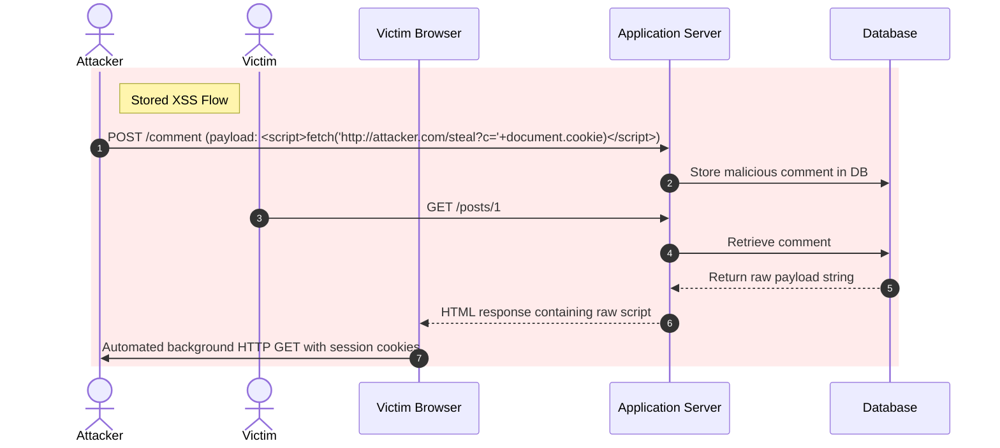

# 02 - XSS and CSRF Masterclass

Cross-Site Scripting (XSS) and Cross-Site Request Forgery (CSRF) represent two fundamental client-side threat vectors targeting the browser's execution context and session trust model.

---

## 1. Cross-Site Scripting (XSS) Deep Dive

Cross-Site Scripting occurs when an application includes untrusted, unvalidated, or unescaped data within a rendered web page. Executing malicious JavaScript inside a victim's session enables session hijacking, credential theft, keylogging, DOM manipulation, and unauthorized actions.

### XSS Classification & Attack Mechanics

```
========================================================================================
1. REFLECTED XSS: Immediate bounce back from application server.
   [Attacker Link] ---> (Victim Browser) ---> [Server (Unescaped Parameter)] ---> [Reflected Payload Execution]

2. STORED XSS: Persistent payload stored in database.
   [Attacker Form Submission] ---> [Database Store] ---> [Victim Reads Post] ---> [Payload Executes]

3. DOM-BASED XSS: Client-side JavaScript reads malicious source into unsafe DOM sink.
   [URL Fragment #payload] ---> (Browser JS: innerHTML) ---> [DOM Execution (No Server Involvement)]
========================================================================================
```



---

### Context-Aware Output Escaping

Standard HTML entity encoding is insufficient when user data is rendered in different contextual locations within a web page. Each context requires specific encoding rules:

```
+-----------------------------------------------------------------------------------------+
| CONTEXT                   | EXAMPLE MARKUP                | REQUIRED ENCODING           |
+---------------------------+-------------------------------+-----------------------------+
| 1. HTML Body              | <div>UNTRUSTED</div>          | HTML Entity Encoding        |
| 2. HTML Attribute         | <input value="UNTRUSTED">     | Attribute Escaping          |
| 3. JavaScript Variable    | var x = "UNTRUSTED";          | JS Unicode/Hex Escaping     |
| 4. URL Parameter          | <a href="/search?q=UNTRUSTED">| Percent URL Encoding        |
| 5. CSS Context            | color: UNTRUSTED;             | CSS Hex Encoding            |
+-----------------------------------------------------------------------------------------+
```

> [!CAUTION]
> Never place untrusted data directly inside execution contexts such as `<script>` tags, inline event handlers (`onload=`, `onclick=`), `javascript:` URIs, or CSS `<style>` blocks—even with standard HTML entity escaping!

---

### DOM-Based XSS Sinks and Sources

DOM-based XSS occurs entirely within client-side JavaScript. The script reads data from an un-sanitized **Source** and passes it to an unsafe execution **Sink**.

* **Common Sources:** `location.search`, `location.hash`, `document.referrer`, `window.name`, `postMessage` event payload.
* **Unsafe Sinks:** `element.innerHTML`, `document.write()`, `eval()`, `setTimeout()`, `element.setAttribute("href", ...)` (when accepting `javascript:` URIs).

#### Vulnerable DOM Script:
```javascript
// VULNERABLE: Reading untrusted location.hash directly into innerHTML
const hash = window.location.hash.substring(1);
document.getElementById('user-greeting').innerHTML = "Welcome " + hash;
// Attacker URL: https://example.com/#
```

#### Remediated DOM Script:
```javascript
// SECURE: Use textContent (prevents HTML parsing) or DOMPurify
const hash = window.location.hash.substring(1);
document.getElementById('user-greeting').textContent = "Welcome " + hash;

// OR using DOMPurify if HTML markup must be rendered:
// document.getElementById('user-greeting').innerHTML = DOMPurify.sanitize(hash);
```

---

### Multi-Language Code Comparison: XSS Remediation

#### Python (Flask / Jinja2)

```python
# VULNERABLE
from flask import Flask, request, render_template_string

app = Flask(__name__)

@app.route('/profile')
def profile():
    bio = request.args.get('bio', '')
    # DANGEROUS: Using safe filter bypasses auto-escaping
    template = "<h1>User Profile</h1><p>{{ bio | safe }}</p>"
    return render_template_string(template, bio=bio)
```

```python
# SECURE
from flask import Flask, request, render_template
from markupsafe import escape

app = Flask(__name__)

@app.route('/profile')
def profile():
    bio = request.args.get('bio', '')
    # SECURE: Explicit escaping or standard Jinja2 auto-escaping templates
    safe_bio = escape(bio)
    return render_template('profile.html', bio=safe_bio)
```

#### Node.js (Express & DOMPurify / sanitize-html)

```javascript
// VULNERABLE
app.get('/search', (req, res) => {
    const query = req.query.q;
    // DANGEROUS: Unescaped string template concatenated into HTML response
    res.send(`<h1>Search Results for: ${query}</h1>`);
});

// SECURE
const sanitizeHtml = require('sanitize-html');

app.get('/search', (req, res) => {
    const rawQuery = req.query.q || '';
    // SECURE: Strict tag allowlist sanitization
    const cleanQuery = sanitizeHtml(rawQuery, {
        allowedTags: [], // Strip ALL HTML tags
        allowedAttributes: {}
    });
    res.send(`<h1>Search Results for: ${cleanQuery}</h1>`);
});
```

#### Go (`html/template`)

```go
package main

import (
	"html/template"
	"net/http"
)

// SECURE: Go's html/template automatically applies context-aware escaping
func profileHandler(w http.ResponseWriter, r *http.Request) {
	bio := r.URL.Query().Get("bio")

	// Context-aware escaping applied automatically based on placement in template
	tmpl := template.Must(template.New("profile").Parse("<h1>User Bio</h1><p>{{.}}</p>"))
	tmpl.Execute(w, bio)
}
```

#### Java (Spring Boot & OWASP Java Encoder)

```java
import org.owasp.encoder.Encode;
import org.springframework.web.bind.annotation.GetMapping;
import org.springframework.web.bind.annotation.RequestParam;
import org.springframework.web.bind.annotation.RestController;

@RestController
public class ProfileController {

    @GetMapping("/profile")
    public String getProfile(@RequestParam(name = "bio", defaultValue = "") String bio) {
        // SECURE: Using OWASP Java Encoder for HTML Context
        String safeBio = Encode.forHtml(bio);
        return "<h1>User Bio</h1><p>" + safeBio + "</p>";
    }
}
```

---

## 2. Cross-Site Request Forgery (CSRF) Deep Dive

Cross-Site Request Forgery (CSRF) tricks an authenticated victim's web browser into issuing unauthorized state-changing HTTP requests (such as money transfers, email changes, or password resets) to a vulnerable target site where the user is logged in.

### CSRF Attack Execution Flow

```mermaid
sequenceDiagram
    autonumber
    actor Victim
    participant VictimBrowser as Victim Browser (Authenticated)
    participant MaliciousSite as Malicious Website (attacker.com)
    participant TargetApp as Vulnerable Application (bank.com)

    Victim->>TargetApp: Log in to bank.com (Sets Session Cookie: SessionId=XYZ; SameSite=None)
    Victim->>MaliciousSite: Visits malicious website while logged into bank.com
    Note over MaliciousSite,VictimBrowser: Malicious site contains hidden auto-submitting form
    MaliciousSite-->>VictimBrowser: Return HTML with auto-submit form target=bank.com/transfer
    VictimBrowser->>TargetApp: POST /transfer (Amount=10000, To=AttackerAccount) + Cookie: SessionId=XYZ
    Note over TargetApp: Target validates SessionId=XYZ, executes transfer!
```

---

### CSRF Defense Strategies

#### 1. Synchronizer Token Pattern (Anti-CSRF Tokens)
The server generates a cryptographically secure, unpredictable, unique token per session or per request. The client must transmit this token inside a custom HTTP request header or request body parameter on all state-changing requests (`POST`, `PUT`, `DELETE`, `PATCH`).

```
Server Generates Token (CSRF_TOKEN = crypto.randomBytes(32))
  |
  +--> Render in HTML: <input type="hidden" name="_csrf" value="CSRF_TOKEN">
  |
  +--> Client POST submits _csrf field
  |
  +--> Server verifies submitted _csrf == session.CSRF_TOKEN
```

#### 2. SameSite Cookie Attributes
The `SameSite` attribute controls whether cookies are sent with cross-site requests:

* `SameSite=Strict`: The cookie is **never** sent in cross-site requests (including following links). Offers maximum protection but can impact user experience when navigating via external links.
* `SameSite=Lax`: The cookie is withheld on cross-site subrequests (e.g., `` or `<iframe>` tags or cross-site `POST` forms), but sent when a user navigates to the origin site via a top-level link (`<a href="...">`). **Recommended default for web session cookies.**
* `SameSite=None`: The cookie is sent on all cross-site requests. **Requires the `Secure` flag (`SameSite=None; Secure`).**

> [!TIP]
> Combining `SameSite=Lax` or `SameSite=Strict` with Synchronizer Tokens provides robust defense-in-depth against CSRF attacks across all browser architectures.

---

### Production Code Examples: Anti-CSRF Implementations

#### Python (Flask-WTF Anti-CSRF Token)

```python
from flask import Flask, render_template, request, flash, redirect, url_for
from flask_wtf.csrf import CSRFProtect

app = Flask(__name__)
app.config['SECRET_KEY'] = 'super-secret-cryptographic-key-change-in-production'
app.config['SESSION_COOKIE_SAMESITE'] = 'Lax'
app.config['SESSION_COOKIE_SECURE'] = True

csrf = CSRFProtect(app)

@app.route('/transfer', methods=['GET', 'POST'])
def transfer():
    if request.method == 'POST':
        # CSRFProtect middleware automatically validates the hidden _csrf_token
        recipient = request.form.get('recipient')
        amount = request.form.get('amount')
        return f"Transferred ${amount} to {recipient} successfully!"
    return '''
        <form method="post">
            <input type="hidden" name="csrf_token" value="{{ csrf_token() }}"/>
            <input type="text" name="recipient" placeholder="Recipient ID">
            <input type="number" name="amount" placeholder="Amount">
            <button type="submit">Transfer Funds</button>
        </form>
    '''
```

#### Node.js (Express with Double Submit Cookie CSRF Protection)

```javascript
const express = require('express');
const cookieParser = require('cookie-parser');
const crypto = require('crypto');

const app = express();
app.use(express.urlencoded({ extended: false }));
app.use(cookieParser('cookie-secret-key'));

// Custom Middleware: Double Submit Cookie Anti-CSRF Implementation
const csrfProtection = (req, res, next) => {
    if (req.method === 'GET' || req.method === 'HEAD' || req.method === 'OPTIONS') {
        // Generate CSRF token for safe methods
        if (!req.cookies['_csrf']) {
            const token = crypto.randomBytes(32).toString('hex');
            res.cookie('_csrf', token, { httpOnly: true, sameSite: 'lax', secure: true });
        }
        return next();
    }

    // Validate on state-changing requests (POST, PUT, DELETE)
    const headerToken = req.headers['x-csrf-token'];
    const bodyToken = req.body ? req.body._csrf : null;
    const clientToken = headerToken || bodyToken;
    const cookieToken = req.cookies['_csrf'];

    if (!clientToken || !cookieToken || clientToken !== cookieToken) {
        return res.status(403).send('CSRF Token Mismatch / Forbidden');
    }
    next();
};

app.use(csrfProtection);

app.post('/api/change-email', (req, res) => {
    const newEmail = req.body.email;
    res.send(`Email updated to: ${newEmail}`);
});
```

#### Go (`gorilla/csrf` Middleware)

```go
package main

import (
	"fmt"
	"net/http"

	"github.com/gorilla/csrf"
	"github.com/gorilla/mux"
)

func main() {
	r := mux.NewRouter()

	r.HandleFunc("/form", func(w http.ResponseWriter, r *http.Request) {
		// Provide CSRF token to form template
		w.Header().Set("X-CSRF-Token", csrf.Token(r))
		fmt.Fprintf(w, `<form method="POST" action="/submit"><input type="hidden" name="gorilla.csrf.Token" value="%s"><button type="submit">Submit</button></form>`, csrf.Token(r))
	}).Methods("GET")

	r.HandleFunc("/submit", func(w http.ResponseWriter, r *http.Request) {
		fmt.Fprintln(w, "Form processing succeeded! Anti-CSRF token verified.")
	}).Methods("POST")

	// 32-byte secret key for gorilla/csrf
	CSRF := csrf.Protect(
		[]byte("32-byte-long-auth-key-secret123"),
		csrf.Secure(true),
		csrf.SameSite(csrf.SameSiteLaxMode),
	)

	http.ListenAndServe(":8080", CSRF(r))
}
```
