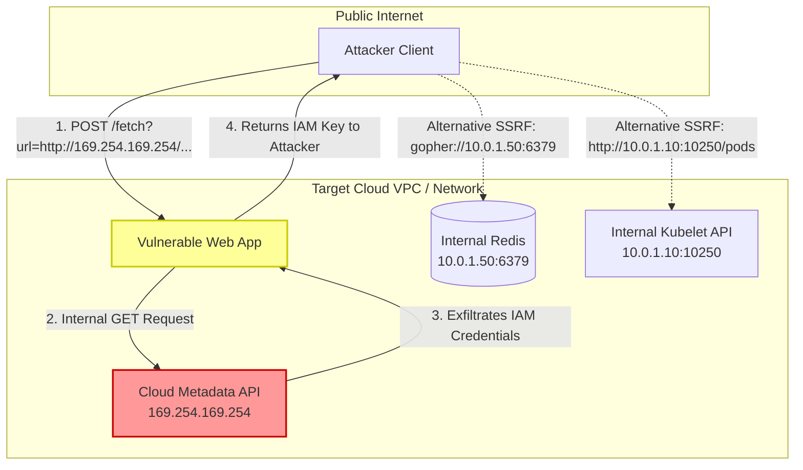

# 03 - SSRF and File Upload Security

Server-Side Request Forgery (SSRF) and Unrestricted File Upload vulnerabilities represent critical threat vectors that often lead directly to complete internal network compromise or Remote Code Execution (RCE).

---

## 1. Server-Side Request Forgery (SSRF) Deep Dive

SSRF occurs when a web application accepts a user-supplied URL and fetches data from that endpoint without validating the destination host or protocol. Attackers use the application as a proxy to send requests to internal services, loopback interfaces, and cloud management metadata APIs.

### Cloud Instance Metadata Service (IMDS) Exploitation

Cloud environments expose non-routable link-local IP addresses (`169.254.169.254`) that provide metadata and IAM role credentials to instances.

```
========================================================================================
AWS IMDSv1 (VULNERABLE TO BASIC SSRF):
  GET http://169.254.169.254/latest/meta-data/iam/security-credentials/admin-role
  --> Returns AccessKeyId, SecretAccessKey, and Token!

GCP METADATA (REQUIRES CUSTOM HEADER):
  GET http://metadata.google.internal/computeMetadata/v1/
  --> Blocked unless attacker can inject header: "Metadata-Flavor: Google"

AWS IMDSv2 (HARDENED - REQUIRES TOKEN):
  1. PUT http://169.254.169.254/latest/api/token (Header: X-aws-ec2-metadata-token-ttl-seconds: 21600)
  2. GET http://169.254.169.254/latest/meta-data/ (Header: X-aws-ec2-metadata-token: TOKEN)
========================================================================================
```



---

### SSRF Bypass Techniques

Attackers use sophisticated tricks to bypass simplistic IP denylists (e.g., checking for `127.0.0.1` or `169.254.169.254` strings):

1. **Alternative IP Notation:**
   * Hexadecimal: `http://0xa9fea9fe` (evaluates to `169.254.169.254`)
   * Decimal Integer: `http://2852039166` (evaluates to `169.254.169.254`)
   * Octal Encoding: `http://0251.0372.0251.0372`
   * IPv6-Mapped IPv4: `http://[::ffff:169.254.169.254]` or `http://[::1]`
2. **DNS Rebinding Attacks:**
   * Attacker sets up a custom domain (e.g., `ssrf.attacker.com`) with a TTL of 0 seconds.
   * On initial DNS lookup (application validation step), the domain resolves to an external safe IP (`203.0.113.5`).
   * On the second DNS lookup (actual HTTP connection step), the domain resolves to internal `127.0.0.1` or `169.254.169.254`.
3. **URL Parsing Differentials:**
   * Using embedded credentials or URL fragments: `http://expected-domain@127.0.0.1` or `http://127.0.0.1#expected-domain`.
4. **Open Redirect Chains:**
   * Application validates `https://trusted.com/redirect?url=http://169.254.169.254`. If HTTP client automatically follows redirects, the validation is bypassed.

---

### Battle-Tested SSRF Defenses

> [!IMPORTANT]
> The only robust defense against SSRF is to resolve the domain to its IP address **prior** to initiating the connection, verify that the IP is not in any private/reserved range, and pin the socket connection directly to that validated IP address to prevent DNS rebinding.

#### Production Python SSRF Guard (Socket-Level Pinning)

```python
import socket
import ipaddress
from urllib.parse import urlparse
import requests
from requests.adapters import HTTPAdapter

def is_ip_allowed(ip_str: str) -> bool:
    """Verifies that an IP is globally routable and not in private or reserved ranges."""
    try:
        ip = ipaddress.ip_address(ip_str)
        # Block private (10.x, 172.16-31.x, 192.168.x), loopback (127.x), 
        # link-local (169.254.x), multicast, and reserved ranges
        return not (ip.is_private or ip.is_loopback or ip.is_link_local or 
                    ip.is_multicast or ip.is_reserved or ip.is_unspecified)
    except ValueError:
        return False

def safe_fetch_url(url: str, timeout: int = 5) -> str:
    """Fetches URL safely by performing strict IP validation before connection."""
    parsed = urlparse(url)
    if parsed.scheme not in ('http', 'https'):
        raise ValueError(f"Disallowed scheme: {parsed.scheme}")

    hostname = parsed.hostname
    if not hostname:
        raise ValueError("Invalid target hostname")

    # 1. Resolve host to IP addresses
    resolved_ips = socket.getaddrinfo(hostname, parsed.port or (443 if parsed.scheme == 'https' else 80))
    target_ip = resolved_ips[0][4][0]

    # 2. Check resolved IP against private address space
    if not is_ip_allowed(target_ip):
        raise SecurityError(f"Access to private IP address {target_ip} is blocked.")

    # 3. Fetch resource with short timeout and redirect handling disabled
    response = requests.get(
        url,
        timeout=timeout,
        allow_redirects=False, # Disable auto-redirects to prevent bypasses
        headers={'User-Agent': 'SecureApp-Fetcher/1.0'}
    )
    return response.text
```

#### Production Go SSRF Mitigation (`http.Client` Custom DialContext)

```go
package main

import (
	"context"
	"fmt"
	"net"
	"net/http"
	"time"
)

func isPrivateIP(ip net.IP) bool {
	if ip.IsLoopback() || ip.IsLinkLocalUnicast() || ip.IsLinkLocalMulticast() || ip.IsPrivate() {
		return true
	}
	return false
}

func NewSafeHTTPClient() *http.Client {
	dialer := &net.Dialer{
		Timeout: 5 * time.Second,
	}

	transport := &http.Transport{
		DialContext: func(ctx context.Context, network, addr string) (net.Conn, error) {
			host, port, err := net.SplitHostPort(addr)
			if err != nil {
				return nil, err
			}

			// Resolve IP address
			ips, err := net.DefaultResolver.LookupIPAddr(ctx, host)
			if err != nil || len(ips) == 0 {
				return nil, fmt.Errorf("failed to resolve host: %v", err)
			}

			// Validate target IP
			targetIP := ips[0].IP
			if isPrivateIP(targetIP) {
				return nil, fmt.Errorf("SSRF Blocked: IP %s is private", targetIP.String())
			}

			// Connect directly to validated IP address
			return dialer.DialContext(ctx, network, net.JoinHostPort(targetIP.String(), port))
		},
	}

	return &http.Client{
		Transport: transport,
		CheckRedirect: func(req *http.Request, via []*http.Request) error {
			return http.ErrUseLastResponse // Block automatic redirects
		},
		Timeout: 10 * time.Second,
	}
}
```

---

## 2. File Upload Security & Path Traversal Deep Dive

Unrestricted file upload vulnerabilities allow attackers to place executable scripts (e.g., PHP, JSP, ASPX web shells) directly into web-accessible directories, resulting in Remote Code Execution (RCE).

### Defensive File Upload Architecture

```mermaid
flowchart LR
    User[Client Browser] -->|1. Multipart Upload| WebServer[Web Application]
    WebServer -->|2. Extract & Validate Bytes| Validator[Magic Byte & MIME Checker]
    Validator -->|3. Strip Metadata & Re-encode| ImageEngine[Pillow / Sharp Engine]
    ImageEngine -->|4. Push to Non-Executable Storage| S3[(AWS S3 Bucket / Private Storage)]
    S3 -->|5. Serve via CDN with Restricted Headers| CDN[Cloudfront CDN]

    style Validator fill:#bbf,stroke:#333,stroke-width:2px
    style ImageEngine fill:#dfd,stroke:#333,stroke-width:2px
    style S3 fill:#f9f,stroke:#333,stroke-width:2px
```



---

### Core Defensive Checklist for File Uploads

1. **Filename Sanitization & Randomization:** Never retain the client-supplied filename. Rename files using cryptographically secure UUIDs (`uuid.uuid4().hex`).
2. **Extension Allowlisting:** Validate file extensions against a strict allowlist (e.g., `.png`, `.jpg`, `.pdf`). **Never use denylists.**
3. **MIME Type & Magic Byte Inspection:** Inspect the actual binary signature (magic bytes) using tools like `python-magic` or `file-type` rather than trusting the `Content-Type` header.
4. **Image Re-Encoding / Metadata Stripping:** Decode image files and re-render them through an image library (Pillow, Sharp) to strip EXIF metadata, malicious polyglot structures, and embedded scripts.
5. **Storage Isolation:** Store files outside the web root directory or in isolated object storage (e.g., AWS S3). Ensure uploaded directories have execution permissions disabled (`NoExec`, `php_flag engine off`).

---

### Secure File Upload Implementation

#### Production Python (Flask + MIME Magic Bytes + Pillow Re-Encoding)

```python
import os
import uuid
from flask import Flask, request, jsonify
from PIL import Image
import magic

app = Flask(__name__)

ALLOWED_EXTENSIONS = {'png', 'jpg', 'jpeg'}
ALLOWED_MIME_TYPES = {'image/png', 'image/jpeg'}
UPLOAD_FOLDER = '/var/app/storage/secure_uploads'
MAX_CONTENT_LENGTH = 5 * 1024 * 1024 # 5 MB Limit

app.config['MAX_CONTENT_LENGTH'] = MAX_CONTENT_LENGTH

def is_allowed_extension(filename: str) -> bool:
    return '.' in filename and filename.rsplit('.', 1)[1].lower() in ALLOWED_EXTENSIONS

def validate_magic_bytes(file_stream) -> bool:
    """Inspects binary magic bytes using python-magic."""
    header = file_stream.read(2048)
    file_stream.seek(0)
    mime_type = magic.from_buffer(header, mime=True)
    return mime_type in ALLOWED_MIME_TYPES

@app.route('/upload-avatar', methods=['POST'])
def upload_avatar():
    if 'avatar' not in request.files:
        return jsonify({'error': 'No file part'}), 400

    file = request.files['avatar']
    if not file or file.filename == '':
        return jsonify({'error': 'No selected file'}), 400

    # 1. Check file extension
    if not is_allowed_extension(file.filename):
        return jsonify({'error': 'Disallowed file extension'}), 400

    # 2. Check Magic Bytes
    if not validate_magic_bytes(file.stream):
        return jsonify({'error': 'File content mismatch / invalid format'}), 400

    # 3. Generate random UUID filename
    ext = file.filename.rsplit('.', 1)[1].lower()
    secure_filename = f"{uuid.uuid4().hex}.{ext}"
    destination_path = os.path.join(UPLOAD_FOLDER, secure_filename)

    # 4. Strip EXIF & Re-encode Image via Pillow
    try:
        image = Image.open(file.stream)
        # Re-create clean image buffer discarding metadata & EXIF payloads
        clean_data = list(image.getdata())
        clean_image = Image.new(image.mode, image.size)
        clean_image.putdata(clean_data)
        clean_image.save(destination_path)
    except Exception as e:
        return jsonify({'error': 'Corrupt image payload'}), 400

    return jsonify({'message': 'Upload successful', 'file_id': secure_filename}), 201
```

#### Node.js (Express + Multer + Sharp Image Processing)

```javascript
const express = require('express');
const multer = require('multer');
const sharp = require('sharp');
const v4 = require('uuid').v4;
const path = require('path');

const app = express();

// Configure Multer memory storage
const upload = multer({
    limits: { fileSize: 5 * 1024 * 1024 }, // 5 MB Limit
    fileFilter: (req, file, cb) => {
        const allowedTypes = ['image/jpeg', 'image/png'];
        if (!allowedTypes.includes(file.mimetype)) {
            return cb(new Error('Invalid MIME Type'), false);
        }
        cb(null, true);
    }
});

app.post('/api/upload', upload.single('image'), async (req, res) => {
    try {
        if (!req.file) {
            return res.status(400).send('No file uploaded');
        }

        const filename = `${v4()}.png`;
        const outputPath = path.join(__dirname, 'uploads', filename);

        // Re-render image with Sharp: strips metadata, converts to sanitized PNG
        await sharp(req.file.buffer)
            .resize(800, 800, { fit: 'inside' })
            .png({ quality: 80 })
            .toFile(outputPath);

        res.status(201).json({ status: 'success', file: filename });
    } catch (err) {
        res.status(500).json({ error: 'Image processing failed' });
    }
});
```

---

## 3. Path Traversal (`../`) Prevention

Path Traversal occurs when user input is concatenated into file system file-access APIs (e.g., `open()`, `readFileSync()`), allowing attackers to navigate outside the intended working directory via `../` sequences.

### Vulnerable Code Pattern:
```python
# VULNERABLE: Direct concatenation allows reading /etc/passwd via filename=../../../../etc/passwd
@app.route('/view')
def view_file():
    filename = request.args.get('filename')
    with open(f"/var/www/uploads/{filename}", "r") as f:
        return f.read()
```

### Remediated Path Traversal Prevention:
```python
import os

BASE_DIR = os.path.abspath("/var/www/uploads")

def get_safe_filepath(user_filename: str) -> str:
    # 1. Resolve absolute canonical path
    target_path = os.path.abspath(os.path.join(BASE_DIR, user_filename))
    
    # 2. Verify target path starts with the base directory prefix
    if not target_path.startswith(BASE_DIR + os.sep):
        raise ValueError("Directory traversal attempt detected!")
        
    return target_path
```
