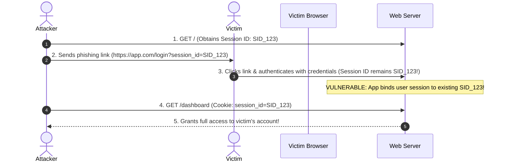

# 04 - Session Management and Authentication

Session management establishes and maintains secure state between a web browser and a backend application across consecutive HTTP requests. Designing resilient session systems requires understanding both stateful (server-side) and stateless (token-based) authentication mechanics.

---

## 1. Stateful vs. Stateless Architecture Comparison

```
STATEFUL SESSIONS (REDIS / DATABASE)
Client (Cookie: session_id=abc) ---> Web App ---> Lookup 'abc' in Redis Store ---> User Context

STATELESS SESSIONS (JSON WEB TOKENS - JWT)
Client (Header: Bearer eyJhbG...) ---> Web App ---> Cryptographically Verify Signature ---> Extract Claims
```

| Feature | Stateful Sessions (Redis Store) | Stateless Tokens (JWT / Bearer) |
| :--- | :--- | :--- |
| **State Location** | Server-side memory / Redis datastore | Client-side storage (Cookies / Memory) |
| **Revocation Control** | **Instant** (Delete key from Redis) | Complex (Requires blacklist / revocation lists) |
| **Scalability** | Requires central session cache cluster | High (No database lookup required per request) |
| **Payload Size** | Minimal (~32-character session token) | Medium to Large (Contains encoded claims) |
| **Primary Threat** | Session Fixation, Hijacking | Signature Bypasses, Key Theft, Replay |

---

## 2. Session Threat Vectors & Attack Mechanics

### Session Fixation Attack Flow

In a Session Fixation attack, an unauthenticated attacker obtains a valid session ID from the application, forces a victim's browser to adopt that session ID, and waits for the victim to authenticate. If the server fails to rotate the session ID upon login, the attacker gains full access to the victim's account.



> [!IMPORTANT]
> **Defensive Rule:** Applications MUST regenerate and assign a brand new session identifier immediately upon successful authentication, privilege escalation, or user state changes.

---

### Cookie Hardening & Prefix Specifications

Session IDs transmitted via HTTP cookies must be fortified against interception and tampering using standard cookie attributes and RFC-compliant prefixes.

```http
Set-Cookie: __Host-sessionId=e837492a01b2c45; Path=/; Secure; HttpOnly; SameSite=Strict
```

#### Security Flags Breakdown:
* `HttpOnly`: Prevents client-side scripts (`document.cookie`) from accessing the session cookie, mitigating session theft via XSS.
* `Secure`: Instructs the browser to send the cookie **only** over encrypted HTTPS connections.
* `SameSite=Strict` / `SameSite=Lax`: Restricts cross-site cookie transmission to defend against CSRF.

#### Hardened Cookie Prefixes (RFC 6638):
1. **`__Host-` Prefix:** The cookie must satisfy ALL of the following criteria, or the browser will reject it:
   * Must include the `Secure` flag.
   * Must be set from a secure origin (HTTPS).
   * Must NOT include a `Domain` attribute (restricts cookie strictly to the current host, preventing subdomain injection).
   * Must specify `Path=/`.
2. **`__Secure-` Prefix:** Requires the cookie to be set with the `Secure` flag from an HTTPS origin.

---

## 3. JWT Security Pitfalls & Best Practices

JSON Web Tokens (JWTs) are widely used for stateless authentication. However, improper implementation introduces critical vulnerabilities:

### Common JWT Vulnerability Vectors

1. **Algorithm Confusion (`alg: none`):** Attackers modify the JWT header to `"alg": "none"` and remove the signature portion. Vulnerable JWT libraries accept unsigned tokens.
2. **Asymmetric to Symmetric Key Confusion (`RS256` to `HS256`):** Attackers change `"alg": "RS256"` (RSA public/private key) to `"HS256"` (HMAC symmetric key) and sign the token using the server's publicly accessible RSA **public key** as the HMAC secret key.
3. **Weak Secret Keys:** Using simple or dictionary words for `HS256` signatures enables offline brute-force attacks via tools like `hashcat` or `John the Ripper`.
4. **Missing Expiration & Token Revocation:** Issuing tokens without short expiration times (`exp`) or missing refresh token revocation capabilities.

```json
// Malicious JWT Header with 'none' Algorithm
{
  "alg": "none",
  "typ": "JWT"
}
```

---

## 4. Production Code Implementations

### Python (Flask + Redis Server-Side Session Management)

```python
import os
from flask import Flask, session, redirect, url_for, request, jsonify
from flask_session import Session
import redis

app = Flask(__name__)

# Cryptographically strong secret key
app.config['SECRET_KEY'] = os.urandom(32)

# Redis Session Configuration
app.config['SESSION_TYPE'] = 'redis'
app.config['SESSION_REDIS'] = redis.Redis(host='127.0.0.1', port=6379, db=0)
app.config['SESSION_PERMANENT'] = False
app.config['SESSION_USE_SIGNER'] = True

# Enforce Security Cookie Flags & Prefixes
app.config['SESSION_COOKIE_NAME'] = '__Host-session'
app.config['SESSION_COOKIE_SECURE'] = True
app.config['SESSION_COOKIE_HTTPONLY'] = True
app.config['SESSION_COOKIE_SAMESITE'] = 'Strict'
app.config['SESSION_COOKIE_PATH'] = '/'

Session(app)

@app.route('/login', methods=['POST'])
def login():
    username = request.json.get('username')
    password = request.json.get('password')

    if authenticate_user(username, password):
        # DEFENSE AGAINST SESSION FIXATION:
        # Clear old session data and rotate session ID
        session.clear()
        session['user_id'] = get_user_id(username)
        session['authenticated'] = True
        return jsonify({'message': 'Logged in successfully'}), 200

    return jsonify({'error': 'Invalid credentials'}), 401

@app.route('/logout', methods=['POST'])
def logout():
    # Purge session from Redis datastore
    session.clear()
    return jsonify({'message': 'Logged out successfully'}), 200
```

---

### Node.js (Express + express-session + Redis Backend)

```javascript
const express = require('express');
const session = require('express-session');
const RedisStore = require('connect-redis').default;
const { createClient } = require('redis');
const crypto = require('crypto');

const app = express();

// Initialize Redis Client
const redisClient = createClient({ url: 'redis://127.0.0.1:6379' });
redisClient.connect().catch(console.error);

app.use(
  session({
    store: new RedisStore({ client: redisClient }),
    secret: crypto.randomBytes(32).toString('hex'),
    resave: false,
    saveUninitialized: false,
    name: '__Host-sid', // RFC 6638 Secure Cookie Prefix
    cookie: {
      secure: true,   // Requires HTTPS
      httpOnly: true, // Mitigates XSS cookie theft
      sameSite: 'strict',
      path: '/',      // Required for __Host- prefix
      maxAge: 1000 * 60 * 30 // 30 minute session expiration
    }
  })
);

app.post('/api/login', (req, res, next) => {
  const { username, password } = req.body;

  if (verifyCredentials(username, password)) {
    // Regenerate Session ID to eliminate Session Fixation
    req.session.regenerate((err) => {
      if (err) return next(err);
      req.session.userId = getUserId(username);
      res.json({ status: 'authenticated' });
    });
  } else {
    res.status(401).json({ error: 'Unauthorized' });
  }
});

app.post('/api/logout', (req, res) => {
  req.session.destroy((err) => {
    res.clearCookie('__Host-sid');
    res.json({ status: 'logged_out' });
  });
});
```

---

### Hardened PyJWT Verification Implementation

```python
import jwt
import datetime

JWT_SECRET_KEY = os.environ.get("JWT_SECRET_KEY")

def generate_access_token(user_id: str) -> str:
    payload = {
        'sub': user_id,
        'iss': 'appsec-atlas-auth',
        'aud': 'appsec-atlas-api',
        'iat': datetime.datetime.now(datetime.timezone.utc),
        'exp': datetime.datetime.now(datetime.timezone.utc) + datetime.timedelta(minutes=15)
    }
    # Always specify explicit algorithm
    return jwt.encode(payload, JWT_SECRET_KEY, algorithm='HS256')

def verify_access_token(token: str) -> dict:
    try:
        # Strictly enforce allowed algorithms, issuer, and audience
        decoded = jwt.decode(
            token,
            JWT_SECRET_KEY,
            algorithms=['HS256'], # Prevents alg: none and algorithm confusion
            issuer='appsec-atlas-auth',
            audience='appsec-atlas-api',
            options={'verify_exp': True, 'verify_iss': True, 'verify_aud': True}
        )
        return decoded
    except jwt.ExpiredSignatureError:
        raise ValueError("Token has expired")
    except jwt.InvalidTokenError:
        raise ValueError("Invalid authentication token")
```
