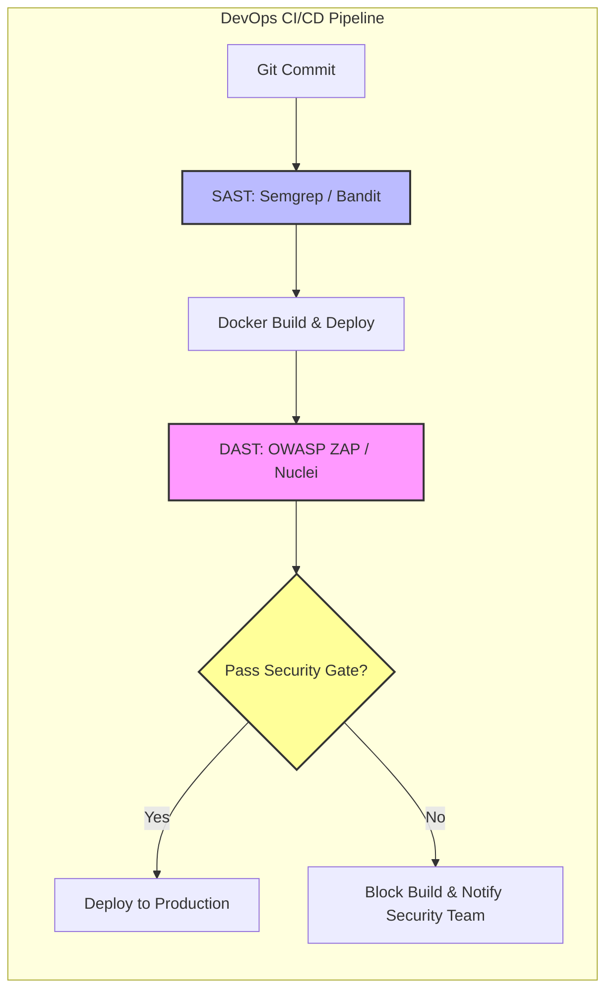

# 05 - Web Security Scanners & Testing Automation

Dynamic Application Security Testing (DAST) tools simulate real-world attacks by interacting with running web applications to identify runtime vulnerabilities, infrastructure misconfigurations, and authentication flaws. Integrating DAST and SAST into automated CI/CD pipelines ensures continuous security verification.

---

## 1. Security Testing Methodology Comparison

```
+----------------------------------------------------------------------------------------------+
| TESTING TYPE | TYPE NAME                        | OPERATIONAL STAGE | PRIMARY STRENGTH           |
+--------------+----------------------------------+-------------------+----------------------------+
| SAST         | Static App Security Testing      | Build / Source    | Line-level source analysis |
| DAST         | Dynamic App Security Testing     | Runtime / Staging | Black-box behavior audit   |
| IAST         | Interactive App Security Testing | Testing / QA      | Agent-based inside runtime |
| SCA          | Software Composition Analysis    | Build / Deps      | Known CVEs in packages     |
+----------------------------------------------------------------------------------------------+
```



---

## 2. OWASP ZAP (Zed Attack Proxy) Deep Dive

OWASP ZAP is an open-source, enterprise-grade web application scanner and proxy.

### Docker CLI Automation Modes

#### 1. Baseline Scan (Passive Audit)
Runs the passive scanner against a target URL for rapid security header and configuration checks:
```bash
docker run -v $(pwd):/zap/wrk/:rw -t owasp/zap2docker-stable zap-baseline.py \
  -t https://staging.example.com \
  -g gen.conf \
  -r zap_baseline_report.html
```

#### 2. Full Active Scan (Attacker Fuzzing)
Executes spidering followed by active attack payloads across all identified inputs:
```bash
docker run -v $(pwd):/zap/wrk/:rw -t owasp/zap2docker-stable zap-full-scan.py \
  -t https://staging.example.com \
  -c zap_rules.conf \
  -r zap_full_report.html
```

#### 3. OpenAPI / REST API Automated Scan
Scans RESTful endpoints directly using an OpenAPI/Swagger definition file:
```bash
docker run -v $(pwd):/zap/wrk/:rw -t owasp/zap2docker-stable zap-api-scan.py \
  -t https://api.staging.example.com/swagger.json \
  -f openapi \
  -r zap_api_report.html
```

---

### OWASP ZAP GitHub Actions CI/CD Integration

```yaml
name: Continuous Security Scan (DAST)

on:
  push:
    branches: [ main ]
  schedule:
    - cron: '0 2 * * 1' # Weekly security baseline

jobs:
  zap_scan:
    runs-on: ubuntu-latest
    name: Run OWASP ZAP DAST Scan
    steps:
      - name: Checkout Code
        uses: actions/checkout@v3

      - name: Launch Staging Application Container
        run: |
          docker-compose -f docker-compose.staging.yml up -d
          sleep 15 # Wait for services to become healthy

      - name: OWASP ZAP Baseline Scan
        uses: zaproxy/action-baseline@v0.7.0
        with:
          target: 'http://localhost:8080'
          rules_file_name: '.zap/rules.tsv'
          cmd_options: '-a'
```

---

## 3. Burp Suite Automation & Power Usage

Burp Suite is the industry-standard interactive security proxy.

### Key Operational Components

1. **Proxy & Intercept:** Captures and inspects HTTP/HTTPS traffic.
2. **Repeater:** Allows security engineers to modify and re-issue individual HTTP requests to analyze backend responses.
3. **Intruder:** Automated parameter fuzzing tool offering four distinct attack types:
   * **Sniper:** Cycles through payloads one parameter at a time.
   * **Battering Ram:** Injects the same payload into all targeted parameters simultaneously.
   * **Pitchfork:** Uses parallel payload lists for corresponding parameters.
   * **Cluster Bomb:** Tests every combination across multiple payload lists (exhaustive matrix).

### Advanced Fuzzing with Turbo Intruder (Python Scripting)

Turbo Intruder is a Burp extension designed to issue thousands of requests per second for race-condition testing and payload fuzzing.

```python
# Turbo Intruder Python Payload Script for Race Conditions
def queueRequests(target, wordlists):
    engine = RequestEngine(endpoint=target.endpoint,
                           concurrentConnections=30,
                           requestsPerConnection=100,
                           pipeline=False
                           )

    # Queue request for race condition testing
    for i in range(30):
        engine.queue(target.req, gate='race1')

    # Release all 30 requests simultaneously on the socket connection
    engine.openGate('race1')

def handleResponse(req, interesting):
    if req.status == 200:
        table.add(req)
```

---

## 4. Nuclei: Modern Vulnerability Scanning

ProjectDiscovery's **Nuclei** is a fast, template-driven vulnerability scanner used for black-box web auditing.

### Essential CLI Commands

```bash
# Update templates repository
nuclei -update-templates

# Scan target for high and critical web vulnerabilities
nuclei -u https://example.com -severity high,critical -r http-key-takeover,cves

# Run specific web security template directory
nuclei -u https://example.com -t http/vulnerabilities/generic/
```

### Custom Nuclei YAML Template Example (`xss-stored-check.yaml`)

```yaml
id: custom-stored-xss-detection

info:
  name: Stored XSS Comment Parameter Detection
  author: appsec-atlas
  severity: high
  description: Detects unescaped stored script tags in comment submission endpoints.

requests:
  - raw:
      - |
        POST /comment HTTP/1.1
        Host: {{Hostname}}
        Content-Type: application/x-www-form-urlencoded

        comment=%3Cscript%3Ealert%28%27NUCLEI_XSS_TEST%27%29%3C%2Fscript%3E

      - |
        GET /comments HTTP/1.1
        Host: {{Hostname}}

    matchers-condition: and
    matchers:
      - type: word
        words:
          - "<script>alert('NUCLEI_XSS_TEST')</script>"
        part: body

      - type: status
        status:
          - 200
```

---

## 5. Static Application Security Testing (SAST) with Semgrep

Semgrep is a fast, open-source SAST engine that uses pattern matching to locate security vulnerabilities in code repositories.

### Custom Semgrep Rule (`flask-ssrf-check.yaml`)

```yaml
rules:
  - id: flask-unsafe-requests-get
    patterns:
      - pattern: requests.get($URL, ...)
      - pattern-not: requests.get("...", ...)
      - pattern-inside: |
          @app.route(...)
          def $FUNC(...):
            ...
    message: "Potential SSRF: User-controlled URL passed directly to requests.get without IP validation."
    languages: [python]
    severity: ERROR
```

### Executing Semgrep CLI

```bash
# Run Semgrep with standard security ruleset
semgrep --config p/security-audit .

# Run custom ruleset file
semgrep --config flask-ssrf-check.yaml /path/to/codebase
```
