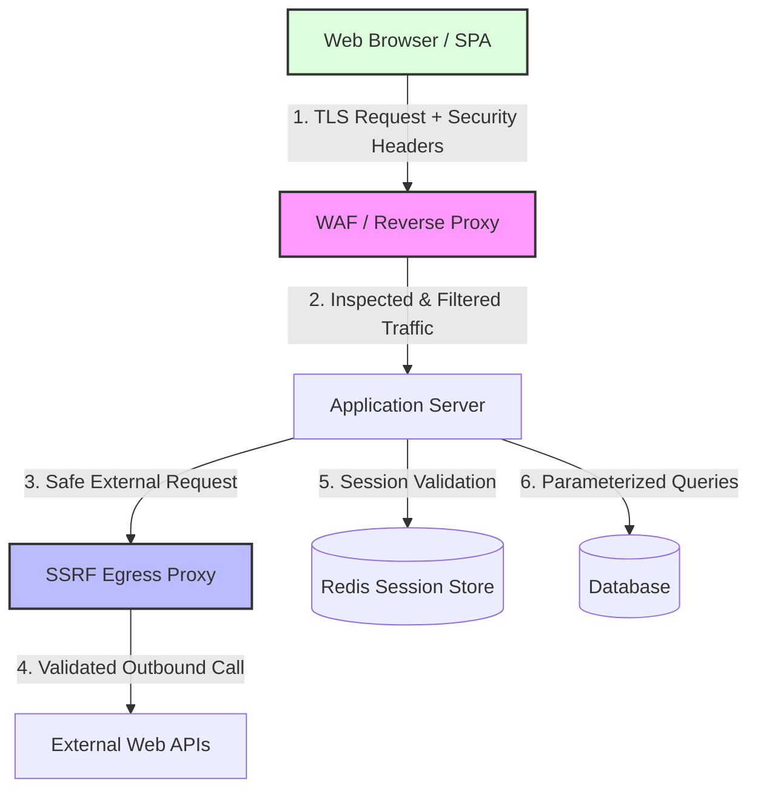

# Web Application Security Handbook

Welcome to the **Web Application Security Handbook**. This guide provides an exhaustive, production-grade exploration of core web application security vulnerabilities, defensive architecture patterns, modern browser security controls, and hands-on remediation techniques.

---

## Architectural Overview

Modern web applications operate across multi-tiered architecture boundaries—ranging from client-side single-page applications (SPAs) and edge proxy layers to backend API servers and microservices. Security must be applied at every layer of the HTTP request lifecycle.

```
+-----------------------------------------------------------------------------------+
|                                 CLIENT / BROWSER                                  |
|  - CSP Policies        - Cookie Security Flags   - Context-Aware Output Escaping  |
+-----------------------------------------------------------------------------------+
                                          |
                                          | HTTPS / TLS 1.3
                                          v
+-----------------------------------------------------------------------------------+
|                             EDGE / REVERSE PROXY / WAF                            |
|  - HSTS Preload        - Rate Limiting           - Web Application Firewall       |
|  - Security Headers    - TLS Termination         - IP Whitelisting / Geo-Blocking |
+-----------------------------------------------------------------------------------+
                                          |
                                          | Internal Mesh / mTLS
                                          v
+-----------------------------------------------------------------------------------+
|                                APPLICATION SERVER                                 |
|  - Input Validation    - Anti-CSRF Tokens        - Safe URL Fetching (SSRF Guard) |
|  - Session Rotation    - Auth & Access Control   - Secure File Upload Pipeline    |
+-----------------------------------------------------------------------------------+
                                          |
                                          v
+-----------------------------------------------------------------------------------+
|                              DATA & INTERNAL SERVICES                             |
|  - Redis Session Store - Relational DB (Prepared) - Cloud Metadata (IMDS Shield)  |
+-----------------------------------------------------------------------------------+
```



---

## Prerequisites

To gain maximum value from this handbook, you should have:

* **HTTP Protocol Fundamentals:** Comprehensive understanding of HTTP requests/responses, status codes, headers, cookies, and CORS mechanisms.
* **Modern Web Architectures:** Familiarity with RESTful APIs, Single Page Applications (React, Vue, or Vanilla JS), server-side rendering, and backend MVC patterns.
* **Programming Proficiency:** Ability to read and execute backend code in **Python** (Flask/FastAPI), **JavaScript/Node.js** (Express), **Go**, or **Java** (Spring Boot).
* **Tooling Environment:** Docker Desktop, Python 3.10+, `curl`, and an API client/proxy such as **OWASP ZAP** or **Burp Suite Community Edition**.

---

## Learning Objectives

By completing this handbook, security engineers and backend developers will achieve the following competencies:

1. **Transport & Browser Hardening:** Implement production-ready HTTP Security Headers (`HSTS`, `CSP`, `X-Frame-Options`, `Referrer-Policy`, `Permissions-Policy`, `COOP/COEP`).
2. **Client-Side Vulnerability Remediation:** Identify, exploit, and remediate **Cross-Site Scripting (XSS)** and **Cross-Site Request Forgery (CSRF)** using context-aware escaping, Strict/Lax SameSite cookies, and cryptographic nonces.
3. **Server-Side Request Security:** Neutralize **Server-Side Request Forgery (SSRF)** against cloud metadata endpoints (IMDSv2) and eliminate **Unrestricted File Upload** / **Path Traversal** vectors via binary validation and isolated storage pipelines.
4. **Authentication & Session Hardening:** Design stateful (Redis) and stateless (JWT) session architectures fortified against Session Fixation, Session Hijacking, and algorithm downgrade attacks.
5. **Security Testing Automation:** Execute automated Dynamic Application Security Testing (DAST) pipelines using **OWASP ZAP**, **Burp Suite**, **Nikto**, **Nmap NSE**, and **Nuclei**.
6. **Hands-on Lab Execution:** Deploy a full-stack vulnerable application, write custom Python exploit scripts, and apply production fixes.

---

## Navigation & Chapter Map

| Chapter | Title | Primary Focus Areas | Key Vulnerabilities Addressed | Est. Time |
| :--- | :--- | :--- | :--- | :--- |
| **[01](./01-introduction.md)** | **Introduction & Architecture** | Multi-tier threat modeling, HTTP protocol security, modern browser headers | MiTM, Clickjacking, MIME-sniffing, SSL Stripping | 25 mins |
| **[02](./02-xss-and-csrf-masterclass.md)** | **XSS & CSRF Masterclass** | Stored/Reflected/DOM XSS, Context-aware escaping, Anti-CSRF tokens, SameSite cookies | Stored/Reflected/DOM XSS, CSRF, Account Takeover | 45 mins |
| **[03](./03-ssrf-and-file-upload-security.md)** | **SSRF & File Upload Security** | Egress filtering, DNS rebinding prevention, MIME/magic byte inspection, Path Traversal | SSRF, IMDS Leakage, Remote Code Execution (RCE), Zip Slip | 40 mins |
| **[04](./04-session-management-and-auth.md)** | **Session Management & Auth** | Cookie security flags (`__Host-`), Redis session storage, JWT attack vectors, Session Fixation | Session Fixation, Session Hijacking, Token Forgery | 35 mins |
| **[05](./05-web-security-scanners.md)** | **Web Security Scanners** | DAST automation, OWASP ZAP CI/CD pipelines, Burp Suite setup, Nuclei templates, SAST rules | Fuzzing, Unlinked endpoints, Outdated dependencies | 30 mins |
| **[06](./06-hands-on-lab.md)** | **Hands-on Vulnerability Lab** | Self-contained multi-vulnerability Flask app, Python exploit automation, complete secure refactor | XSS, SSRF, File Upload RCE, Session Fixation | 60 mins |
| **[07](./07-references.md)** | **References & Resources** | OWASP WSTG, ASVS v4.0, RFC standards, CVE case studies, security cheat sheets | Continuous Learning & Standard Compliance | 15 mins |

---

## Usage Instructions & Lab Quickstart

To run the interactive vulnerability lab provided in **Chapter 06**:

```bash
# Clone or navigate to the repository directory
cd docs/02-web-and-api/web-application-security/

# Setup Python virtual environment
python3 -m venv venv
source venv/bin/activate  # On Windows: venv\Scripts\activate

# Install dependencies
pip install flask requests pillow

# Launch vulnerable application (Chapter 06)
python 06-hands-on-lab/app.py
```
