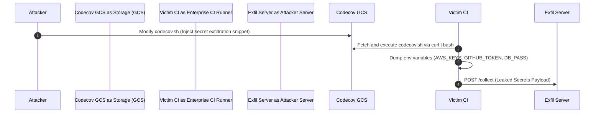

# 01. Overview, Architecture & Supply Chain Threat Landscape

Modern software development relies heavily on Continuous Integration and Continuous Deployment (CI/CD) pipelines to automate building, testing, packaging, and deploying applications. While automation accelerates deployment velocity, it also consolidates high-value operational secrets and deployment privileges into build environments.

Attackers have shifted their focus from target production environments to the software supply chain—hijacking build runners, manipulating dependencies, and poisoning pipelines to compromise downstream consumers.

---

## 1. CI/CD Pipeline Architecture & Attack Surface

A typical automated delivery pipeline connects version control repositories, ephemeral build runners, secrets stores, third-party plugin registries, and target cloud environments.

```
┌─────────────────────────────────────────────────────────────────────────────────────────┐
│                                 CI/CD ATTACK SURFACE MAP                                │
└─────────────────────────────────────────────────────────────────────────────────────────┘
                                                                                           
 [ Developer ] ──► ( 1. Source Code Repositories )                                        
                          │                                                                
                          ▼                                                                
                   [ Pull Request ] ──► ( 2. Pipeline Trigger / PPE )                      
                                               │                                           
                                               ▼                                           
                                  ( 3. Build Runner Node ) ──► [ Exfiltrate Secrets ]     
                                      │                │                                   
             ┌────────────────────────┴───┐            └──► [ Malicious Dependency ]       
             ▼                            ▼                                                
( 4. Secrets Vault / OIDC )   ( 5. Build & Sign )                                          
                                          │                                                
                                          ▼                                                
                              ( 6. Container Registry )                                    
                                          │                                                
                                          ▼                                                
                              [ Production Cluster ]                                       
```

### The 6 Primary Attack Vectors

| Vectors | Target Area | Description |
| :--- | :--- | :--- |
| **1. Source Control** | Git Repository / PRs | Malicious PRs, unauthorized commits, bypassed branch protection rules. |
| **2. Pipeline Triggers** | Event Handlers | Poisoned Pipeline Execution (PPE) via untrusted event contexts (e.g. `pull_request_target`). |
| **3. Runner Environment** | Ephemeral / Self-Hosted | Host execution escape, unisolated shared memory, persistent backdoors on self-hosted runners. |
| **4. Secrets Access** | Environment Variables | Unauthorized reading of cloud API keys, SSH keys, or database credentials stored in pipeline configs. |
| **5. Build & Sign** | Compiler / Bundler | Code modification during compilation without altering git source code (Compiler-level injection). |
| **6. Artifact Distribution** | Image Registries / Package Repos | Publishing unsigned binaries, dependency confusion, or compromised container images to public/private registries. |

---

## 2. OWASP Top 10 for CI/CD Security Risks

The OWASP Foundation established a dedicated security framework for CI/CD pipelines to classify vulnerabilities specific to delivery pipelines:

| Risk ID | Title | Summary & Technical Impact |
| :--- | :--- | :--- |
| **CICD-SEC-01** | **Insufficient Flow Control** | Lack of mandatory human reviews or status checks allowing unverified code directly into production. |
| **CICD-SEC-02** | **Inadequate Identity & Access (IAM)** | Over-privileged build tokens (`GITHUB_TOKEN` write access) or static cloud keys shared across jobs. |
| **CICD-SEC-03** | **Dependency Chain Abuse** | Ingestion of malicious upstream packages, typosquatting, or dependency confusion attacks. |
| **CICD-SEC-04** | **Poisoned Pipeline Execution (PPE)** | Attackers injecting commands into workflow definitions (`.github/workflows/*.yml`) via PRs. |
| **CICD-SEC-05** | **Insufficient Pipeline Verification** | Deploying software artifacts without verifying signatures, checksums, or SLSA provenance metadata. |
| **CICD-SEC-06** | **Arbitrary Code Execution** | Executing untrusted code inside privileged pipeline steps (e.g., executing code from PR forks). |
| **CICD-SEC-07** | **Ungoverned Third-Party Services** | Using unvetted external build actions or SaaS integrations with broad access permissions. |
| **CICD-SEC-08** | **Improper Environment Hygiene** | Reusing non-ephemeral build agents across jobs without cleanup, leading to cross-build contamination. |
| **CICD-SEC-09** | **Secrets Ungoverned Usage** | Hardcoding static secrets in repo files, printing credentials in build logs, or leaking secrets to forks. |
| **CICD-SEC-10** | **Inadequate Logging & Visibility** | Lack of execution auditing, audit log collection, or anomaly detection on build runners. |

---

## 3. High-Profile Real-World Supply Chain Incidents

> [!IMPORTANT]
> Supply chain attacks bypass traditional network perimeters and web application firewalls (WAFs) because the payload originates from a trusted, cryptographically signed internal build process.

### Case Study 1: SolarWinds SUNBURST (2020)
- **Vector**: Compromise of internal build infrastructure (MSBuild compilation pipeline).
- **Mechanism**: Attackers deployed a lightweight implant (`Solorigate`) on build servers. During the build process of SolarWinds Orion software, the implant monitored memory for active compilation of target source files and dynamically inserted backdoor code into `SolarWinds.Orion.Core.BusinessLayer.dll` right before code signing.
- **Impact**: The malicious DLL was signed with legitimate SolarWinds digital certificates and distributed as an official software update to 18,000+ public and private organizations worldwide.

### Case Study 2: Codecov Bash Uploader Compromise (2021)
- **Vector**: Modification of public bash uploader script (`codecov.sh`) hosted on Google Cloud Storage.
- **Mechanism**: Attackers obtained GCS credentials due to a misconfigured Docker image creation process. They modified `codecov.sh` to extract all environment variables passed into the runner environment (including git tokens, cloud keys, database URLs) and send them to an external attacker-controlled server.
- **Impact**: Hundreds of enterprise CI/CD pipelines executing `curl -s https://codecov.io/bash | bash` leaked secret tokens silently for over 2 months.



### Case Study 3: XZ Utils Backdoor (CVE-2024-3094)
- **Vector**: Multi-year social engineering + build-system M4 macro & tarball script injection.
- **Mechanism**: A malicious contributor ("Jia Tan") spent over two years gaining maintainer trust on the `xz` compression library. Malicious test files containing obfuscated binary payloads were committed. During release tarball generation (outside git repository commit logs), modified `build-to-host.m4` build scripts extracted and injected a backdoor into `liblzma` during compilation.
- **Impact**: The backdoor intercepted OpenSSH `RSA_public_decrypt` calls, allowing attackers possessing a specific private key to achieve Remote Code Execution (RCE) on affected Linux distributions (Debian, Fedora, Arch).

---

## 4. The SLSA Framework (Supply-chain Levels for Software Artifacts v1.0)

SLSA (pronounced *salsa*) is an OpenSSF open standard defining actionable security requirements to prevent supply chain tampering across software builds.

```
┌─────────────────────────────────────────────────────────────────────────────┐
│                       SLSA BUILD LEVELS & REQUIREMENTS                      │
├──────────┬──────────────────────────────────────────────────────────────────┤
│ Level 1  │ Build process is fully automated. Build tool generates build     │
│          │ provenance metadata detailing how the artifact was created.      │
├──────────┼──────────────────────────────────────────────────────────────────┤
│ Level 2  │ Build runs on a dedicated hosted build service (e.g. GitHub      │
│          │ Actions). Provenance is cryptographically signed by the platform.│
├──────────┼──────────────────────────────────────────────────────────────────┤
│ Level 3  │ Build environment is isolated and ephemeral. Hardened against    │
│          │ cross-build contamination, host tamper attempts, and secret leaks.│
└──────────┴──────────────────────────────────────────────────────────────────┘
```

### SLSA Provenance Structure

A SLSA provenance document is an in-toto attestation (`.intoto.json`) containing cryptographic hashes of source commits, build parameters, runner environment identity, and output artifacts:

```json
{
  "_type": "https://in-toto.io/Statement/v1",
  "subject": [
    {
      "name": "registry.example.com/appsec/api-service",
      "digest": {
        "sha256": "e3b0c44298fc1c149afbf4c8996fb92427ae41e4649b934ca495991b7852b855"
      }
    }
  ],
  "predicateType": "https://slsa.dev/provenance/v1",
  "predicate": {
    "buildDefinition": {
      "buildType": "https://actions.github.com/buildtypes/v1",
      "externalParameters": {
        "repository": "https://github.com/techcorp/api-service",
        "ref": "refs/heads/main"
      },
      "resolvedDependencies": [
        {
          "uri": "git+https://github.com/techcorp/api-service@refs/heads/main",
          "digest": {
            "gitCommit": "8f8b0569bc539a4891cb09c4d9fa2e413009a25b"
          }
        }
      ]
    },
    "runDetails": {
      "builder": {
        "id": "https://github.com/actions/runner/github-hosted"
      }
    }
  }
}
```

---

> [!TIP]
> **Key Takeaway:** Securing a CI/CD pipeline requires enforcing identity isolation, pinning all inputs, scanning for secrets before execution, and signing generated artifacts with immutable provenance.

---

*Next Chapter: [02. GitHub Actions & Runner Security Hardening →](02-github-actions-hardening.md)*
