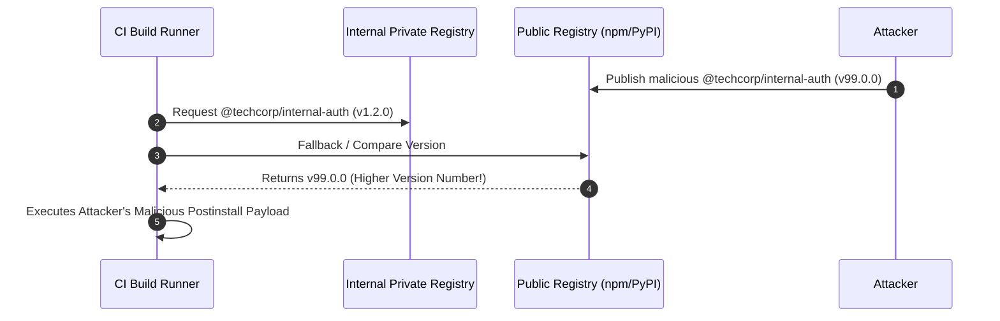

# 03. Secrets Management & Dependency Supply Chain

Securing a CI/CD pipeline requires preventing credential leakage from build logs and securing third-party dependency ingestion. As modern applications rely heavily on external open-source packages, malicious dependency injection has become one of the fastest-growing supply chain attack vectors.

---

## 1. Pipeline Secrets Leakage & Automated Secret Scanning

CI/CD runners require access to deployment credentials (API tokens, cloud access keys, database passwords). Credentials can inadvertently leak via:
- Unmasked output in stdout/stderr build logs.
- Environment variable dumps during failing test suites (`env` or `printenv` execution).
- Child processes inheriting sensitive process environments.
- Malicious pull requests accessing unmasked workflow secrets.

```
┌─────────────────────────────────────────────────────────────────────────────┐
│                       AUTOMATED SECRET SCANNING IN CI                       │
└─────────────────────────────────────────────────────────────────────────────┘
  Git Push / PR ──► [ TruffleHog Scanner ] ──► Detect Verified API Keys
                           │
                           ├──► High Entropy String Matched
                           ├──► Live Key Verification Call (AWS/Slack/GitHub API)
                           └──► BLOCK Build if Valid Secret Found!
```

### TruffleHog Automated Secret Scanning Gate

Integrate TruffleHog into your pipeline to analyze full Git history and pull request diffs for active credentials:

```yaml
# .github/workflows/secret_scan.yml
name: Secret Leak Gate
on:
  push:
    branches: [ main ]
  pull_request:

jobs:
  trufflehog:
    name: TruffleHog Secret Scan
    runs-on: ubuntu-latest
    steps:
      - name: Checkout Code
        uses: actions/checkout@b4ffde65f46336ab88eb53be808477a3936bae11 # v4.1.7
        with:
          fetch-depth: 0 # Full commit history required for scanning diffs

      - name: Scan Commit History for Secrets
        uses: trufflesecurity/trufflehog-actions-scan@v3.82.6
        with:
          base: ${{ github.event.repository.default_branch }}
          head: ${{ github.sha }}
          extra_args: --debug --only-verified
```

---

## 2. Dependency Confusion & Typosquatting Attacks

Dependency Confusion (discovered by Alex Birsan) exploits package managers that query both internal private registries and public registries (e.g. `npmjs.org` or `pypi.org`) without strict scope isolation.



### Ecosystem Mitigations & Configuration

#### A. Node.js / npm: Scope Mapping & `.npmrc`
Enforce explicit scope mapping so all internal scoped packages (`@techcorp/*`) are routed **exclusively** to your internal private registry:

```text
# .npmrc (Repository Root)
# Route private scope exclusively to internal Azure Artifacts / Artifactory
@techcorp:registry=https://pkgs.dev.azure.com/techcorp/_packaging/private-npm/registry/
always-auth=true

# Force npm to error if an unscoped dependency is missing from lockfile
engine-strict=true
```

Reserve your organizational scope (`@techcorp`) on public `npmjs.org` to prevent external attackers from claiming the namespace!

---

#### B. Python / PyPI: Eliminating `--extra-index-url`
Using `--extra-index-url` in `pip` causes `pip` to check both public PyPI and private registries simultaneously, picking whichever index offers the **highest version number**.

##### ❌ Vulnerable `pip` Command
```bash
# VULNERABLE: pip compares PyPI vs private index and downloads highest version!
pip install --extra-index-url https://pkgs.dev.azure.com/techcorp/_packaging/pypi/simple/ internal-pkg
```

##### ✅ Secure `pip.conf` Configuration
```ini
# pip.conf (Secure Registry Routing)
[global]
# Point primary index exclusively to private internal mirror/proxy
index-url = https://pkgs.dev.azure.com/techcorp/_packaging/pypi/simple/
# Disable fallback to public PyPI unless explicitly proxied by private registry
no-index = false
```

---

#### C. Go: `GOPRIVATE` & Go Proxy Isolation
Prevent the Go toolchain from leaking internal module paths to public checksum databases (`sum.golang.org`) or public proxies:

```bash
# Set GOPRIVATE to bypass public proxies for internal domains
export GOPRIVATE=github.com/techcorp/*,gitlab.internal.com/*
export GOPROXY=https://goproxy.internal.com,direct
```

---

#### D. Java / Maven: Explicit Mirror in `settings.xml`
Force Maven to route all artifact downloads through a secure internal Nexus/Artifactory repository mirror:

```xml
<!-- ~/.m2/settings.xml -->
<settings>
  <mirrors>
    <mirror>
      <id>internal-repository-mirror</id>
      <name>Corporate Nexus Mirror</name>
      <url>https://nexus.techcorp.internal/repository/maven-public/</url>
      <mirrorOf>*</mirrorOf> <!-- Route ALL repositories through mirror -->
    </mirror>
  </mirrors>
</settings>
```

---

## 3. Multi-Language Secure Dependency Implementation

The table below contrasts vulnerable dependency configurations against secure, production-grade implementations across major language ecosystems.

### Node.js (JavaScript / TypeScript)

#### ❌ Vulnerable `package.json`
```json
{
  "name": "api-service",
  "dependencies": {
    "@techcorp/auth-lib": "^1.0.0",
    "express": "*"
  },
  "scripts": {
    "postinstall": "node scripts/setup.js"
  }
}
```

#### ✅ Secure `package.json` & Lockfile Policy
```json
{
  "name": "api-service",
  "dependencies": {
    "@techcorp/auth-lib": "1.2.4",
    "express": "4.19.2"
  },
  "scripts": {
    "build": "tsc"
  }
}
```
*Run CI installs using `npm ci` (which fails if `package-lock.json` is modified or out of sync).*

---

### Python

#### ❌ Vulnerable `requirements.txt`
```text
# VULNERABLE: Unpinned versions allowing unexpected upstream updates
flask
requests>=2.0.0
internal-auth-sdk
```

#### ✅ Secure Hash-Pinned `requirements.txt` (`pip-compile`)
```text
# SECURE: Exact version and SHA-256 hash pinning generated via pip-compile --generate-hashes
flask==3.0.3 \
    --hash=sha256:0b04618e478546b5a371c667683fe79f5ee01a0937a075c32ee3b216960d70b7
requests==2.31.0 \
    --hash=sha256:58bc26171735163a401b228b3e839178ed4e912444cb3f98293998b3f274a2a1
```

---

### Go

#### ❌ Vulnerable `go.mod`
```go
// VULNERABLE: Indirect dependencies not pinned or audited
module github.com/techcorp/service

go 1.22

require (
    github.com/gin-gonic/gin v1.9.0
)
```

#### ✅ Secure Go Build Command in CI
```bash
# SECURE: Build using vendor directory and check go.sum checksum integrity
go mod verify
go build -mod=readonly -o bin/server main.go
```

---

### Java (Maven / Gradle)

#### ❌ Vulnerable `pom.xml`
```xml
<!-- VULNERABLE: Dynamic LATEST/RELEASE versions -->
<dependency>
    <groupId>com.techcorp</groupId>
    <artifactId>auth-sdk</artifactId>
    <version>RELEASE</version>
</dependency>
```

#### ✅ Secure `pom.xml`
```xml
<!-- SECURE: Explicit fixed version with checksum enforcement -->
<dependency>
    <groupId>com.techcorp</groupId>
    <artifactId>auth-sdk</artifactId>
    <version>2.4.1</version>
</dependency>
```

---

## 4. Lockfile Poisoning & SCA Scanner Integration

Attackers can submit PRs that subtly modify lockfiles (`package-lock.json`, `poetry.lock`, `Cargo.lock`) to insert a malicious deep transitive dependency without changing `package.json`.

### Pipeline SCA Audit Gate (Trivy + Snyk)

Integrate Software Composition Analysis (SCA) into CI/CD pipelines to block builds containing known vulnerabilities (CVEs) or suspicious lockfile modifications:

```yaml
# .github/workflows/sca_audit.yml
name: Dependency SCA Audit
on:
  push:
    branches: [ main ]
  pull_request:

jobs:
  sca-scan:
    name: Trivy Dependency Scan
    runs-on: ubuntu-latest
    steps:
      - uses: actions/checkout@b4ffde65f46336ab88eb53be808477a3936bae11 # v4.1.7

      - name: Run Trivy FS Scan
        uses: aquasecurity/trivy-action@d43c1f166ea080cd16e927a74373012b5da2280c # v0.20.0
        with:
          scan-type: 'fs'
          scan-ref: '.'
          format: 'sarif'
          output: 'trivy-results.sarif'
          severity: 'CRITICAL,HIGH'
          exit-code: '1' # Fail pipeline if CRITICAL/HIGH CVEs exist
```

---

*Next Chapter: [04. OIDC Authentication & Cryptographic Artifact Signing →](04-oidc-and-artifact-signing.md)*
