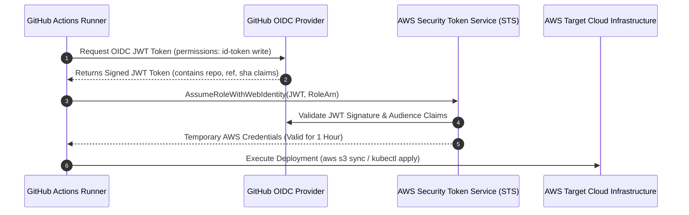

# 04. OIDC Authentication & Cryptographic Artifact Signing

Securing the boundary between CI/CD pipelines and production infrastructure requires two core architectural controls: **eliminating long-lived static cloud credentials** and **cryptographically signing all compiled software artifacts**.

This chapter details OpenID Connect (OIDC) federation and container image signing using Sigstore/Cosign.

---

## 1. Eliminating Static Credentials with OIDC Federation

Storing long-lived cloud API keys (`AWS_ACCESS_KEY_ID`, `AWS_SECRET_ACCESS_KEY`, GCP service account JSON keys) in GitHub Secrets creates a critical risk: if a pipeline runner is compromised, attackers extract keys that grant persistent access to enterprise cloud environments.

OpenID Connect (OIDC) allows CI/CD runners to request short-lived, dynamically minted OAuth 2.0 / JWT tokens directly from the cloud provider (AWS, GCP, Azure).



---

### AWS OIDC Integration Setup

#### Step 1: AWS IAM Role Trust Policy (`github-oidc-policy.json`)
Configure an AWS IAM Role trust policy that restricts assumption to a specific GitHub organization, repository, and branch:

```json
{
  "Version": "2012-10-17",
  "Statement": [
    {
      "Effect": "Allow",
      "Principal": {
        "Federated": "arn:aws:iam::123456789012:oidc-provider/token.actions.githubusercontent.com"
      },
      "Action": "sts:AssumeRoleWithWebIdentity",
      "Condition": {
        "StringEquals": {
          "token.actions.githubusercontent.com:aud": "sts.amazonaws.com"
        },
        "StringLike": {
          "token.actions.githubusercontent.com:sub": "repo:techcorp/api-service:ref:refs/heads/main"
        }
      }
    }
  ]
}
```

#### Step 2: GitHub Actions Workflow (`.github/workflows/deploy.yml`)

```yaml
name: Deploy to Production AWS
on:
  push:
    branches: [ main ]

# CRITICAL: Grant permission to request OIDC JWT ID token
permissions:
  id-token: write
  contents: read

jobs:
  deploy:
    runs-on: ubuntu-latest
    steps:
      - uses: actions/checkout@b4ffde65f46336ab88eb53be808477a3936bae11 # v4.1.7

      - name: Authenticate to AWS via OIDC
        uses: aws-actions/configure-aws-credentials@e3dd6a429d7300a6a4c196c26e071d42e0343502 # v4.0.2
        with:
          role-to-assume: arn:aws:iam::123456789012:role/GitHubActionsDeployRole
          aws-region: us-east-1
          # NO STATIC KEYS STORED IN SECRETS!

      - name: Deploy to Cloud
        run: |
          aws ecr get-login-password --region us-east-1 | docker login ...
```

---

## 2. Cryptographic Container Image Signing (Sigstore / Cosign)

Mutable container tags (`:latest`, `:v1.0.0`) can be overwritten by unauthorized registries or man-in-the-middle attackers. Container image signing guarantees that Kubernetes clusters run **ONLY** container images built and signed by authorized CI/CD workflows.

Sigstore provides an open-source standard for artifact signing backed by Linux Foundation and OpenSSF.

```
┌─────────────────────────────────────────────────────────────────────────────┐
│                          SIGSTORE ECOSYSTEM ARCHITECTURE                    │
├──────────────┬──────────────────────────────────────────────────────────────┤
│ Cosign       │ CLI tool for signing and verifying OCI container images.     │
├──────────────┼──────────────────────────────────────────────────────────────┤
│ Fulcio       │ Ephemeral Certificate Authority issuing short-lived X.509    │
│              │ certificates tied to OIDC identity (e.g. GitHub Workflow).  │
├──────────────┼──────────────────────────────────────────────────────────────┤
│ Rekor        │ Immutable, append-only transparency log auditing all signed   │
│              │ certificates and image digests globally.                    │
└──────────────┴──────────────────────────────────────────────────────────────┘
```

---

### Cosign Keyless Signing Workflow in GitHub Actions

Keyless signing uses OIDC identity tokens to obtain temporary signing certificates from Fulcio, publishing public audit records to Rekor without managing private key files!

```yaml
# .github/workflows/build_and_sign.yml
name: Build, Sign, and Push Container Image
on:
  push:
    branches: [ main ]

permissions:
  id-token: write # Required for Sigstore keyless OIDC authentication
  contents: read
  packages: write

jobs:
  build-and-sign:
    runs-on: ubuntu-latest
    steps:
      - uses: actions/checkout@b4ffde65f46336ab88eb53be808477a3936bae11 # v4.1.7

      - name: Install Cosign CLI
        uses: sigstore/cosign-installer@59acb6260d9c0d3bbf966565078588ef73c7165c # v3.5.0

      - name: Log in to GitHub Container Registry (GHCR)
        uses: docker/login-action@0d4c9c5ea7693da7b069a1841bce44c3a93d6d3d # v3.2.0
        with:
          registry: ghcr.io
          username: ${{ github.actor }}
          password: ${{ secrets.GITHUB_TOKEN }}

      - name: Build and Push Docker Image
        id: build-image
        uses: docker/build-push-action@ca052bb54ab0790a636c9b5f226502c73d547a25 # v5.4.0
        with:
          push: true
          tags: ghcr.io/techcorp/api-service:${{ github.sha }}

      - name: Sign Container Image (Keyless Sigstore)
        env:
          IMAGE_DIGEST: ghcr.io/techcorp/api-service@${{ steps.build-image.outputs.digest }}
        run: |
          # Cosign authenticates via GitHub OIDC ID Token automatically
          cosign sign --yes "$IMAGE_DIGEST"
```

---

## 3. Kubernetes Admission Control Enforcement (Kyverno)

Generating signatures in CI/CD provides security only if the production Kubernetes cluster **enforces signature verification** prior to pod deployment.

Deploy a Kyverno ClusterPolicy to intercept pod creation requests and reject unsigned images:

```yaml
# kubernetes/kyverno-verify-images.yaml
apiVersion: kyverno.io/v1
kind: ClusterPolicy
metadata:
  name: verify-container-signature
  annotations:
    policies.kyverno.io/title: Verify Signed Container Images
    policies.kyverno.io/subject: Pod
spec:
  validationFailureAction: Enforce # Block non-compliant deployments
  background: false
  rules:
    - name: verify-signature-sigstore
      match:
        any:
        - resources:
            kinds:
              - Pod
      verifyImages:
        - imageReferences:
            - "ghcr.io/techcorp/*"
          attestors:
            - entries:
                - keyless:
                    issuer: "https://token.actions.githubusercontent.com"
                    subject: "https://github.com/techcorp/api-service/.github/workflows/build_and_sign.yml@refs/heads/main"
                    rekor:
                      url: "https://rekor.sigstore.dev"
```

---

## 4. Generating & Verifying SLSA Provenance

In addition to signing container images, attach cryptographically verifiable SLSA Provenance attestations using the `slsa-github-generator`:

```yaml
# Step inside build workflow calling SLSA Generator reusable workflow
jobs:
  build:
    runs-on: ubuntu-latest
    outputs:
      digests: ${{ steps.hash.outputs.digests }}
    steps:
      - id: hash
        run: echo "digests=$(sha256sum binary-artifact | base64 -w0)" >> "$GITHUB_OUTPUT"

  provenance:
    needs: [build]
    permissions:
      id-token: write
      contents: read
      actions: read
    uses: slsa-framework/slsa-github-generator/.github/workflows/generator_generic_slsa3.yml@v2.0.0
    with:
      base64-subjects: "${{ needs.build.outputs.digests }}"
```

---

*Next Chapter: [05. Pipeline Security Gates & Governance →](05-pipeline-security-gates.md)*
