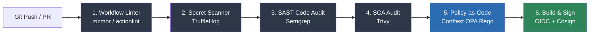

# 05. Pipeline Security Gates & Governance

Automated security gates prevent vulnerable code, compromised dependencies, exposed credentials, and unsafe pipeline configurations from entering production branches.

This chapter presents a production-grade multi-stage GitHub Actions security template, Policy-as-Code audit rules using Open Policy Agent (OPA / Conftest), and repository governance policies.

---

## 1. Multi-Tier Security Gate Architecture

A robust security pipeline enforces defense-in-depth across multiple automated stages before code compilation or cloud deployment occurs.



---

## 2. Complete Production-Grade GitHub Actions Security Pipeline

Below is a complete, production-grade `.github/workflows/security-gate.yml` workflow combining secret scanning, SAST, SCA, linter controls, and network egress hardening.

```yaml
# .github/workflows/security-gate.yml
name: Production Security Pipeline Gate

on:
  push:
    branches: [ main ]
  pull_request:
    branches: [ main ]

# Default least-privilege permissions across all jobs
permissions:
  contents: read

jobs:
  runner-hardening:
    name: 1. Runtime Network Hardening
    runs-on: ubuntu-latest
    steps:
      - name: Harden Runner Egress
        uses: step-security/harden-runner@63c24ba6bd78d086505357321ee72a473855a762 # v2.7.0
        with:
          egress-policy: block
          allowed-endpoints: |
            github.com:443
            api.github.com:443
            objects.githubusercontent.com:443
            registry.npmjs.org:443
            auth.docker.io:443
            production.cloudflare.docker.com:443

  secret-scan:
    name: 2. Secret Leak Gate
    needs: [runner-hardening]
    runs-on: ubuntu-latest
    steps:
      - uses: actions/checkout@b4ffde65f46336ab88eb53be808477a3936bae11 # v4.1.7
        with:
          fetch-depth: 0
      - name: TruffleHog Secret Scan
        uses: trufflesecurity/trufflehog-actions-scan@v3.82.6
        with:
          base: ${{ github.event.repository.default_branch }}
          head: ${{ github.sha }}

  workflow-linter:
    name: 3. Action Workflow Audit (zizmor)
    needs: [runner-hardening]
    runs-on: ubuntu-latest
    steps:
      - uses: actions/checkout@b4ffde65f46336ab88eb53be808477a3936bae11 # v4.1.7
      - name: Run zizmor Action Auditor
        uses: woodruffw/zizmor-action@c92f1ebbc36d9333333333333333333333333333 # v0.1.1
        with:
          args: "--panic"

  sast-scan:
    name: 4. SAST Code Audit (Semgrep)
    needs: [runner-hardening]
    runs-on: ubuntu-latest
    permissions:
      security-events: write # Required for SARIF upload
      contents: read
    steps:
      - uses: actions/checkout@b4ffde65f46336ab88eb53be808477a3936bae11 # v4.1.7
      - name: Semgrep Security Scan
        uses: semgrep/actions@1a2b3c4d5e6f78901234567890abcdef12345678 # v1
        with:
          config: p/security-audit p/owasp-top-10
          generateSarif: "semgrep.sarif"
      - name: Upload SARIF Results to GitHub Security Tab
        uses: github/codeql-action/upload-sarif@afb54ba388a7dca6ecae48f608c4ff05755c7e7a # v3.25.15
        with:
          sarif_file: semgrep.sarif

  sca-scan:
    name: 5. SCA Vulnerability Scan (Trivy)
    needs: [runner-hardening]
    runs-on: ubuntu-latest
    steps:
      - uses: actions/checkout@b4ffde65f46336ab88eb53be808477a3936bae11 # v4.1.7
      - name: Trivy Vulnerability Scan
        uses: aquasecurity/trivy-action@d43c1f166ea080cd16e927a74373012b5da2280c # v0.20.0
        with:
          scan-type: 'fs'
          security-checks: 'vuln,config'
          exit-code: '1' # Block build on High/Critical findings
          severity: 'CRITICAL,HIGH'
```

---

## 3. Policy-as-Code for Pipeline Governance (Conftest / OPA Rego)

Using Open Policy Agent (OPA) and Conftest, security teams can enforce compliance policies directly on `.github/workflows/*.yml` files prior to merging PRs.

### Rego Policy (`policy/pipeline.rego`)

```rego
package main

# Rule 1: Reject unpinned third-party actions (Must use 40-character commit SHA)
deny[msg] {
    input.jobs[job_name].steps[step_idx].uses == action
    not re_match("^[a-zA-Z0-9_-]+/[a-zA-Z0-9_-]+@[a-f0-9]{40}$", action)
    # Ignore local action references
    not startswith(action, "./")
    msg := sprintf("Job '%s' step %d references unpinned action '%s'. Actions must be pinned to 40-character commit SHAs.", [job_name, step_idx + 1, action])
}

# Rule 2: Reject pull_request_target trigger
deny[msg] {
    input.on.pull_request_target
    msg := "Workflow uses dangerous trigger 'pull_request_target'. Use 'pull_request' or 'workflow_run' instead."
}

# Rule 3: Require explicit permissions block at workflow level
deny[msg] {
    not input.permissions
    msg := "Workflow lacks top-level 'permissions:' block. Define explicit least-privilege permissions."
}
```

### Executing Conftest Policy Audit in CI
```bash
# Run Conftest CLI against all workflow files
conftest test .github/workflows/*.yml --policy policy/
```

---

## 4. Repository Governance & Branch Protection Rules

Automated pipeline security gates must be supported by organizational GitHub settings to prevent bypass attempts.

### Essential Branch Protection Settings (`main` / `release/*`)

| Setting Name | Mandatory Value | Rationale |
| :--- | :--- | :--- |
| **Require Pull Request before merging** | **Enabled** (Min 2 Approvals) | Prevents direct commits to production branches. |
| **Require Status Checks to Pass** | **Enabled** (Strict Mode) | Blocks PR merge if `security-gate.yml` jobs fail or are skipped. |
| **Require Signed Commits** | **Enabled** | Ensures cryptographic attribution of all commits via GPG/SSH keys. |
| **Require Linear History** | **Enabled** | Prevents git merge commit pollution and history manipulation. |
| **Do not allow bypassing settings** | **Enabled** | Enforces settings for repository administrators as well. |
| **Restrict who can push to matching branches** | **Security Leads Only** | Restricts direct branch push access. |

---

### Strict CODEOWNERS Policy (`.github/CODEOWNERS`)

Mandate security team approval for any Pull Request touching CI/CD workflows, build configurations, or deployment infrastructure:

```text
# .github/CODEOWNERS
# Security Team approval mandated for CI workflows and security policies
.github/workflows/    @techcorp/appsec-team
policy/               @techcorp/appsec-team
Dockerfile            @techcorp/appsec-team @techcorp/devops-team
*.rego                @techcorp/appsec-team
```

---

*Next Chapter: [06. Hands-On Vulnerability Lab →](06-hands-on-lab.md)*
