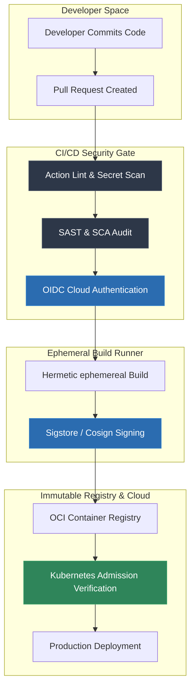

# CI/CD Pipeline Security Masterclass

> **Section:** ☁️ Cloud & Infrastructure Security  
> **Level:** Advanced / Intermediate  
> **Time to Complete:** ~90 minutes  
> **Prerequisites:** Fundamentals of Git, GitHub Actions or GitLab CI, Docker, and basic Cloud IAM (AWS/GCP/Azure)  
> **Status:** ✅ Complete & Production-Ready

---

## 🎯 Overview & Learning Objectives

Continuous Integration and Continuous Deployment (CI/CD) pipelines serve as the central nervous system of modern software engineering. However, because build engines possess elevated privileges—accessing source code, cloud deployment infrastructure, production registries, and API keys—they have become the primary attack surface for supply chain compromised adversaries. 

Instead of attacking heavily defended production clusters directly, sophisticated threat actors compromise the CI/CD pipeline to inject malicious backdoors into legitimate software updates (e.g., SolarWinds, Codecov, XZ Utils).

By completing this masterclass, you will be able to:
- [x] **Analyze** supply chain threat vectors using the OWASP Top 10 for CI/CD Security and the SLSA (Supply-chain Levels for Software Artifacts v1.0) framework.
- [x] **Detect and Remediate** Poisoned Pipeline Execution (PPE), insecure `pull_request_target` triggers, third-party tag spoofing, and inline shell script injection vulnerabilities in GitHub Actions.
- [x] **Eliminate** long-lived cloud credentials from pipeline secrets by implementing federated OpenID Connect (OIDC) authentication with AWS, GCP, and Azure.
- [x] **Prevent** dependency confusion, namespace squatting, and lockfile tampering across npm, PyPI, Go, and Maven ecosystems.
- [x] **Implement** cryptographic artifact and container image signing using Sigstore/Cosign with automated admission control verification via Kyverno.
- [x] **Enforce** policy-as-code governance using Semgrep, TruffleHog, StepSecurity Harden-Runner, Conftest (OPA Rego), and strict GitHub branch protection rules.
- [x] **Execute** a hands-on vulnerability lab involving an end-to-end PPE exploit, secret exfiltration PoC script, and secure workflow remediation.

---

## 📚 Module Navigation

1. **[01. Overview, Architecture & Supply Chain Threat Landscape](01-introduction.md)** — CI/CD architecture breakdown, OWASP Top 10 CI/CD Security Risks, SLSA v1.0 specification, and deep-dives into SolarWinds, Codecov, XZ Utils, and CircleCI breaches.
2. **[02. GitHub Actions & Runner Security Hardening](02-github-actions-hardening.md)** — Poisoned Pipeline Execution (PPE), unsafe `pull_request_target` patterns, action SHA pinning, context variable script injection, and self-hosted runner isolation.
3. **[03. Secrets Management & Dependency Supply Chain](03-secrets-and-dependency-confusion.md)** — Secret scanning with TruffleHog and Gitleaks, dependency confusion attacks, namespace scope reservation (`.npmrc`, `pip.conf`), and multi-language secure package management (Node.js, Python, Go, Java).
4. **[04. OIDC Authentication & Cryptographic Artifact Signing](04-oidc-and-artifact-signing.md)** — Short-lived OIDC federated credentials for AWS/GCP/Azure, Sigstore/Cosign keyless and key-based image signing, SLSA provenance generation, and Kubernetes admission controller enforcement.
5. **[05. Pipeline Security Gates & Governance](05-pipeline-security-gates.md)** — Complete production GitHub Actions security pipeline template, Policy-as-Code using Conftest (OPA Rego), GitHub branch protection, `CODEOWNERS`, and workflow linters (`zizmor`, `actionlint`).
6. **[06. Hands-On Vulnerability Lab](06-hands-on-lab.md)** — Complete runnable vulnerability lab: Vulnerable GitHub Actions workflow + Python PPE exploit script exfiltrating secrets + secure remediated workflow + automated Python pipeline security audit script.
7. **[07. References & Standards](07-references.md)** — Framework specifications, CVE bibliography, open-source security tool repository links, and regulatory standards (NIST SP 800-218 SSDF, CIS Benchmarks).

---

> [!TIP]
> **Getting Started:** If you are auditing an existing engineering pipeline, start with [02. GitHub Actions & Runner Security Hardening](02-github-actions-hardening.md) to inspect your workflow triggers and script injection points immediately.

*Begin reading: [01. Overview, Architecture & Supply Chain Threat Landscape →](01-introduction.md)*
