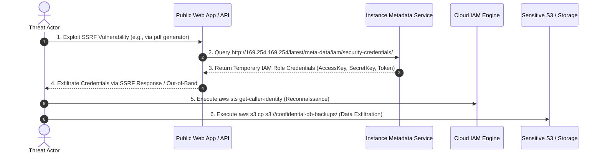

# 01 - Introduction to Cloud Security Architecture & Threat Landscape

The transition from physical data centers to public cloud infrastructure fundamentally redefines the security boundaries of modern software engineering. In traditional on-premises environments, security relied heavily on physical access controls, hard network perimeters (firewalls, demilitarized zones), and static IP addressing. In contrast, cloud environments operate on software-defined infrastructure managed via high-privilege Application Programming Interfaces (APIs).

> [!IMPORTANT]
> **Identity is the New Perimeter:** In the cloud, network perimeters are secondary. A compromised identity credential (API access key, OAuth token, or IAM role) grants direct access to control planes and cloud resources regardless of physical location or network placement.

---

## 1. On-Premises vs. Cloud Infrastructure Security

Understanding the operational differences between legacy on-premises systems and cloud environments is essential for building effective application security controls.

| Security Dimension | On-Premises Data Center | Public Cloud (AWS / Azure / GCP) |
| :--- | :--- | :--- |
| **Security Perimeter** | Hardware firewalls, physical data center walls, network VLANs | Software-defined perimeters, IAM policies, Entra ID, VPC Service Controls |
| **Asset Lifecycle** | Static servers, manually provisioned over days/weeks | Ephemeral, elastic, provisioned dynamically in seconds via APIs/Terraform |
| **Management Boundary** | Direct hypervisor, physical server console, IPMI/iDRAC | Multi-tenant cloud control plane API (`management.azure.com`, `aws.amazon.com`) |
| **Identity Model** | Active Directory Domain Services, Kerberos, LDAP | Cloud IAM, SAML 2.0 / OIDC, Federated Identity, Managed Identities |
| **Data Protection** | Local SAN/NAS encryption, physical drive destruction | KMS envelope encryption, bucket policies, automated customer-managed keys |
| **Visibility** | Network taps, physical SPAN ports, hardware SIEMs | CloudTrail, Azure Monitor, GCP Audit Logs, VPC Flow Logs |

---

## 2. Deep Dive: The Shared Responsibility Model

The **Shared Responsibility Model** dictates the division of security obligations between the Cloud Service Provider (CSP) and the customer enterprise. Misinterpreting this model is the single largest contributor to cloud security breaches.

```mermaid
block-beta
    columns 4
    space:1 title["Cloud Shared Responsibility Model"]:2 space:1
    
    block:SaaS:1
        SaaS_Data["Customer Data"]
        SaaS_IAM["Identity & Access"]
        SaaS_App["App Configuration"]
        SaaS_OS["Vendor OS / Runtime"]
        SaaS_HW["Vendor Hardware / Infra"]
    end

    block:PaaS:1
        PaaS_Data["Customer Data"]
        PaaS_IAM["Identity & Access"]
        PaaS_App["Application Code"]
        PaaS_OS["Vendor OS / Runtime"]
        PaaS_HW["Vendor Hardware / Infra"]
    end

    block:IaaS:1
        IaaS_Data["Customer Data"]
        IaaS_IAM["Identity & Access"]
        IaaS_App["Application Code"]
        IaaS_OS["Customer Guest OS"]
        IaaS_HW["Vendor Hardware / Infra"]
    end

    block:Serverless:1
        SL_Data["Customer Data"]
        SL_IAM["Identity & Access"]
        SL_App["Functions / Logic"]
        SL_OS["Vendor Container Runtime"]
        SL_HW["Vendor Hardware / Infra"]
    end
```

### Granular Responsibility Breakdown Matrix

| Operational Component | Customer Responsibility (IaaS) | Customer Responsibility (PaaS) | Customer Responsibility (SaaS) | CSP Responsibility |
| :--- | :--- | :--- | :--- | :--- |
| **Data Classification & Rights** | Full Responsibility | Full Responsibility | Full Responsibility | None |
| **Identity & Access Management** | Full Responsibility | Full Responsibility | Shared Responsibility | Base IAM Platform |
| **Application Security & Code** | Full Responsibility | Full Responsibility | Configuration Only | App Core & Patching |
| **Guest OS Patching & Config** | Full Responsibility | CSP Managed | CSP Managed | Host OS & Hypervisor |
| **Network Controls & Firewalls** | Security Groups & Subnets | API & Ingress Rules | IP Allowlisting Only | Physical Switches & Routers |
| **Physical Data Center Security** | None | None | None | 100% Responsibility |

> [!WARNING]
> **The Cloud Default Fallacy:** CSPs design default settings for *developer convenience and rapid onboarding*, not maximum security. Out of the box, storage buckets, API endpoints, and databases may lack restrictive access controls or mandatory MFA unless explicitly hardened.

---

## 3. Cloud Threat Landscape & MITRE ATT&CK for Cloud

Attacking a cloud environment requires a different methodology than traditional network penetration testing. Threat actors target control plane APIs, metadata endpoints, and IAM misconfigurations.

### Top 5 Cloud Attack Vectors

1. **Unprotected Storage & Open Buckets:** S3 buckets or Azure Blobs configured with public read access or unauthenticated `AuthenticatedUsers` permissions.
2. **Over-Privileged IAM Roles & Static Keys:** Broad wildcard permissions (such as `Action: *`, `Resource: *` or `iam:PassRole`) committed to git repositories or assigned to EC2/VM instances.
3. **SSRF to Instance Metadata Service (IMDS):** Exploiting Server-Side Request Forgery vulnerabilities to fetch temporary STS security credentials from `http://169.254.169.254`.
4. **Exposed Control Planes & Management Interfaces:** Unrestricted Kubernetes API servers (`6443`), Docker sockets (`2375`), or Azure Resource Manager APIs exposed to the public internet.
5. **Supply Chain & Container Registry Poisoning:** Deploying compromised third-party container images or unverified Terraform modules containing backdoors or cryptominers.

---

## 4. Security Frameworks & Governance Benchmarks

Standardizing cloud security requires alignment with proven industry benchmarks:

- **CIS Benchmarks (Center for Internet Security):** Technical consensus guidelines providing step-by-step hardening rules for AWS, Azure, and GCP foundations.
- **NIST SP 800-53 & SP 800-145:** Federal standards defining cloud deployment models and comprehensive security controls.
- **CSA Cloud Controls Matrix (CCM):** Cybersecurity control framework aligned with 17 cloud domains for auditing and risk management.
- **OWASP Cloud Top 10:** Community-driven security risk model highlighting misconfiguration, insecure interfaces, and identity flaws.
