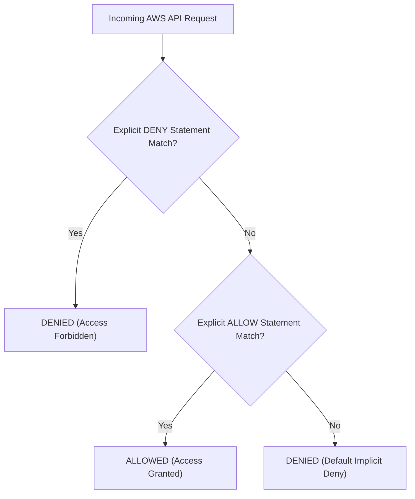

# 02 - AWS Security Hardening & Deep Dive

Amazon Web Services (AWS) infrastructure security requires mastering four core pillars: **Identity and Access Management (IAM)**, **Amazon S3 Data Security**, **Instance Metadata Service Hardening (IMDSv2)**, and **Virtual Private Cloud (VPC) Networking**.

---

## 1. AWS IAM Mechanics & Least Privilege Enforcing

AWS IAM evaluates request permissions using a deterministic logic hierarchy:



### Dangerous IAM Permissions & Privilege Escalation Vectors

Over-permissive IAM policies allow low-privileged identity accounts to escalate privileges to full `AdministratorAccess`. Common high-risk permission combinations include:

- `iam:PassRole` + `ec2:RunInstances`: Allows creating a new EC2 instance with an attached administrator IAM role, granting remote root access via SSH.
- `iam:CreateAccessKey`: Allows generating a new set of long-lived access keys for any existing user, including administrators.
- `iam:CreatePolicyVersion`: Allows editing existing IAM policies to append `Action: "*"` permissions.
- `sts:AssumeRole`: Allows assuming target IAM roles across AWS accounts if trust relationships lack stringent conditions.

### Vulnerable vs. Secure IAM Policy Comparison

#### Vulnerable IAM Policy (Excessive Wildcards)
```json
{
  "Version": "2012-10-17",
  "Statement": [
    {
      "Effect": "Allow",
      "Action": [
        "s3:*",
        "ec2:*",
        "iam:*"
      ],
      "Resource": "*"
    }
  ]
}
```

#### Secure Production IAM Policy (Least Privilege & Conditions)
```json
{
  "Version": "2012-10-17",
  "Statement": [
    {
      "Sid": "RestrictedS3Access",
      "Effect": "Allow",
      "Action": [
        "s3:GetObject",
        "s3:PutObject"
      ],
      "Resource": "arn:aws:s3:::production-app-data-12345/*"
    },
    {
      "Sid": "EnforceTLSAndMFA",
      "Effect": "Deny",
      "Action": "s3:*",
      "Resource": [
        "arn:aws:s3:::production-app-data-12345",
        "arn:aws:s3:::production-app-data-12345/*"
      ],
      "Condition": {
        "Bool": {
          "aws:SecureTransport": "false",
          "aws:MultiFactorAuthPresent": "false"
        }
      }
    }
  ]
}
```

---

### Programmatic Temporary Credential Assumption (STS)

Avoid long-lived AWS IAM Access Keys (`AKIA...`). Use AWS Security Token Service (STS) to assume short-lived temporary credentials dynamically.

<details>
<summary>Multi-Language Code Snippets: Temporary STS AssumeRole</summary>

#### Python (boto3)
```python
import boto3
from botocore.exceptions import BotoCoreError, ClientError

def get_temporary_credentials(role_arn: str, session_name: str) -> dict:
    """Dynamically assume an IAM role and fetch temporary STS credentials."""
    sts_client = boto3.client('sts')
    try:
        response = sts_client.assume_role(
            RoleArn=role_arn,
            RoleSessionName=session_name,
            DurationSeconds=3600
        )
        credentials = response['Credentials']
        return {
            'aws_access_key_id': credentials['AccessKeyId'],
            'aws_secret_access_key': credentials['SecretAccessKey'],
            'aws_session_token': credentials['SessionToken']
        }
    except (BotoCoreError, ClientError) as error:
        raise RuntimeError(f"STS AssumeRole failed: {error}")
```

#### Node.js (AWS SDK v3)
```typescript
import { STSClient, AssumeRoleCommand } from "@aws-sdk/client-sts";

async function getTemporaryCredentials(roleArn: string, sessionName: string) {
  const client = new STSClient({ region: "us-east-1" });
  const command = new AssumeRoleCommand({
    RoleArn: roleArn,
    RoleSessionName: sessionName,
    DurationSeconds: 3600,
  });

  const response = await client.send(command);
  if (!response.Credentials) {
    throw new Error("Failed to retrieve temporary credentials");
  }

  return {
    accessKeyId: response.Credentials.AccessKeyId,
    secretAccessKey: response.Credentials.SecretAccessKey,
    sessionToken: response.Credentials.SessionToken,
  };
}
```

#### Go (AWS SDK v2)
```go
package main

import (
	"context"
	"fmt"
	"github.com/aws/aws-sdk-go-v2/config"
	"github.com/aws/aws-sdk-go-v2/service/sts"
)

func getTempCredentials(ctx context.Context, roleArn, sessionName string) (*sts.AssumeRoleOutput, error) {
	cfg, err := config.LoadDefaultConfig(ctx, config.WithRegion("us-east-1"))
	if err != nil {
		return nil, fmt.Errorf("failed to load AWS config: %w", err)
	}

	stsClient := sts.NewFromConfig(cfg)
	result, err := stsClient.AssumeRole(ctx, &sts.AssumeRoleInput{
		RoleArn:         &roleArn,
		RoleSessionName: &sessionName,
	})
	if err != nil {
		return nil, fmt.Errorf("failed to assume role: %w", err)
	}
	return result, nil
}
```

#### Java (AWS SDK v2)
```java
package com.appsec.atlas;

import software.amazon.awssdk.regions.Region;
import software.amazon.awssdk.services.sts.StsClient;
import software.amazon.awssdk.services.sts.model.AssumeRoleRequest;
import software.amazon.awssdk.services.sts.model.AssumeRoleResponse;

public class StsSessionManager {
    public static AssumeRoleResponse getTemporaryCredentials(String roleArn, String sessionName) {
        try (StsClient stsClient = StsClient.builder().region(Region.US_EAST_1).build()) {
            AssumeRoleRequest roleRequest = AssumeRoleRequest.builder()
                    .roleArn(roleArn)
                    .roleSessionName(sessionName)
                    .durationSeconds(3600)
                    .build();
            return stsClient.assumeRole(roleRequest);
        }
    }
}
```
</details>

---

## 2. Amazon S3 Storage Security & Exposure Prevention

S3 buckets must be protected using a combination of **Account-level Block Public Access (BPA)**, **Bucket Policies**, and **KMS Encryption**.

### Secure S3 Bucket Infrastructure in Terraform (HCL)

```hcl
# 1. Enforce Account-Level Block Public Access
resource "aws_s3_account_public_access_block" "account_bpa" {
  block_public_acls       = true
  block_public_policy     = true
  ignore_public_acls      = true
  restrict_public_buckets = true
}

# 2. Provision Customer Managed KMS Key for Encryption
resource "aws_kms_key" "s3_kms_key" {
  description             = "KMS Key for Sensitive S3 Bucket Encryption"
  deletion_window_in_days = 30
  enable_key_rotation     = true
}

# 3. Secure Production S3 Bucket
resource "aws_s3_bucket" "secure_bucket" {
  bucket        = "appsec-atlas-prod-secure-vault-98765"
  force_destroy = false
}

# 4. Enforce Bucket-Level Block Public Access
resource "aws_s3_bucket_public_access_block" "bucket_bpa" {
  bucket                  = aws_s3_bucket.secure_bucket.id
  block_public_acls       = true
  block_public_policy     = true
  ignore_public_acls      = true
  restrict_public_buckets = true
}

# 5. Enable Server-Side KMS Encryption
resource "aws_s3_bucket_server_side_encryption_configuration" "s3_encryption" {
  bucket = aws_s3_bucket.secure_bucket.id

  rule {
    apply_server_side_encryption_by_default {
      kms_master_key_id = aws_kms_key.s3_kms_key.arn
      sse_algorithm     = "aws:kms"
    }
    bucket_key_enabled = true
  }
}

# 6. Enforce TLS 1.2+ Transport Policy
resource "aws_s3_bucket_policy" "enforce_tls" {
  bucket = aws_s3_bucket.secure_bucket.id

  policy = jsonencode({
    Version = "2012-10-17"
    Statement = [
      {
        Sid       = "EnforceTLSRequestsOnly"
        Effect    = "Deny"
        Principal = "*"
        Action    = "s3:*"
        Resource = [
          aws_s3_bucket.secure_bucket.arn,
          "${aws_s3_bucket.secure_bucket.arn}/*"
        ]
        Condition = {
          Bool = {
            "aws:SecureTransport" = "false"
          }
        }
      }
    ]
  })
}
```

---

## 3. Defeating SSRF with Instance Metadata Service (IMDSv2)

The AWS Instance Metadata Service running at `http://169.254.169.254` supplies temporary IAM credentials to EC2 workloads.

- **IMDSv1 (Vulnerable):** Responds directly to simple HTTP `GET` requests without authentication. Any Server-Side Request Forgery (SSRF) flaw in a web app allows attackers to extract IAM tokens.
- **IMDSv2 (Secure):** Requires a session-oriented HTTP `PUT` request with an `X-aws-ec2-metadata-token-ttl-seconds` header to fetch a secret token first, followed by a `GET` request containing that token.

```
IMDSv1 Attack Payload (Vulnerable):
curl http://169.254.169.254/latest/meta-data/iam/security-credentials/EC2-Role-Name

IMDSv2 Request Sequence (Secure):
# Step 1: Request Session Token
TOKEN=$(curl -s -X PUT "http://169.254.169.254/latest/api/token" -H "X-aws-ec2-metadata-token-ttl-seconds: 21600")

# Step 2: Use Token to Fetch Metadata
curl -s -H "X-aws-ec2-metadata-token: $TOKEN" http://169.254.169.254/latest/meta-data/iam/security-credentials/EC2-Role-Name
```

> [!IMPORTANT]
> **Hop Limit Hardening for Containers:** When running Docker or Kubernetes on EC2 instances, configure `http_put_response_hop_limit = 1`. This prevents containers running inside worker nodes from reaching IMDSv2 via SSRF, as network packets traversing container bridge interfaces exceed the IP Hop Limit (TTL).

### Enforcing IMDSv2 in Terraform
```hcl
resource "aws_instance" "hardened_ec2" {
  ami           = "ami-0c55b159cbfafe1f0"
  instance_type = "t3.micro"

  metadata_options {
    http_endpoint               = "enabled"
    http_tokens                 = "required" # Mandatory IMDSv2
    http_put_response_hop_limit = 1          # Prevents container SSRF bypasses
    instance_metadata_tags      = "disabled"
  }
}
```

---

## 4. VPC Networking & Security Groups

AWS networking relies on **Security Groups (Stateful)** and **Network ACLs (Stateless)** to enforce isolation.

| Feature | Security Group (SG) | Network Access Control List (NACL) |
| :--- | :--- | :--- |
| **Operating Layer** | Instance / Network Interface level | Subnet boundary level |
| **State Nature** | **Stateful:** Inbound allowed responses automatically permit outbound | **Stateless:** Outbound response traffic must be explicitly allowed |
| **Evaluation Rules** | Evaluates ALL rules before making allow decision | Processed sequentially in strict numerical rule order |
| **Rule Capabilities** | Supports `ALLOW` rules only | Supports both `ALLOW` and `DENY` rules |

### Hardened Production Security Group in Terraform

```hcl
resource "aws_security_group" "web_app_sg" {
  name        = "production-web-app-sg"
  description = "Hardened Security Group allowing HTTPS ingress from ALB only"
  vpc_id      = aws_vpc.main.id

  # Ingress: Only accept HTTPS traffic from Load Balancer SG
  ingress {
    description     = "HTTPS from Application Load Balancer"
    from_port       = 443
    to_port         = 443
    protocol        = "tcp"
    security_groups = [aws_security_group.alb_sg.id]
  }

  # Egress: Restrict outbound connections to database subnet
  egress {
    description     = "PostgreSQL to Database Subnet"
    from_port       = 5432
    to_port         = 5432
    protocol        = "tcp"
    cidr_blocks     = ["10.0.2.0/24"]
  }

  tags = {
    Environment = "Production"
    ManagedBy   = "Terraform"
  }
}
```
