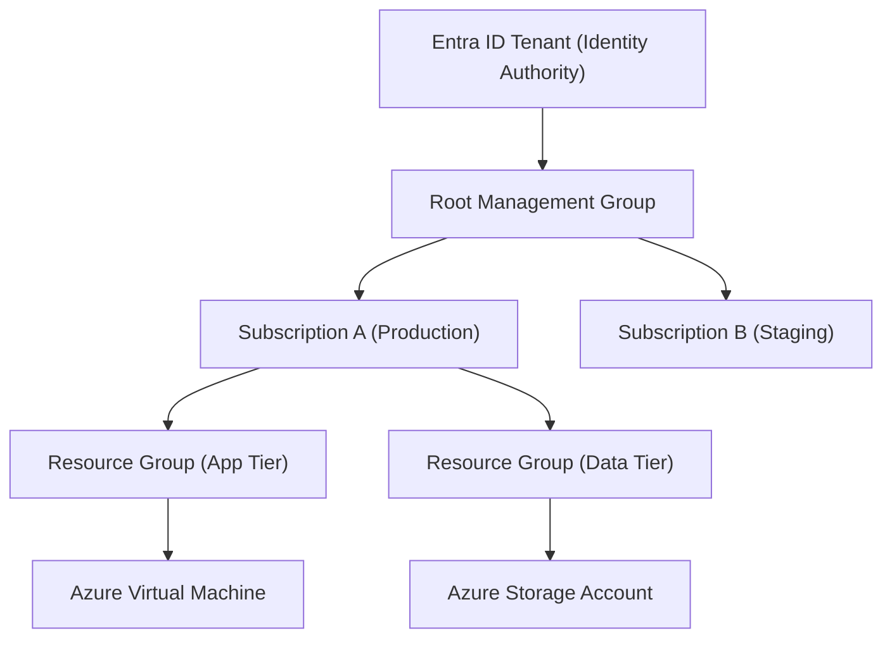
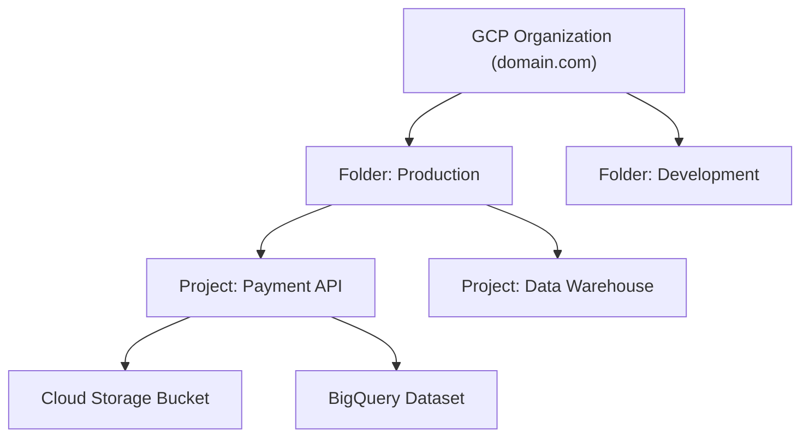
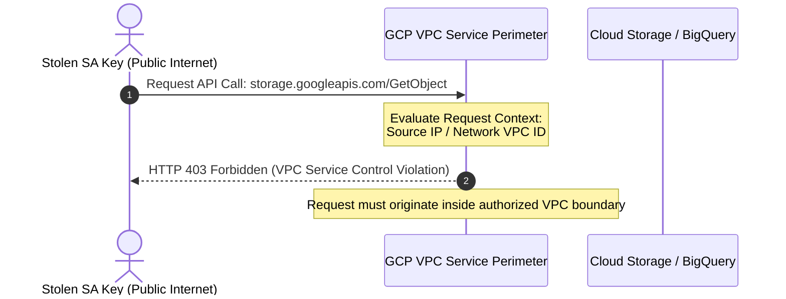

# 03 - Azure and GCP Security Architecture & Hardening

While AWS dominates public cloud infrastructure, enterprise environments frequently operate multi-cloud architectures involving **Microsoft Azure** and **Google Cloud Platform (GCP)**. Securing Azure and GCP requires understanding their unique identity models, resource hierarchies, and perimeter controls.

---

## 1. Microsoft Azure Security Mechanics

Azure infrastructure management centers around **Microsoft Entra ID** (formerly Azure Active Directory) and **Azure Role-Based Access Control (RBAC)**.



### Azure Resource Hierarchy & RBAC Scope

Azure RBAC permissions are assigned at four distinct scope levels: **Management Group**, **Subscription**, **Resource Group**, or **Resource**. Inherited permissions flow downward through the hierarchy.

#### Azure RBAC Role Definition Structure
An Azure custom role explicitly defines permitted and prohibited operations:
```json
{
  "Name": "Production Storage Operator",
  "IsCustom": true,
  "Description": "Allows managing blob storage items without granting subscription-level access.",
  "Actions": [
    "Microsoft.Storage/storageAccounts/blobServices/containers/read",
    "Microsoft.Storage/storageAccounts/blobServices/containers/blobs/read"
  ],
  "NotActions": [],
  "DataActions": [
    "Microsoft.Storage/storageAccounts/blobServices/containers/blobs/read"
  ],
  "NotDataActions": [
    "Microsoft.Storage/storageAccounts/blobServices/containers/blobs/write"
  ],
  "AssignableScopes": [
    "/subscriptions/00000000-0000-0000-0000-000000000000"
  ]
}
```

> [!WARNING]
> **DataActions vs Control Plane Actions:** Standard Azure RBAC `Actions` control infrastructure management (e.g., deleting a storage account). Accessing actual stored data requires `DataActions` permissions (e.g., reading blob bytes). Conflating these scopes can grant unintended control-plane privileges.

---

### Hardening Azure Storage Accounts

Prevent data leaks in Azure Storage Accounts by disabling public access, requiring Entra ID auth, and disabling legacy Shared Key authentication.

#### Secure Azure Storage Account in Bicep
```bicep
param location string = resourceGroup().location
param storageAccountName string = 'stappsecprod${uniqueString(resourceGroup().id)}'

resource storageAccount 'Microsoft.Storage/storageAccounts@2023-01-01' = {
  name: storageAccountName
  location: location
  sku: {
    name: 'Standard_GRS'
  }
  kind: 'StorageV2'
  properties: {
    allowBlobPublicAccess: false
    allowSharedKeyAccess: false // Mandatory: Disables account access keys; requires Entra ID
    minimumTlsVersion: 'TLS1_2'
    supportsHttpsTrafficOnly: true
    encryption: {
      services: {
        blob: {
          enabled: true
          keyType: 'Account'
        }
      }
      keySource: 'Microsoft.Storage'
    }
  }
}
```

#### Disabling Shared Key Access via Azure CLI
```bash
az storage account update \
  --name stappsecprod9876 \
  --resource-group rg-production-sec \
  --allow-blob-public-access false \
  --allow-shared-key-access false
```

---

## 2. Google Cloud Platform (GCP) Security Architecture

Google Cloud Platform structures assets under a centralized organizational tree: **Organization** -> **Folders** -> **Projects** -> **Resources**.



### GCP IAM Mechanics: Primitive vs. Predefined vs. Custom Roles

- **Primitive Roles (`Owner`, `Editor`, `Viewer`):** Legacy roles granting sweeping access across an entire project. **NEVER use in production environments.**
- **Predefined Roles (`roles/storage.objectViewer`):** Fine-grained roles managed by GCP catering to specific service actions.
- **Custom Roles:** User-curated permission bundles enforcing granular least privilege.

---

### Service Account Impersonation (Eliminating Static Keys)

Long-lived GCP Service Account JSON keys introduce severe supply-chain risks. Eliminate static JSON keys by utilizing **Service Account Impersonation** via short-lived OAuth 2.0 access tokens.

<details>
<summary>Multi-Language Code Snippets: GCP Service Account Impersonation</summary>

#### Python (`google-auth`)
```python
from google.auth import impersonated_credentials
from google.auth.transport.requests import Request
from google.cloud import storage

def generate_impersonated_gcs_client(target_service_account: str):
    """Generate a GCS client using short-lived impersonated tokens instead of JSON keys."""
    # Obtain base credentials (e.g., Application Default Credentials / Workload Identity)
    base_credentials, _ = google.auth.default()
    
    # Create impersonated credentials expiring in 1 hour
    target_scopes = ["https://www.googleapis.com/auth/devstorage.read_only"]
    impersonated_creds = impersonated_credentials.Credentials(
        source_credentials=base_credentials,
        target_principal=target_service_account,
        target_scopes=target_scopes,
        lifetime=3600
    )

    # Initialize GCS client using short-lived impersonation
    storage_client = storage.Client(credentials=impersonated_creds)
    return storage_client
```

#### Go (`google.golang.org/api/impersonate`)
```go
package main

import (
	"context"
	"fmt"
	"cloud.google.com/go/storage"
	"google.golang.org/api/impersonate"
	"google.golang.org/api/option"
)

func createImpersonatedClient(ctx context.Context, targetSA string) (*storage.Client, error) {
	ts, err := impersonate.CredentialsTokenSource(ctx, impersonate.CredentialsConfig{
		TargetPrincipal: targetSA,
		Scopes:          []string{"https://www.googleapis.com/auth/devstorage.read_only"},
	})
	if err != nil {
		return nil, fmt.Errorf("failed to create impersonated token source: %w", err)
	}

	client, err := storage.NewClient(ctx, option.WithTokenSource(ts))
	if err != nil {
		return nil, fmt.Errorf("failed to create GCS client: %w", err)
	}
	return client, nil
}
```
</details>

---

## 3. GCP VPC Service Controls (VPC SC)

Even if a service account key is stolen by a threat actor, **VPC Service Controls** prevent data exfiltration by enforcing a logical security perimeter around GCP API services (BigQuery, Cloud Storage).



### Provisioning a VPC Service Perimeter in Terraform

```hcl
# 1. Define Access Level (Allowed IP Range / Corporate Egress)
resource "google_access_context_manager_access_level" "corp_access" {
  parent = "accessPolicies/${google_access_context_manager_access_policy.policy.name}"
  name   = "accessPolicies/${google_access_context_manager_access_policy.policy.name}/accessLevels/corp_trusted_network"
  title  = "Corporate Trusted Network"

  basic {
    conditions {
      ip_subnetworks = ["198.51.100.0/24"]
    }
  }
}

# 2. Construct VPC Service Perimeter around Production Project
resource "google_access_context_manager_service_perimeter" "prod_perimeter" {
  parent         = "accessPolicies/${google_access_context_manager_access_policy.policy.name}"
  name           = "accessPolicies/${google_access_context_manager_access_policy.policy.name}/servicePerimeters/production_data_perimeter"
  title          = "Production Data Protection Perimeter"
  perimeter_type = "PERIMETER_TYPE_REGULAR"

  status {
    restricted_services = [
      "storage.googleapis.com",
      "bigquery.googleapis.com"
    ]

    resources = [
      "projects/123456789012" # Production GCP Project Number
    ]

    access_levels = [
      google_access_context_manager_access_level.corp_access.name
    ]
  }
}
```

---

## 4. Cross-Cloud Alignment Matrix

| Architectural Control | Amazon Web Services (AWS) | Microsoft Azure | Google Cloud Platform (GCP) |
| :--- | :--- | :--- | :--- |
| **Root Hierarchy** | AWS Organization / Management Account | Entra ID Tenant & Root Management Group | GCP Organization Domain |
| **Identity Management** | AWS IAM & AWS IAM Identity Center | Microsoft Entra ID (Azure AD) | GCP IAM & Cloud Identity |
| **Resource Grouping** | AWS Accounts & OUs | Subscriptions & Resource Groups | Folders & Projects |
| **Data Perimeter** | S3 Bucket Policies & VPC Endpoints | Storage Private Endpoints & NSGs | VPC Service Controls (VPC SC) |
| **Metadata Endpoint** | `169.254.169.254` (IMDSv2) | `169.254.169.254` (`Metadata: true`) | `169.254.169.254` (`Metadata-Flavor: Google`) |
