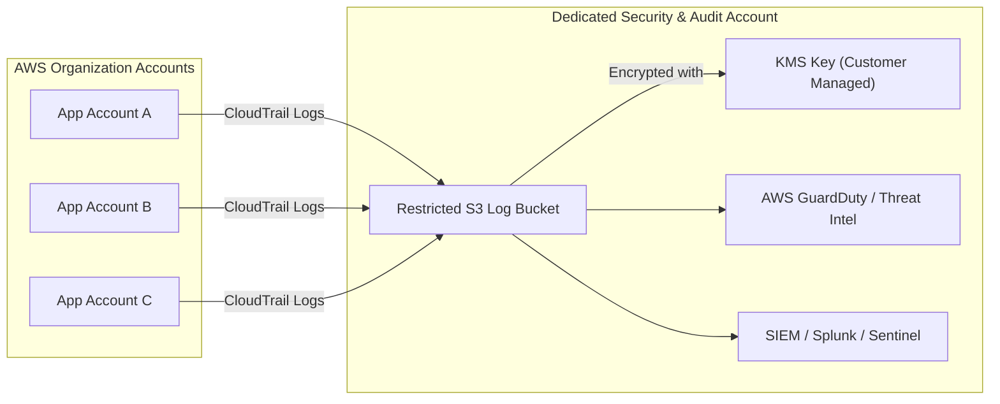
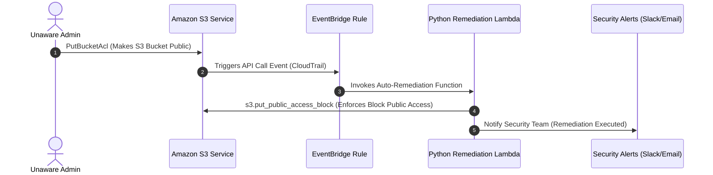

# 04 - Cloud Logging, Telemetry, and CSPM

Visibility is the foundation of cloud infrastructure security. In software-defined environments, security teams cannot secure what they cannot see. Maintaining comprehensive **Cloud Audit Telemetry** combined with continuous **Cloud Security Posture Management (CSPM)** ensures immediate detection of misconfigurations and security breaches.

---

## 1. Cloud Audit Logging Architecture

Every major Cloud Service Provider provides centralized logging capabilities capturing control-plane API activity and data access events.



### Multi-Cloud Logging Mechanisms

- **AWS CloudTrail:** Captures API actions executed by identities or AWS services. Turn on **Log File Validation** to detect tampering using SHA-256 cryptographic signatures. Enable **Data Events** for S3 bucket object access and KMS key usage.
- **Azure Activity Log & Diagnostic Settings:** Records subscription-level events (resource creation, modification, deletion). Route logs via Diagnostic Settings to a centralized **Azure Log Analytics Workspace** or Microsoft Sentinel.
- **GCP Cloud Audit Logs:** Provides four audit streams: Admin Activity, System Event, Data Access, and Policy Denied. *Data Access logs are disabled by default due to storage volume and must be explicitly enabled per project.*

---

### Python Script: Parsing AWS CloudTrail for Suspicious API Calls

```python
import json
import gzip
from typing import List, Dict

def parse_cloudtrail_log(file_path: str) -> List[Dict]:
    """Parse gzipped CloudTrail JSON logs for suspicious administrative API calls."""
    suspicious_events = []
    suspicious_actions = {
        "ConsoleLogin",
        "CreateAccessKey",
        "CreateUser",
        "AttachUserPolicy",
        "PutBucketPolicy",
        "ModifyInstanceAttribute",
        "AuthorizeSecurityGroupIngress"
    }

    with gzip.open(file_path, 'rt', encoding='utf-8') as gz_file:
        data = json.load(gz_file)
        for record in data.get('Records', []):
            event_name = record.get('eventName')
            user_identity = record.get('userIdentity', {})
            event_source = record.get('eventSource')

            # Detect root account usage or unauthorized policy modifications
            if event_name in suspicious_actions or user_identity.get('type') == 'Root':
                suspicious_events.append({
                    'eventTime': record.get('eventTime'),
                    'eventName': event_name,
                    'userArn': user_identity.get('arn', 'N/A'),
                    'sourceIp': record.get('sourceIPAddress'),
                    'userAgent': record.get('userAgent'),
                    'errorCode': record.get('errorCode', 'SUCCESS')
                })
    return suspicious_events

if __name__ == "__main__":
    alerts = parse_cloudtrail_log("123456789012_CloudTrail_us-east-1_20260725.json.gz")
    print(f"[!] Detected {len(alerts)} suspicious API events:")
    print(json.dumps(alerts, indent=2))
```

---

## 2. Cloud Security Posture Management (CSPM)

**CSPM** solutions continuously evaluate cloud resource configurations against compliance baselines (CIS Benchmarks, NIST SP 800-53, PCI-DSS) to flag security posture drift.

### 1. Prowler (Multi-Cloud CLI Tool)

Prowler is an industry-standard open-source security tool for AWS, Azure, GCP, and Kubernetes security assessments.

```bash
# 1. Install Prowler via Pip
pip install prowler

# 2. Execute AWS CIS 1.4 / 2.0 Benchmark Scan
prowler aws --framework cis_2.0_aws -M csv json-ocsf

# 3. Scan specific service (e.g., S3 & IAM only) with high severity filter
prowler aws --services s3 iam --severity critical high

# 4. Execute Azure Security Audit
prowler azure --subscription-ids "00000000-0000-0000-0000-000000000000"

# 5. Execute GCP Security Audit
prowler gcp --project-ids "my-production-gcp-project"
```

### 2. Scout Suite (Multi-Cloud Audit Engine)

Scout Suite produces interactive HTML auditing reports by querying cloud provider APIs.

```bash
# 1. Install Scout Suite
pip install scoutsuite

# 2. Run Audit against AWS Account
scout aws --profile production-auditor --result-format json

# 3. Run Audit against GCP Project
scout gcp --user-account --project-id my-gcp-project-id
```

---

## 3. Continuous Compliance Pipelines (CI/CD Integration)

Integrate automated CSPM scans directly into GitHub Actions pipelines to block non-compliant infrastructure deployments.

```yaml
name: Continuous Cloud Security Audit

on:
  schedule:
    - cron: '0 0 * * *' # Run daily at midnight
  workflow_dispatch:

jobs:
  prowler-scan:
    name: Execute Prowler CSPM Audit
    runs-on: ubuntu-latest
    steps:
      - name: Checkout Code
        uses: actions/checkout@v4

      - name: Set up Python
        uses: actions/setup-python@v5
        with:
          python-version: '3.11'

      - name: Install Prowler
        run: pip install prowler

      - name: Configure AWS Credentials
        uses: aws-actions/configure-aws-credentials@v4
        with:
          aws-access-key-id: ${{ secrets.AWS_ACCESS_KEY_ID }}
          aws-secret-access-key: ${{ secrets.AWS_SECRET_ACCESS_KEY }}
          aws-region: us-east-1

      - name: Run Prowler Audit
        run: |
          prowler aws --severity critical --exit-code-on-severity critical
```

---

## 4. Automated Event-Driven Remediation

Do not rely solely on manual incident response for low-risk, high-confidence misconfigurations. Deploy **Event-Driven Auto-Remediation**.



### Python Lambda: Auto-Remediating Public S3 Buckets

```python
import boto3
import json

s3_client = boto3.client('s3control')
sns_client = boto3.client('sns')

def lambda_handler(event, context):
    """Automatically enforce Block Public Access when an S3 bucket is created or updated."""
    detail = event.get('detail', {})
    account_id = detail.get('recipientAccountId')
    bucket_name = detail.get('requestParameters', {}).get('bucketName')

    if not bucket_name or not account_id:
        return {'statusCode': 400, 'body': 'Invalid Event Format'}

    try:
        # Enforce Account / Bucket Block Public Access immediately
        s3_client.put_public_access_block(
            AccountId=account_id,
            PublicAccessBlockConfiguration={
                'BlockPublicAcls': True,
                'IgnorePublicAcls': True,
                'BlockPublicPolicy': True,
                'RestrictPublicBuckets': True
            }
        )
        print(f"[+] Successfully enforced Block Public Access on account {account_id} / bucket {bucket_name}")
        
        return {'statusCode': 200, 'body': f'Remediated {bucket_name}'}
    except Exception as e:
        print(f"[-] Auto-remediation failed: {str(e)}")
        raise e
```
