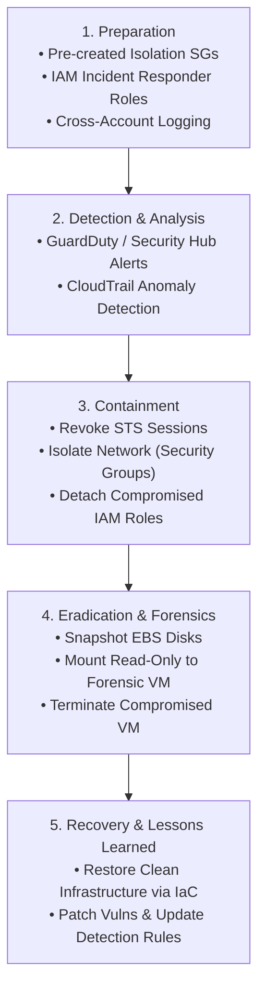
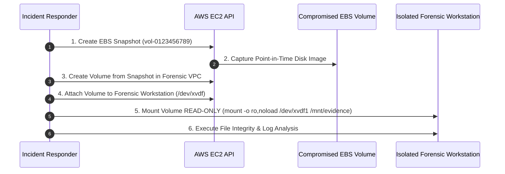

# 05 - Cloud Incident Response & Digital Forensics

Incident Response (IR) in cloud environments requires a fundamental shift from traditional on-premises forensics. In the cloud, physical access to hardware hypervisors does not exist, IP addresses are highly ephemeral, and malicious operations execute at API speeds.

---

## 1. The Cloud IR Lifecycle (NIST SP 800-61 Adaptation)

Cloud incident responders must execute rapid containment to prevent adversary lateral movement across accounts.



---

## 2. Containment Mechanics: Isolating Compromised Workloads

When an EC2 instance, Azure VM, or GCP Compute instance is suspected of compromise (e.g., infected by ransomware or cryptominers), **DO NOT terminate or stop the machine immediately**. Terminating the instance destroys critical volatile data stored in RAM and temporary storage.

### AWS Dynamic Network Isolation (Isolation Security Group)

Isolate the compromised instance at the network layer by replacing its existing Security Group with an **Isolation SG** that explicitly denies all outbound egress and restricts inbound access exclusively to the Security Operations Center (SOC) forensic IP.

```bash
#!/usr/bin/env bash
set -euo pipefail

INSTANCE_ID="i-0deadbeef12345678"
SOC_IP="198.51.100.50/32"
VPC_ID="vpc-0123456789abcdef0"

echo "[*] Step 1: Creating Isolation Security Group in VPC ${VPC_ID}..."
ISOLATION_SG=$(aws ec2 create-security-group \
    --group-name "INCIDENT-ISOLATION-${INSTANCE_ID}" \
    --description "Emergency Isolation SG for ${INSTANCE_ID}" \
    --vpc-id "${VPC_ID}" \
    --output text --query 'GroupId')

# Revoke default outbound egress rule (Deny all egress)
aws ec2 revoke-security-group-egress \
    --group-id "${ISOLATION_SG}" \
    --protocol all \
    --cidr 0.0.0.0/0 || true

# Allow SSH ingress ONLY from SOC Forensic Workstation
aws ec2 authorize-security-group-ingress \
    --group-id "${ISOLATION_SG}" \
    --protocol tcp \
    --port 22 \
    --cidr "${SOC_IP}"

echo "[*] Step 2: Applying Isolation SG to Instance ${INSTANCE_ID}..."
aws ec2 modify-instance-attribute \
    --instance-id "${INSTANCE_ID}" \
    --groups "${ISOLATION_SG}"

echo "[+] Instance ${INSTANCE_ID} successfully isolated at network layer!"
```

---

### Revoking Temporary IAM Sessions Immediately

If an instance IAM role or user credential was compromised (e.g., via SSRF to IMDSv1), attaching a temporary `Deny` policy with an `aws:TokenIssueTime` condition immediately revokes all existing active STS tokens.

```json
{
  "Version": "2012-10-17",
  "Statement": [
    {
      "Sid": "RevokeAllPriorSessions",
      "Effect": "Deny",
      "Action": "*",
      "Resource": "*",
      "Condition": {
        "DateLessThan": {
          "aws:TokenIssueTime": "2026-07-25T12:00:00Z"
        }
      }
    }
  ]
}
```

```bash
# Attach Revocation Inline Policy to the Role
aws iam put-role-policy \
    --role-name "CompromisedEC2Role" \
    --policy-name "EmergencyRevokeSessions" \
    --policy-document file://revoke-policy.json
```

---

## 3. Forensic Artifact Collection & Disk Analysis

To analyze root cause, malware execution, and persistence mechanisms, preserve disk state by creating EBS volume snapshots.



### Forensic Volume Snapshot & Mount Workflow

```bash
# 1. Locate Volume ID attached to compromised instance
VOLUME_ID=$(aws ec2 describe-instances \
    --instance-id i-0deadbeef12345678 \
    --query "Reservations[0].Instances[0].BlockDeviceMappings[0].Ebs.VolumeId" \
    --output text)

# 2. Create Point-in-Time Snapshot
SNAPSHOT_ID=$(aws ec2 create-snapshot \
    --volume-id "${VOLUME_ID}" \
    --description "Forensic Evidence Snapshot for i-0deadbeef12345678" \
    --output text --query 'SnapshotId')

echo "[+] Created Snapshot: ${SNAPSHOT_ID}"

# 3. Provision new Volume from Snapshot in Forensic VPC Zone
FORENSIC_VOL=$(aws ec2 create-volume \
    --availability-zone us-east-1a \
    --snapshot-id "${SNAPSHOT_ID}" \
    --volume-type gp3 \
    --output text --query 'VolumeId')

# 4. Attach Volume to Forensic Workstation EC2
aws ec2 attach-volume \
    --volume-id "${FORENSIC_VOL}" \
    --instance-id i-0forensicvm99999 \
    --device /dev/sdf

# 5. SSH into Forensic VM & Mount Disk READ-ONLY (noload prevents journal replay)
# sudo mount -o ro,noload /dev/xvdf1 /mnt/evidence
```

---

## 4. Priority Artifact Checklist for Cloud Forensics

Once the forensic volume is mounted under `/mnt/evidence`, inspect these key locations:

| Forensic File Path | Analysis Objective |
| :--- | :--- |
| `/mnt/evidence/var/log/auth.log` (or `secure`) | Identify unauthorized SSH logins, brute-force IP addresses, and privilege escalation (`sudo`) |
| `/mnt/evidence/var/log/syslog` | Detect service executions, daemon crashes, and malware execution strings |
| `/mnt/evidence/root/.bash_history` | Inspect command-line history executed by compromised root identity |
| `/mnt/evidence/etc/crontab` & `/etc/cron.*` | Uncover persistence mechanisms scheduled by threat actors |
| `/mnt/evidence/tmp/` & `/var/tmp/` | Locate dropped executable payloads, reverse shells, or mining binaries (`xmrig`) |
| **CloudTrail Log Events** | Match instance internal events against external API calls made with instance STS credentials |
