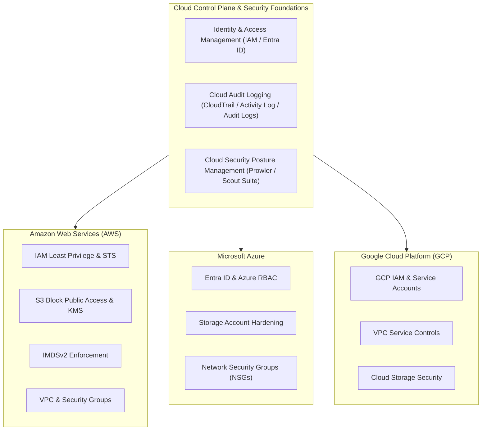

# Cloud Security Fundamentals Guide

## Overview

As modern application workloads transition from legacy on-premises data centers to elastic multi-cloud environments, security paradigms undergo a fundamental transformation. Physical security perimeters, static IP addresses, and hardware firewalls are replaced by **software-defined infrastructure**, **identity-centric control planes**, and **ephemeral API-driven management**.

In cloud environments, misconfigurations in Identity and Access Management (IAM), storage permissions, metadata services, and network boundaries represent the primary attack surface. A single over-privileged IAM credential or an open metadata service can lead to total enterprise cloud compromise.

This guide provides an enterprise-grade, deeply technical operational manual for securing infrastructure across **Amazon Web Services (AWS)**, **Microsoft Azure**, and **Google Cloud Platform (GCP)**.

---

## Prerequisites

To gain maximum practical value from this guide, security engineers and developers should possess:

- **Networking Fundamentals:** Solid grasp of OSI model, CIDR notation, subnets, routing tables, NAT, and stateful vs. stateless firewalls.
- **System Administration:** Proficiency with Linux command-line tools (`curl`, `jq`, `ssh`, environment variables).
- **Identity Concepts:** Familiarity with Authentication (AuthN) vs. Authorization (AuthZ), OAuth 2.0, SAML, and API token lifecycles.
- **Cloud Infrastructure Access:** An active AWS, Azure, or GCP free-tier account, along with configured CLI tools (`aws-cli`, `az-cli`, or `gcloud`).
- **Infrastructure as Code (IaC):** Basic reading knowledge of HashiCorp Terraform / OpenTofu (HCL) or CloudFormation.

---

## Learning Objectives

By completing this module, you will master the ability to:

1. **Deconstruct the Shared Responsibility Model:** Precisely delineate security obligations across IaaS, PaaS, SaaS, and Serverless architectures.
2. **Implement IAM Least Privilege:** Construct context-aware IAM policies, prevent privilege escalation vectors (`iam:PassRole`, `sts:AssumeRole`), and eliminate static keys.
3. **Prevent Storage Data Exposure:** Configure account-level Block Public Access, enforce server-side encryption (KMS), and construct secure resource policies.
4. **Neutralize SSRF & IMDS Exploitation:** Upgrade infrastructure from IMDSv1 to IMDSv2 and configure token hop limits to defeat cloud credential theft.
5. **Architect Multi-Cloud Security Boundaries:** Deploy Azure RBAC, GCP VPC Service Controls, and AWS VPC Security Groups to isolate critical workloads.
6. **Automate CSPM & Telemetry:** Deploy open-source scanners (Prowler, Scout Suite) and build event-driven auto-remediation playbooks.
7. **Execute Cloud Incident Response:** Perform non-destructive VM network isolation, revoke active STS sessions, collect EBS disk snapshots, and conduct forensics.

---

## Recommended Learning Path

| Chapter | Topic Focus | Practical Skill Acquired | Multi-Cloud Scope |
| :--- | :--- | :--- | :--- |
| **[01 - Introduction](./01-introduction.md)** | Architecture & Threat Landscape | Shared responsibility mapping & MITRE ATT&CK for Cloud | AWS / Azure / GCP |
| **[02 - AWS Security](./02-aws-security-hardening.md)** | AWS Hardening Mechanics | IAM policies, IMDSv2 enforcement, S3 BPA, Terraform HCL | AWS Focus |
| **[03 - Azure & GCP](./03-azure-and-gcp-security.md)** | Azure & GCP Architecture | Entra ID RBAC, GCP Service Accounts, VPC Service Controls | Azure & GCP Focus |
| **[04 - Logging & CSPM](./04-cloud-logging-and-cspm.md)** | Visibility & Posture Management | CloudTrail/Audit logging, Prowler CLI, EventBridge auto-fix | Multi-Cloud |
| **[05 - Cloud IR](./05-cloud-incident-response.md)** | Forensics & Incident Response | Dynamic instance isolation, EBS snapshotting, token revocation | AWS / Azure / GCP |
| **[06 - Hands-on Lab](./06-hands-on-lab.md)** | Exploitation & Remediation | Practical breach simulation: Leaked key to S3 exfiltration & fix | Hands-on Sandbox |
| **[07 - References](./07-references.md)** | Frameworks & Tooling | CIS Benchmarks, NIST SP 800-53, CTFs, and security tools | Reference Library |

---

## Guide Navigation

- **[01 - Introduction to Cloud Security Architecture & Threat Landscape](./01-introduction.md)**
- **[02 - AWS Security Hardening & Deep Dive](./02-aws-security-hardening.md)**
- **[03 - Azure and GCP Security Architecture & Hardening](./03-azure-and-gcp-security.md)**
- **[04 - Cloud Logging, Telemetry, and CSPM](./04-cloud-logging-and-cspm.md)**
- **[05 - Cloud Incident Response & Digital Forensics](./05-cloud-incident-response.md)**
- **[06 - Hands-on Lab: Cloud Vulnerability Exploitation & Remediation](./06-hands-on-lab.md)**
- **[07 - References & Cloud Security Resources](./07-references.md)**
