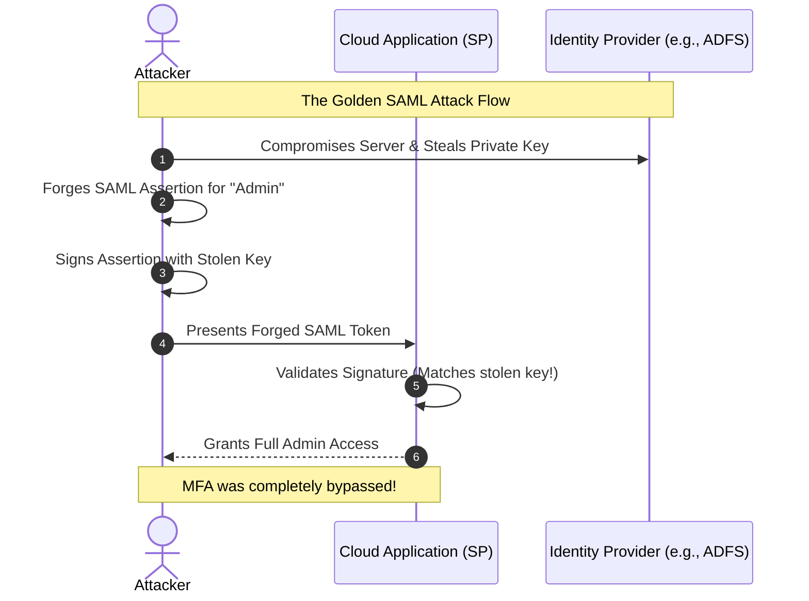

# Chapter 01: Identity Provider (IdP) Compromise & Golden SAML

Identity is the new perimeter. In cloud environments, your Identity Provider (IdP) is the absolute source of truth. When an attacker compromises the IdP or steals the token-signing certificates, they can forge authentication tokens for any user, bypassing all Multi-Factor Authentication (MFA). This is famously known as a "Golden SAML" attack.

## 1. The Concept (ELI5)

Imagine your company is an exclusive VIP nightclub. To get in, guests do not show their ID to the bouncer at every single door inside the club. Instead, they go to the front desk (the Identity Provider). The front desk checks their ID, verifies their guest list status, and gives them a special, un-forgeable, cryptographically stamped VIP wristband (the SAML token). 

Once a guest has this wristband, every bouncer inside the club (your cloud apps, AWS, GitHub) just looks at the wristband and lets them in. 

A **Golden SAML** attack is like an attacker sneaking into the front desk's office and stealing the special stamp used to create the VIP wristbands. Now, the attacker can make their own wristbands for anyone—even the club owner—and the bouncers inside will blindly accept them. The attacker never needed to steal the owner's actual ID or pass the front desk's checks; they just forged the ultimate hall pass.

## 2. The Visual

Below is the architectural flow of how a Golden SAML attack works versus a secure authentication flow.



## 3. The Code

When implementing Service Providers (apps that consume SAML or JWTs), a common mistake is failing to validate the signature, failing to enforce expiration, or trusting unsigned assertions.

### Vulnerable Code ❌

Here is how developers often misconfigure SAML/JWT validation, allowing token forgery or replay attacks.

**Node.js / TypeScript (Vulnerable JWT parsing without validation):**
```typescript
import jwt from 'jsonwebtoken';

export function authenticateUser(token: string) {
    // ❌ VULNERABILITY: jwt.decode only reads the payload, it does NOT verify the signature!
    // An attacker can just change {"role": "user"} to {"role": "admin"}
    const decoded = jwt.decode(token);
    
    if (decoded && decoded.role === 'admin') {
        return grantAdminAccess();
    }
    return grantUserAccess();
}
```

**Python (Vulnerable SAML parsing):**
```python
from onelogin.saml2.auth import OneLogin_Saml2_Auth

def acs_endpoint(req):
    auth = OneLogin_Saml2_Auth(req, custom_data)
    
    # ❌ VULNERABILITY: Processing the assertion without verifying the signature
    # In some libraries, you must explicitly call process_response() or check is_valid()
    auth.process_response()
    
    # Missing: if not auth.is_authenticated(): return Error
    user_email = auth.get_nameid()
    return login_user(user_email)
```

**Go (Vulnerable JWT validation):**
```go
package main

import (
	"fmt"
	"github.com/golang-jwt/jwt"
)

func validateToken(tokenString string) {
    // ❌ VULNERABILITY: Using the "none" algorithm or not enforcing the signing method
	token, _ := jwt.Parse(tokenString, func(token *jwt.Token) (interface{}, error) {
		return []byte("secret"), nil
	})

	if claims, ok := token.Claims.(jwt.MapClaims); ok {
		fmt.Println("User:", claims["user"])
	}
}
```

---

### Production-Ready Secure Code ✅

Secure implementations must rigorously enforce cryptographic verification, audience checking, and expiration.

**Node.js / TypeScript (Secure):**
```typescript
import jwt from 'jsonwebtoken';
import jwksClient from 'jwks-rsa';

const client = jwksClient({
  jwksUri: 'https://your-idp.com/.well-known/jwks.json'
});

function getKey(header: jwt.JwtHeader, callback: jwt.SigningKeyCallback) {
  client.getSigningKey(header.kid, function(err, key) {
    const signingKey = key?.getPublicKey();
    callback(err, signingKey);
  });
}

export function authenticateUserSecure(token: string) {
    // ✅ SECURE: jwt.verify explicitly checks the signature using the IdP's public key
    // It also checks the 'exp' (expiration) and 'aud' (audience) claims automatically.
    jwt.verify(token, getKey, { algorithms: ['RS256'], audience: 'my-cloud-app' }, (err, decoded) => {
        if (err) {
            throw new Error('Unauthorized: Token validation failed');
        }
        if (decoded && decoded.role === 'admin') {
            return grantAdminAccess();
        }
        return grantUserAccess();
    });
}
```

**Python (Secure):**
```python
from onelogin.saml2.auth import OneLogin_Saml2_Auth

def acs_endpoint(req):
    auth = OneLogin_Saml2_Auth(req, custom_data)
    
    # ✅ SECURE: Explicitly process and validate the response
    auth.process_response()
    
    errors = auth.get_errors()
    if not errors:
        if auth.is_authenticated():
            # ✅ SECURE: Check for replay attacks and validate expiration
            user_email = auth.get_nameid()
            return login_user(user_email)
        else:
            return "Not authenticated", 401
    else:
        return f"SAML Error: {', '.join(errors)}", 400
```

**Go (Secure):**
```go
package main

import (
	"fmt"
	"github.com/golang-jwt/jwt"
)

func validateTokenSecure(tokenString string) error {
	token, err := jwt.Parse(tokenString, func(token *jwt.Token) (interface{}, error) {
		// ✅ SECURE: Explicitly enforce the expected signing method (e.g., RSA)
		// This prevents the "none" algorithm attack or HMAC confusion attacks.
		if _, ok := token.Method.(*jwt.SigningMethodRSA); !ok {
			return nil, fmt.Errorf("unexpected signing method: %v", token.Header["alg"])
		}
		return getPublicKeyFromIdP(), nil
	})

	if err != nil || !token.Valid {
		return fmt.Errorf("invalid token")
	}

	if claims, ok := token.Claims.(jwt.MapClaims); ok {
		fmt.Println("User:", claims["user"])
		return nil
	}
	return fmt.Errorf("invalid claims")
}
```

## 4. The Guardrail

To contain a Golden SAML attack or general IdP compromise, you must enforce strict infrastructure guardrails. The best defense is ensuring that token signing keys are generated and stored inside Hardware Security Modules (HSMs) where they cannot be exported, and enforcing continuous evaluation of access.

Here is a Terraform snippet to enforce strict AWS IAM policies that require MFA for critical actions, which acts as a secondary defense even if a session is compromised (though true Golden SAML bypasses initial MFA, enforcing MFA on the *role assumption* or *action* level adds friction).

**Terraform (AWS IAM Guardrail):**
```hcl
# ✅ GUARDRAIL: Require MFA for sensitive API actions even if the user is authenticated
resource "aws_iam_policy" "require_mfa_for_sensitive_actions" {
  name        = "RequireMFAForSensitiveActions"
  description = "Deny sensitive actions if MFA is not present in the current session"

  policy = jsonencode({
    Version = "2012-10-17"
    Statement = [
      {
        Sid    = "DenySensitiveUnlessMFA"
        Effect = "Deny"
        Action = [
          "iam:CreateUser",
          "iam:DeleteUser",
          "iam:UpdateAssumeRolePolicy",
          "cloudtrail:StopLogging",
          "kms:ScheduleKeyDeletion"
        ]
        Resource = "*"
        Condition = {
          BoolIfExists = {
            "aws:MultiFactorAuthPresent" = "false"
          }
        }
      }
    ]
  })
}
```

**Semgrep Rule (Detecting vulnerable JWT parsing):**
```yaml
rules:
  - id: insecure-jwt-decode
    patterns:
      - pattern: jwt.decode(...)
      - pattern-not-inside: |
          jwt.verify(...)
          ...
          jwt.decode(...)
    message: "Using jwt.decode() does not verify the token signature. Use jwt.verify() instead to ensure the token was not tampered with by an attacker."
    languages: [javascript, typescript]
    severity: ERROR
```
