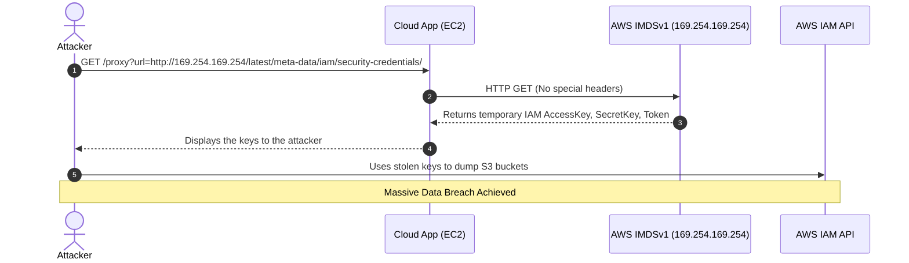

# Chapter 02: Cloud Metadata API SSRF

Server-Side Request Forgery (SSRF) in the cloud is infinitely more dangerous than on-premise. In cloud environments like AWS, GCP, and Azure, instances possess a magical endpoint called the Instance Metadata Service (IMDS). If an attacker can trick your application into making an HTTP request to this internal IP (`169.254.169.254`), they can extract the temporary IAM credentials of the server itself. This was the exact mechanism behind the massive Capital One data breach.

## 1. The Concept (ELI5)

Imagine you work as an assistant in a corporate office. Your job is simple: a customer gives you a website link, you print out the webpage, and you hand it back to them.

Now, imagine the customer gives you a link to `http://internal-HR-portal/salaries`. Because *you* are inside the corporate network, you can access that secret page. You blindly print it out and hand it to the customer. You just committed Server-Side Request Forgery.

In the cloud, every server has a secret internal phone number (`169.254.169.254`). If you call this number, a robot answers and says, "Here are the master keys to the database for the next 6 hours." If an attacker tricks your app into calling that number and echoing the response, the attacker steals your cloud identity.

## 2. The Visual



## 3. The Code

The vulnerability occurs when an application accepts a URL or domain from user input and fetches it without validating the destination.

### Vulnerable Code ❌

**Node.js / TypeScript (Vulnerable):**
```typescript
import express from 'express';
import axios from 'axios';

const app = express();

app.get('/fetch-image', async (req, res) => {
    const targetUrl = req.query.url as string;
    
    // ❌ VULNERABILITY: Blindly fetching the user-provided URL.
    // Attacker passes: http://169.254.169.254/latest/meta-data/iam/security-credentials/role-name
    try {
        const response = await axios.get(targetUrl);
        res.send(response.data);
    } catch (err) {
        res.status(500).send('Error fetching image');
    }
});
```

**Python (Vulnerable):**
```python
import requests
from flask import Flask, request

app = Flask(__name__)

@app.route('/webhook-tester')
def webhook_tester():
    url = request.args.get('url')
    
    # ❌ VULNERABILITY: No checks on the destination IP or domain.
    # Requests will follow redirects to local/metadata IPs!
    response = requests.get(url)
    return response.text
```

**Go (Vulnerable):**
```go
package main

import (
	"io/ioutil"
	"net/http"
)

func fetchHandler(w http.ResponseWriter, r *http.Request) {
	url := r.URL.Query().Get("url")
	
    // ❌ VULNERABILITY: Default HTTP client fetches any address provided by the user.
	resp, err := http.Get(url)
	if err != nil {
		http.Error(w, "Failed to fetch", http.StatusInternalServerError)
		return
	}
	defer resp.Body.Close()
	
	body, _ := ioutil.ReadAll(resp.Body)
	w.Write(body)
}
```

---

### Production-Ready Secure Code ✅

To secure against SSRF, you must validate URLs against a strict allowlist. Additionally, you should resolve the domain to an IP address *before* making the request to ensure it does not resolve to an internal/private subnet (preventing DNS rebinding).

**Node.js / TypeScript (Secure):**
```typescript
import express from 'express';
import axios from 'axios';
import { URL } from 'url';
import dns from 'dns/promises';

const app = express();
const ALLOWED_DOMAINS = ['api.github.com', 'trusted-partner.com'];

// Helper to check if IP is private/internal
function isPrivateIP(ip: string): boolean {
    return /^(127\.|10\.|172\.(1[6-9]|2[0-9]|3[0-1])\.|192\.168\.|169\.254\.)/.test(ip);
}

app.get('/fetch-image', async (req, res) => {
    try {
        const targetUrl = new URL(req.query.url as string);
        
        // 1. Check Domain Allowlist
        if (!ALLOWED_DOMAINS.includes(targetUrl.hostname)) {
            return res.status(403).send('Domain not allowed');
        }

        // 2. Prevent DNS Rebinding & SSRF by resolving the IP first
        const lookup = await dns.lookup(targetUrl.hostname);
        if (isPrivateIP(lookup.address)) {
            return res.status(403).send('Private IPs are forbidden');
        }

        // ✅ SECURE: Domain is trusted, and IP resolves to a public address.
        const response = await axios.get(targetUrl.toString());
        res.send(response.data);
    } catch (err) {
        res.status(400).send('Invalid request');
    }
});
```

**Python (Secure):**
```python
import requests
import socket
import ipaddress
from urllib.parse import urlparse
from flask import Flask, request, abort

app = Flask(__name__)

ALLOWED_DOMAINS = ["example.com", "api.example.com"]

def is_safe_url(url_string):
    try:
        parsed = urlparse(url_string)
        if parsed.hostname not in ALLOWED_DOMAINS:
            return False
            
        # Resolve IP to check for internal/metadata ranges
        ip = socket.gethostbyname(parsed.hostname)
        ip_obj = ipaddress.ip_address(ip)
        
        # ✅ SECURE: Block loopback, private, and link-local (169.254.x.x)
        if ip_obj.is_private or ip_obj.is_loopback or ip_obj.is_link_local:
            return False
            
        return True
    except Exception:
        return False

@app.route('/webhook-tester')
def webhook_tester():
    url = request.args.get('url')
    
    if not is_safe_url(url):
        abort(403, description="Forbidden URL")
        
    # ✅ SECURE: Disable redirects to prevent Time-of-Check to Time-of-Use (TOCTOU) DNS rebinding
    response = requests.get(url, allow_redirects=False, timeout=5)
    return response.text
```

**Go (Secure):**
```go
package main

import (
	"errors"
	"net"
	"net/http"
	"time"
)

// ✅ SECURE: Custom transport that strictly blocks private and link-local IP addresses
var secureTransport = &http.Transport{
	DialContext: (&net.Dialer{
		Timeout:   5 * time.Second,
		KeepAlive: 30 * time.Second,
		Control: func(network, address string, c net.RawConn) error {
			host, _, err := net.SplitHostPort(address)
			if err != nil {
				return err
			}
			ip := net.ParseIP(host)
			if ip != nil {
				if ip.IsLoopback() || ip.IsPrivate() || ip.IsLinkLocalUnicast() {
					return errors.New("SSRF Attempt: Blocked access to internal IP")
				}
			}
			return nil
		},
	}).DialContext,
}

var secureClient = &http.Client{
	Transport: secureTransport,
	Timeout:   10 * time.Second,
	// Disable redirects
	CheckRedirect: func(req *http.Request, via []*http.Request) error {
		return http.ErrUseLastResponse
	},
}

func fetchHandler(w http.ResponseWriter, r *http.Request) {
    // Implementation uses secureClient.Get() ...
}
```

## 4. The Guardrail

While code-level fixes are necessary, the ultimate cloud defense against SSRF is infrastructure-level enforcement. For AWS, this means migrating from IMDSv1 to IMDSv2.

IMDSv2 requires a special `PUT` request with a specific header to retrieve a session token before metadata can be accessed. Since SSRF vulnerabilities usually only allow attackers to control the URL (and occasionally basic headers like User-Agent, but rarely custom headers or PUT verbs), IMDSv2 completely neuters standard SSRF attacks.

**Terraform (AWS IMDSv2 Guardrail):**
```hcl
# ✅ GUARDRAIL: Enforce IMDSv2 on all EC2 instances
resource "aws_instance" "app_server" {
  ami           = "ami-12345678"
  instance_type = "t3.micro"

  metadata_options {
    http_endpoint               = "enabled"
    # ENFORCE IMDSv2 ONLY (Blocks IMDSv1)
    http_tokens                 = "required" 
    # Prevent metadata from being forwarded in a containerized environment (optional but recommended)
    http_put_response_hop_limit = 1 
  }

  tags = {
    Name = "SecureAppServer"
  }
}
```

**Rego Policy (OPA to enforce IMDSv2 in Terraform code):**
```rego
package terraform.ec2_imdsv2

deny[msg] {
    resource := input.resource.aws_instance[name]
    # Check if metadata_options block is missing or http_tokens is not "required"
    metadata := resource.metadata_options[_]
    metadata.http_tokens != "required"
    
    msg := sprintf("EC2 instance '%v' does not enforce IMDSv2. SSRF vulnerability risk.", [name])
}
```
