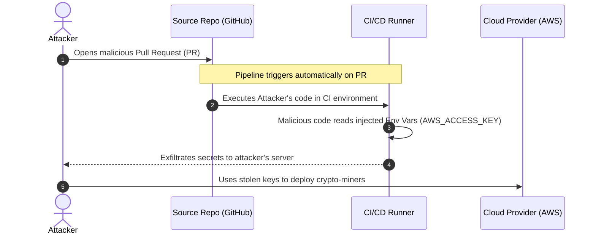

# Chapter 03: Compromised CI/CD Pipeline

The CI/CD pipeline is the central nervous system of modern software delivery. It possesses the ultimate privilege: the ability to take raw text (code) and convert it into running production systems. If an attacker breaches the CI/CD pipeline, they don't just compromise an app; they compromise the entire software supply chain.

Attacks like the SolarWinds and Codecov breaches relied on intercepting or poisoning the build process. A common cloud zero-day vector is executing arbitrary code inside pull requests, which then steals deployment secrets or alters build artifacts.

## 1. The Concept (ELI5)

Imagine a car factory. The engineers design the car on paper (source code). The assembly line (CI/CD) takes those designs, orders the parts, puts them together, and ships the car to the dealership (production).

If a criminal wants to install a tracker in the car, trying to break into the secure dealership at night is hard. Instead, they apply for a job as an assembly line worker. Once inside, they quietly bolt the tracker onto every single car as it gets built.

In CI/CD, if you configure your pipeline to automatically run tests on any code submitted by a stranger on the internet, the stranger can submit a "test" that actually executes a command to steal the factory's master keys (AWS credentials).

## 2. The Visual



## 3. The Code & Configuration

The vulnerability typically lies in CI/CD configuration files (like GitHub Actions `.yml` files) that expose long-lived secrets to untrusted execution environments.

### Vulnerable Configuration ❌

**GitHub Actions (Vulnerable `pull_request_target` usage):**
```yaml
# ❌ VULNERABILITY: pull_request_target runs in the context of the BASE repository.
# It has access to repository secrets!
name: Insecure CI
on:
  pull_request_target:
    types: [opened, synchronize]

jobs:
  build:
    runs-on: ubuntu-latest
    steps:
      - name: Checkout Code
        # ❌ VULNERABILITY: Checking out the attacker's untrusted PR code
        uses: actions/checkout@v3
        with:
          ref: ${{ github.event.pull_request.head.sha }}
          
      - name: Run Build (Executes untrusted code)
        run: npm run build
        env:
          # ❌ VULNERABILITY: Injecting long-lived secrets into untrusted execution
          AWS_ACCESS_KEY_ID: ${{ secrets.AWS_ACCESS_KEY_ID }}
          AWS_SECRET_ACCESS_KEY: ${{ secrets.AWS_SECRET_ACCESS_KEY }}
```

### Production-Ready Secure Configuration ✅

To secure the pipeline, we must drop long-lived secrets entirely. Instead of storing `AWS_SECRET_ACCESS_KEY` in GitHub, we use **OpenID Connect (OIDC)**. OIDC allows the cloud provider to dynamically issue short-lived, restricted tokens to the CI runner based on cryptographic proof of its identity.

Furthermore, we never execute untrusted PR code in a privileged context.

**GitHub Actions (Secure via OIDC and Least Privilege):**
```yaml
name: Secure CI Deployment
on:
  push:
    branches:
      - main  # ✅ SECURE: Only run deployment on merges to main, not on open PRs

# ✅ SECURE: Required permissions for OIDC token generation
permissions:
  id-token: write   # This is required for requesting the JWT
  contents: read    # This is required for actions/checkout

jobs:
  deploy:
    runs-on: ubuntu-latest
    steps:
      - name: Checkout Code
        uses: actions/checkout@v3

      - name: Configure AWS Credentials using OIDC
        uses: aws-actions/configure-aws-credentials@v2
        with:
          # ✅ SECURE: No hardcoded secrets. We assume a specific role.
          role-to-assume: arn:aws:iam::123456789012:role/GitHubActionsDeployRole
          aws-region: us-east-1

      - name: Deploy to Cloud
        run: ./deploy.sh
```

## 4. The Guardrail

To make OIDC work securely, you must configure your cloud provider to trust the specific GitHub repository and branch. If you mess this up (the "Confused Deputy" problem), any GitHub repo in the world could assume your AWS role!

**Terraform (Secure AWS OIDC Guardrail):**
```hcl
# 1. Establish Trust with GitHub's OIDC Provider
resource "aws_iam_openid_connect_provider" "github" {
  url             = "https://token.actions.githubusercontent.com"
  client_id_list  = ["sts.amazonaws.com"]
  thumbprint_list = ["6938fd4d98bab03faadb97b34396831e3780aea1"]
}

# 2. Create the Role and restrict it to a specific repo AND branch
resource "aws_iam_role" "github_actions_role" {
  name = "GitHubActionsDeployRole"

  assume_role_policy = jsonencode({
    Version = "2012-10-17"
    Statement = [
      {
        Effect = "Allow"
        Principal = {
          Federated = aws_iam_openid_connect_provider.github.arn
        }
        Action = "sts:AssumeRoleWithWebIdentity"
        Condition = {
          StringEquals = {
            # ✅ GUARDRAIL: Only trust the specific organization and repository
            "token.actions.githubusercontent.com:aud" = "sts.amazonaws.com"
          }
          StringLike = {
            # ✅ GUARDRAIL: Only allow deployments from the 'main' branch
            "token.actions.githubusercontent.com:sub" = "repo:MySecureOrg/MyWebApp:ref:refs/heads/main"
          }
        }
      }
    ]
  })
}
```

**Semgrep Rule (Detecting vulnerable PR triggers):**
```yaml
rules:
  - id: dangerous-pull-request-target
    patterns:
      - pattern-inside: |
          on:
            pull_request_target: ...
      - pattern: actions/checkout
    message: "Using actions/checkout with pull_request_target can lead to untrusted code execution in a privileged context. Use standard 'pull_request' instead, which isolates secrets."
    languages: [yaml]
    severity: ERROR
```
