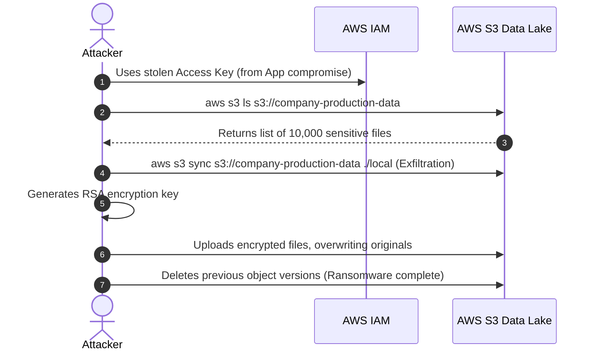

# Chapter 05: S3/Storage Ransomware & Exfiltration

Object storage (AWS S3, Azure Blob, GCP Cloud Storage) serves as the massive data lake for modern enterprises. Misconfigured storage is arguably the most prolific cause of cloud data breaches. 

However, modern attacks go beyond simply finding a "public" bucket. Attackers compromise legitimate credentials (via SSRF or CI/CD, as discussed in previous chapters), list the contents of private buckets, exfiltrate the data, and then—critically—they overwrite the objects with encrypted versions and delete the original versions, effectively executing Cloud Ransomware.

## 1. The Concept (ELI5)

Imagine you run a giant, un-gated outdoor warehouse filled with filing cabinets (your S3 buckets). 

**Data Leak:** By accident, you left the warehouse doors wide open (Public Bucket). Anyone walking down the street can walk in, read your files, and walk out.

**Cloud Ransomware:** Someone steals a security guard's badge (compromised IAM keys). They walk in legally. Instead of just reading the files, they put a heavy steel padlock on every single filing cabinet, throw the keys into the ocean, and leave a sticky note demanding 10 Bitcoin. If you don't have invincible backup copies, your data is gone forever.

## 2. The Visual



## 3. The Code

A frequent cause of bucket compromise is an application that acts as a proxy for downloading files but fails to implement authorization checks, or uses overly permissive AWS SDK clients.

### Vulnerable Code ❌

**Node.js (Vulnerable S3 Proxy):**
```javascript
const AWS = require('aws-sdk');
const s3 = new AWS.S3();

exports.downloadFile = async (req, res) => {
    // ❌ VULNERABILITY: Insecure Direct Object Reference (IDOR)
    // The user specifies the file key, and the server fetches it blindly.
    // Attacker passes: filename="admin-backups/database.sql"
    const fileKey = req.query.filename;
    
    const params = {
        Bucket: 'company-internal-data',
        Key: fileKey
    };
    
    try {
        const data = await s3.getObject(params).promise();
        res.send(data.Body);
    } catch (err) {
        res.status(500).send('File not found');
    }
};
```

---

### Production-Ready Secure Code ✅

Instead of proxying the file through your application (which consumes your server's bandwidth and introduces IDOR vulnerabilities), use **Pre-Signed URLs**. Authenticate the user, verify they have permission to access the specific file, and then generate a temporary URL that allows them to download the file directly from S3.

**Node.js (Secure Pre-Signed URLs):**
```javascript
const { S3Client, GetObjectCommand } = require('@aws-sdk/client-s3');
const { getSignedUrl } = require('@aws-sdk/s3-request-presigner');

const s3Client = new S3Client({ region: 'us-east-1' });

exports.getDownloadLink = async (req, res) => {
    const fileKey = req.query.filename;
    const userId = req.user.id; // Authenticated user from middleware
    
    // ✅ SECURE: Validate authorization. Does this user own this file?
    if (!await userOwnsFile(userId, fileKey)) {
        return res.status(403).send('Unauthorized');
    }
    
    const command = new GetObjectCommand({
        Bucket: 'company-internal-data',
        Key: fileKey
    });
    
    try {
        // ✅ SECURE: Generate a URL valid for only 60 seconds
        const signedUrl = await getSignedUrl(s3Client, command, { expiresIn: 60 });
        res.json({ downloadUrl: signedUrl });
    } catch (err) {
        res.status(500).send('Error generating link');
    }
};
```

## 4. The Guardrail

To prevent Cloud Ransomware and mass data leaks, you must enforce infrastructure rules:
1. **Block Public Access:** A blanket denial at the account level.
2. **Object Lock & Versioning:** Enforce WORM (Write Once, Read Many). Even if an attacker overwrites a file or issues a delete command, the original version is mathematically guaranteed to survive until a retention period expires. Even the Root user cannot bypass this lock.

**Terraform (S3 Anti-Ransomware Guardrail):**
```hcl
resource "aws_s3_bucket" "secure_data_lake" {
  bucket = "company-secure-data-lake"

  # ✅ GUARDRAIL: Enable Object Lock to prevent Ransomware deletion
  object_lock_enabled = true
}

resource "aws_s3_bucket_versioning" "versioning" {
  bucket = aws_s3_bucket.secure_data_lake.id
  versioning_configuration {
    status = "Enabled"
  }
}

resource "aws_s3_bucket_object_lock_configuration" "ransomware_protection" {
  bucket = aws_s3_bucket.secure_data_lake.id

  rule {
    default_retention {
      # ✅ GUARDRAIL: Files cannot be deleted or overwritten for 30 days.
      # "COMPLIANCE" mode means even the root AWS account cannot bypass this.
      mode  = "COMPLIANCE"
      days  = 30
    }
  }
}

# ✅ GUARDRAIL: Blanket block public access
resource "aws_s3_bucket_public_access_block" "block_public" {
  bucket                  = aws_s3_bucket.secure_data_lake.id
  block_public_acls       = true
  block_public_policy     = true
  ignore_public_acls      = true
  restrict_public_buckets = true
}
```
