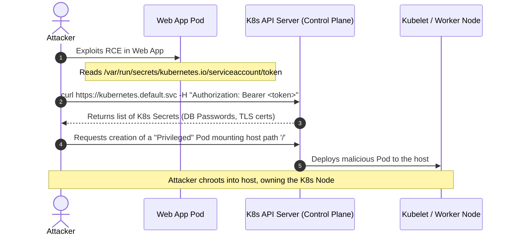

# Chapter 06: Container & Kubernetes Cluster Takeover

Kubernetes (K8s) is a cloud operating system. When an application running inside a Docker container on a K8s cluster is compromised, the attacker finds themselves in an isolated container. But Kubernetes natively injects a powerful secret into almost every container by default: a Service Account Token. 

If Role-Based Access Control (RBAC) is misconfigured, an attacker can use this mounted token to talk to the Kubernetes API Server, list other pods, read secrets, or even launch privileged containers that mount the underlying host node's filesystem, leading to a total cluster takeover.

## 1. The Concept (ELI5)

Imagine you run an apartment building (Kubernetes Node). Each tenant lives in their own apartment (Container). 

To help tenants request maintenance, the building manager slips a master intercom key (Service Account Token) under everyone's door by default. Usually, this key only lets a tenant buzz the front desk and say, "My sink is broken."

However, if the manager configured the intercom permissions poorly, an attacker who breaks into one apartment can use that intercom key to announce: "I am the building manager. Unlock all doors and give me the master keys to the safe." 

Cluster Takeover is the act of using the default Service Account Token to escalate from a single container breach to owning the entire cluster.

## 2. The Visual



## 3. The Configuration (YAML)

Kubernetes security relies on declarative YAML configurations rather than application code. The primary vulnerabilities are excessive RBAC permissions and failing to disable auto-mounting of tokens.

### Vulnerable Configuration ❌

**ClusterRoleBinding (Vulnerable Privilege Escalation):**
```yaml
# ❌ VULNERABILITY: Wildcard permissions granted to a service account
apiVersion: rbac.authorization.k8s.io/v1
kind: ClusterRole
metadata:
  name: overly-permissive-role
rules:
- apiGroups: ["*"]
  resources: ["*"] # Grants access to secrets, pods, deployments, etc.
  verbs: ["*"]
---
apiVersion: rbac.authorization.k8s.io/v1
kind: ClusterRoleBinding
metadata:
  name: bind-permissive-role
subjects:
- kind: ServiceAccount
  name: default
  namespace: default
roleRef:
  kind: ClusterRole
  name: overly-permissive-role
  apiGroup: rbac.authorization.k8s.io
```

**Pod Spec (Vulnerable defaults):**
```yaml
apiVersion: v1
kind: Pod
metadata:
  name: web-app
spec:
  # ❌ VULNERABILITY: By default, K8s mounts the service account token into the pod!
  containers:
  - name: web
    image: nginx
```

---

### Production-Ready Secure Configuration ✅

To secure the pod, we explicitly tell Kubernetes *not* to mount the service account token unless the pod strictly requires it to talk to the K8s API (which most standard web apps do not). We also apply restrictive SecurityContexts.

**Pod Spec (Secure):**
```yaml
apiVersion: v1
kind: Pod
metadata:
  name: secure-web-app
spec:
  # ✅ SECURE: Stop injecting the Service Account token into the container
  automountServiceAccountToken: false
  
  # ✅ SECURE: Enforce security boundaries
  securityContext:
    runAsNonRoot: true
    runAsUser: 1000
    
  containers:
  - name: web
    image: nginx
    securityContext:
      allowPrivilegeEscalation: false
      readOnlyRootFilesystem: true
      capabilities:
        drop: ["ALL"]
```

## 4. The Guardrail

Applying these settings manually to every Pod is prone to human error. You need an admission controller like **OPA Gatekeeper** or **Kyverno** to intercept and reject non-compliant deployments before they ever enter the cluster.

**Rego (OPA Gatekeeper Policy to block Privileged Containers):**
```rego
apiVersion: templates.gatekeeper.sh/v1
kind: ConstraintTemplate
metadata:
  name: k8spspprivilegedcontainer
spec:
  crd:
    spec:
      names:
        kind: K8sPSPPrivilegedContainer
  targets:
    - target: admission.k8s.gatekeeper.sh
      rego: |
        package k8spspprivilegedcontainer

        # ✅ GUARDRAIL: Deny any pod requesting 'privileged: true'
        violation[{"msg": msg, "details": {}}] {
            c := input_containers[_]
            c.securityContext.privileged == true
            msg := sprintf("Privileged container is not allowed: %v, securityContext: %v", [c.name, c.securityContext])
        }

        input_containers[c] {
            c := input.review.object.spec.containers[_]
        }
        input_containers[c] {
            c := input.review.object.spec.initContainers[_]
        }
```

**Kyverno (Policy to enforce automountServiceAccountToken: false):**
```yaml
apiVersion: kyverno.io/v1
kind: ClusterPolicy
metadata:
  name: disallow-default-serviceaccount-token
spec:
  validationFailureAction: Enforce
  rules:
  - name: validate-automountServiceAccountToken
    match:
      resources:
        kinds:
        - Pod
    validate:
      message: "Opt-out of automounting API credentials for pods by setting automountServiceAccountToken: false"
      pattern:
        spec:
          # ✅ GUARDRAIL: Enforce that all pods explicitly set this to false
          automountServiceAccountToken: false
```
