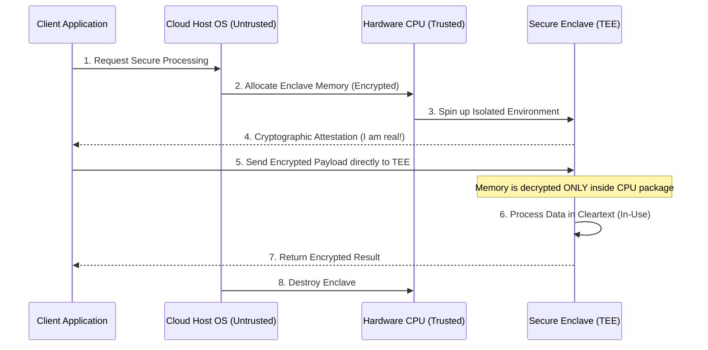

# 01 - Introduction to Trusted Execution Environments (TEEs)

Before diving into vendor-specific hardware, we must understand the foundational building block of Confidential Computing: the **Trusted Execution Environment (TEE)**.

## 1. The Concept (ELI5)

Imagine you are staying at a luxury hotel. You bring a highly valuable diamond necklace with you. 

Normally, when you leave your room, the hotel staff (the Cloud Provider) can use their master key (the Hypervisor/Host OS) to enter your room (your Virtual Machine) and look at everything you have laying out on the bed (your RAM). 

A **TEE** is like a cryptographically locked steel safe bolted inside your hotel room. The hotel staff can still enter the room, and they provide the electricity and space for the safe, but **they do not have the key to the safe**. Only you have the key. You can place your diamond (Data in Use) inside the safe, work on it, and extract it, knowing that even the hotel manager cannot peek inside.

In technical terms, a TEE is a secure, hardware-enforced area of the main processor. It guarantees that code and data loaded inside are protected with respect to **confidentiality** and **integrity**.

## 2. The Visual: Architecture Blueprint



## 3. The Code: In-Memory Processing

When dealing with highly sensitive data (like a private signing key), standard applications leave the key in cleartext in RAM. A memory dump by a compromised host OS will expose it. 

Here is the comparison of standard processing versus delegating to an enclave via an SDK.

### ❌ Vulnerable Code (Standard Processing)

The application loads the secret key directly into process memory. If the VM is compromised, the key is stolen.

```python
# python
import os
from cryptography.hazmat.primitives import hashes
from cryptography.hazmat.primitives.asymmetric import padding
from cryptography.hazmat.primitives import serialization

def process_transaction(transaction_data: bytes):
    # VULNERABILITY: Loading the raw private key into host OS RAM
    with open("/etc/secrets/private_key.pem", "rb") as key_file:
        private_key = serialization.load_pem_private_key(
            key_file.read(),
            password=None
        )
    
    # Processing happens in the untrusted host memory
    signature = private_key.sign(
        transaction_data,
        padding.PSS(mgf=padding.MGF1(hashes.SHA256()), salt_length=padding.PSS.MAX_LENGTH),
        hashes.SHA256()
    )
    return signature
```

### ✅ Production-Ready Secure Code (TEE Delegation)

Instead of loading the key into host memory, the host forwards the data to the Enclave. The key NEVER exists in the host's memory space.

```python
# python
import requests
import json

# The Host OS acts ONLY as a router. It cannot see the key.
ENCLAVE_VSOCK_URL = "http://localhost:5000/sign"

def process_transaction_secure(transaction_data: bytes) -> bytes:
    """
    Delegates sensitive processing to the local Trusted Execution Environment.
    The host OS cannot inspect the memory of the Enclave.
    """
    payload = {
        "transaction_data": transaction_data.hex()
    }
    
    # Send data to the enclave over a secure local channel (e.g., vsock)
    # The enclave holds the key in its isolated memory space.
    try:
        response = requests.post(ENCLAVE_VSOCK_URL, json=payload, timeout=5)
        response.raise_for_status()
        return bytes.fromhex(response.json()["signature"])
    except Exception as e:
        raise RuntimeError(f"Enclave processing failed: {e}")
```

## 4. The Guardrail: CI/CD Enforcement

To ensure infrastructure is provisioned securely, we must enforce that cloud compute instances are created using Confidential Computing instance families (e.g., GCP `Confidential VMs`).

Here is a Rego/OPA policy that blocks the creation of non-confidential VMs in Google Cloud via Terraform.

```rego
# rego
package terraform.gcp.confidential_compute

import input as tfplan

# Deny instances that do not have confidential_instance_config enabled
deny[msg] {
    resource := tfplan.resource_changes[_]
    resource.type == "google_compute_instance"
    
    # Check if the resource is being created or updated
    resource.change.actions[_] in ["create", "update"]
    
    # Check for confidential_instance_config
    config := resource.change.after.confidential_instance_config
    not config_is_enabled(config)

    msg := sprintf(
        "SECURITY VIOLATION: Compute instance `%v` must enable Confidential Computing (confidential_instance_config.enable_confidential_compute = true)", 
        [resource.name]
    )
}

config_is_enabled(config) {
    count(config) > 0
    config[0].enable_confidential_compute == true
}
```
