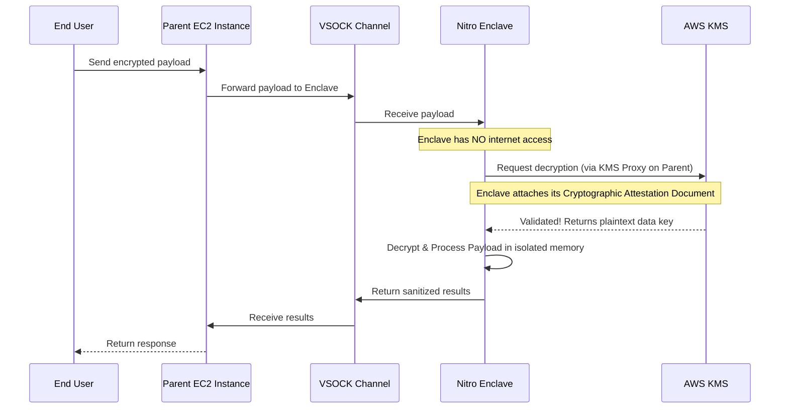

# 02 - AWS Nitro Enclaves

Amazon Web Services (AWS) approaches Confidential Computing via **Nitro Enclaves**. Nitro Enclaves are isolated, highly constrained virtual machines attached to a parent EC2 instance.

## 1. The Concept (ELI5)

Imagine you are in a submarine (your EC2 instance) navigating dangerous waters (the internet). 

You need to analyze extremely dangerous alien DNA (sensitive data), but if it gets loose, the entire submarine is doomed. So, you build an **Airlock Chamber** (the Nitro Enclave). 

This airlock has:
- **No external doors**: No internet access.
- **No storage cabinets**: No persistent storage.
- **No interactive controls**: No SSH or user access.

The only way to communicate with the airlock is through a single secure feeding tube (a **vsock** connection) connected directly to your submarine. You push data into the tube, the airlock processes it in total isolation, and pushes the safe results back. Even if a spy takes over the main submarine, they cannot enter the airlock.

## 2. The Visual: Nitro Enclave Architecture



## 3. The Code: Secure KMS Decryption

In a traditional setup, the EC2 instance has an IAM role that allows it to decrypt KMS keys. If the EC2 instance is breached, the attacker can ask KMS to decrypt anything.

With Nitro Enclaves, the EC2 instance **cannot** decrypt the data. Only the Enclave can, by proving its identity via an Attestation Document.

### ❌ Vulnerable Code (Parent EC2 Decryption)

The parent instance uses standard AWS credentials to decrypt data. If compromised, the attacker has full access to the data.

```javascript
// typescript (Node.js)
import { KMSClient, DecryptCommand } from "@aws-sdk/client-kms";

const kms = new KMSClient({ region: "us-east-1" });

async function processPayment(encryptedCreditCard: Uint8Array) {
    // VULNERABILITY: Decrypting in the untrusted parent instance
    // An attacker on this box can dump memory or hijack the IAM role.
    const command = new DecryptCommand({
        CiphertextBlob: encryptedCreditCard
    });
    
    const response = await kms.send(command);
    const plaintextCard = response.Plaintext;
    
    // Process card in easily-dumped host memory...
    return performTransaction(plaintextCard);
}
```

### ✅ Production-Ready Secure Code (Enclave vsock proxying)

The parent forwards the encrypted data to the Enclave over a Unix-like socket (`vsock`). The Enclave securely communicates with KMS using a proxy, proving its exact cryptographic hash (PCRs).

```javascript
// typescript (Node.js running in Parent EC2)
import net from 'net';

// CID 3 represents the Enclave, Port 5000 is our custom listener
const ENCLAVE_CID = 3; 
const ENCLAVE_PORT = 5000;

async function processPaymentSecure(encryptedCreditCard: Uint8Array): Promise<string> {
    return new Promise((resolve, reject) => {
        // Connect to the isolated Enclave via vsock
        // Node.js requires a native addon or custom bindings for AF_VSOCK
        // Here we simulate the socket interaction.
        const socket = setupVsockConnection(ENCLAVE_CID, ENCLAVE_PORT);
        
        socket.on('data', (data) => {
            resolve(data.toString());
        });
        
        socket.on('error', (err) => reject(err));
        
        // Push the ENCRYPTED data into the airlock.
        // The parent NEVER sees the plaintext.
        socket.write(encryptedCreditCard);
    });
}
```
*(Note: Inside the Enclave, a specialized AWS Nitro SDK creates an attestation document, sends it through a KMS proxy running on the parent, and receives the plaintext key back into its isolated memory.)*

## 4. The Guardrail: Terraform Enclave Enforcement

To ensure developers actually spin up EC2 instances capable of hosting Nitro Enclaves, you must enforce the `enclave_options` block in your Terraform configurations.

```terraform
# terraform
resource "aws_instance" "secure_processor" {
  ami           = "ami-0abcdef1234567890"
  instance_type = "m5.xlarge"

  # REQUIRED: Enforce Nitro Enclaves
  enclave_options {
    enabled = true
  }

  metadata_options {
    http_endpoint               = "enabled"
    http_tokens                 = "required" # IMDSv2
    http_put_response_hop_limit = 1
  }

  tags = {
    Name = "Nitro-Parent-Node"
  }
}
```
