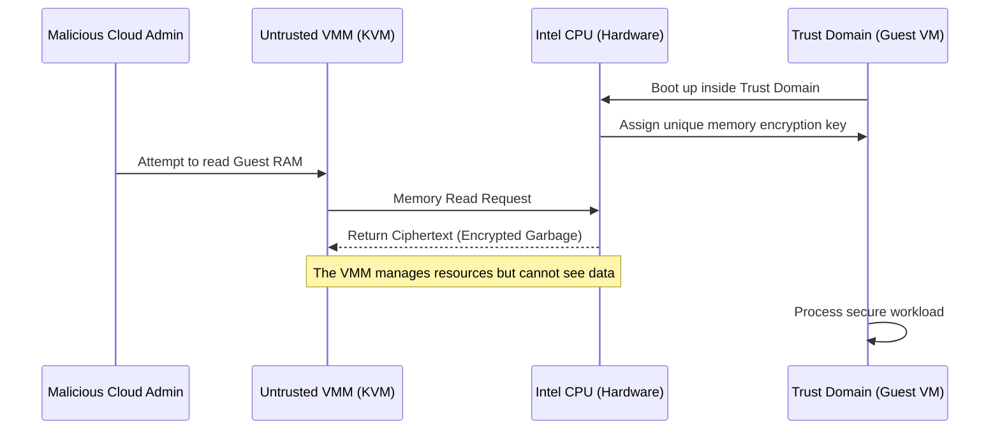

# 03 - Intel TDX (Trust Domain Extensions)

While AWS Nitro Enclaves attach a small secondary VM to a parent, **Intel TDX** (Trust Domain Extensions) operates at the hardware level to encrypt entire, unmodified Virtual Machines.

## 1. The Concept (ELI5)

Imagine renting an apartment (a Virtual Machine) in a large building (the Cloud Provider's Host Server). 

Normally, the building super (the Hypervisor) has master keys and can walk into your apartment anytime to inspect your belongings (Host OS having access to VM memory). 

**Intel TDX** is like signing a lease where the locks are entirely changed by a third-party locksmith (the CPU hardware). Your apartment is now a **Trust Domain**. The building super still provides water and power (CPU cycles and network), but if they try to look through the keyhole or open the door, all they see is encrypted static. The hypervisor is completely locked out of the guest VM's state, registers, and RAM.

## 2. The Visual: Trust Domain Isolation



## 3. The Code: Hardware-Backed Randomness

When running inside a highly isolated Trust Domain, traditional sources of entropy (randomness) might be manipulated by a malicious hypervisor trying to force predictable keys. You must rely on hardware-backed CPU instructions (`RDRAND` / `RDSEED`) rather than host-provided pseudo-random number generators.

### ❌ Vulnerable Code (Trusting Host Entropy)

Relying on standard OS random functions inside a TEE can be dangerous if the underlying OS entropy pool is being silently poisoned or observed by an advanced attacker.

```go
// go
package main

import (
	"crypto/rand"
	"fmt"
)

func generateSessionKeyVulnerable() []byte {
    key := make([]byte, 32)
    // VULNERABILITY: Trusting the OS /dev/urandom which could 
    // theoretically be tampered with by a malicious VMM in some TEE setups.
    _, err := rand.Read(key)
    if err != nil {
        panic(err)
    }
    return key
}
```

### ✅ Production-Ready Secure Code (Hardware Entropy)

When writing low-level enclave code (or configuring the TD's kernel), explicitly request entropy from the CPU hardware instructions. In Go, while `crypto/rand` often safely uses hardware instructions under the hood in modern systems, in strict TEE runtimes, you verify or explicitly call hardware RNG.

```go
// go
package main

import (
    "fmt"
)

// In Go, on x86_64, you can use assembly to call RDRAND directly if you 
// want absolute guarantee that host OS entropy is bypassed.
// Below is a conceptual wrapper for the RDRAND instruction.

//go:noescape
func rdrand64() (uint64, bool)

func generateSessionKeySecure() []byte {
    key := make([]byte, 32)
    
    // Explicitly pull 32 bytes (4 x 64-bit uints) directly from the 
    // Intel CPU's hardware random number generator.
    for i := 0; i < 4; i++ {
        val, ok := rdrand64()
        if !ok {
            panic("CPU hardware RNG failed or is unsupported!")
        }
        // Pack uint64 into the byte array...
        for j := 0; j < 8; j++ {
            key[(i*8)+j] = byte(val >> (j * 8))
        }
    }
    return key
}
```

## 4. The Guardrail: Azure AKS Confidential Node Pools

When deploying Kubernetes clusters, you can enforce that sensitive microservices are scheduled *only* on Intel TDX or AMD SEV-SNP enabled nodes.

Here is a Terraform snippet enforcing Confidential Computing node pools in Azure Kubernetes Service (AKS).

```terraform
# terraform
resource "azurerm_kubernetes_cluster_node_pool" "confidential_pool" {
  name                  = "cconly"
  kubernetes_cluster_id = azurerm_kubernetes_cluster.main.id
  
  # DC-series VMs are backed by Intel SGX / TDX hardware
  vm_size               = "Standard_DC4as_v5" 
  
  node_count            = 3
  
  # Ensure the node pool is isolated and labeled for specific TEE workloads
  node_labels = {
    "workload-type"     = "confidential-computing"
    "hardware-enclave"  = "true"
  }

  # Prevent standard pods from landing on these expensive, secure nodes
  taint {
    key    = "confidential"
    value  = "true"
    effect = "NoSchedule"
  }
}
```
